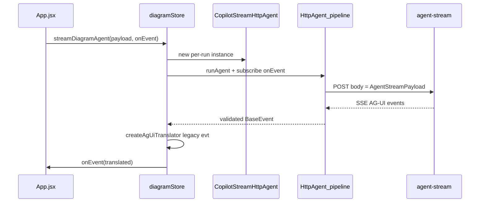

# Minimal `@ag-ui/client` HttpAgent boundary

## Constraint (why a small subclass is needed)

[`HttpAgent`](https://github.com/ag-ui-protocol/ag-ui) (per [client SDK reference](.agents/skills/copilotkit-agui/references/client-sdk.md)) defaults to `POST` with a **JSON `RunAgentInput`** body. Your route [`POST /api/copilotkit/agent-stream`](apps/server/src/routes/copilot.js) validates **`AgentStreamPayloadSchema`** from [`packages/shared/src/diagramSchema.js`](packages/shared/src/diagramSchema.js) — the same object you already pass from [`streamDiagramAgent`](apps/web/src/state/diagramStore.js) today.

So the minimal integration is: **use HttpAgent for fetch + SSE decode + `@ag-ui/core` event validation**, but **override `requestInit`** so the wire body stays your existing stream payload (plus the same URL query and session header).

## Implementation sketch

1. **Dependencies** — Add `@ag-ui/client` to [`apps/web/package.json`](apps/web/package.json). Pin the same minor version the monorepo already resolves for server-side AG-UI (lockfile shows `0.0.53` at repo root) so `@ag-ui/core` types/events stay aligned. Expect a transitive **`rxjs`** (HttpAgent’s `run()` returns an Observable); Vite will bundle it.

2. **Small dedicated module** (keeps [`diagramStore.js`](apps/web/src/state/diagramStore.js) readable) — e.g. [`apps/web/src/state/copilotStreamHttpAgent.js`](apps/web/src/state/copilotStreamHttpAgent.js):
   - `export class CopilotStreamHttpAgent extends HttpAgent` from `@ag-ui/client`.
   - Constructor stores the **stream payload** (plain object matching `AgentStreamPayloadSchema` on the wire).
   - Override **`requestInit(_input)`** (JS: same method name HttpAgent uses internally) to return:
     - `method: 'POST'`
     - `headers`: `'content-type': 'application/json'`, `'accept': 'text/event-stream'`, spread `SESSION_HEADER` / session headers (same as current [`streamDiagramAgent`](apps/web/src/state/diagramStore.js) fetch).
     - `body: JSON.stringify(this._streamPayload)`
     - `signal`: `this.abortController.signal` (per SDK doc pattern) so `abortRun()` still cancels the request.

3. **Refactor `streamDiagramAgent`** (same public API: `(payload, onEvent, { signal, sessionId }) => Promise<void>`):
   - Keep the **idle timer + `callerSignal` forwarding** logic you already have (lines ~374–397, ~473–481); wire it so **any abort** (user cancel or idle stall) calls **`agent.abortRun()`** (or aborts the same `AbortController` HttpAgent uses — pick one approach and avoid double-abort races).
   - Instantiate **`new CopilotStreamHttpAgent({ url: .../agent-stream?protocol=agui`, headers: session only }, payload)`** per call (throwaway agent; no long-lived conversation state in the SDK).
   - **`const translate = createAgUiTranslator()`** (unchanged).
   - Register **`agent.subscribe({ onEvent: ({ event }) => { ... } })`** (or finer-grained callbacks if you prefer) that:
     - **`armIdleTimer()`** on every successfully delivered event (parity with current “reset idle on each chunk” behavior — today you reset per SSE frame after `read()`, which is close; resetting per **parsed event** is slightly stricter and acceptable).
     - Runs **`const translated = translate(event)`** and calls **`onEvent(translated)`** when non-null (same contract as today).
   - Await **`agent.runAgent({})`** (or the minimal parameter object the SDK requires — **verify after install**: some versions require `messages` / `runId`; use empty `messages: []` if needed). Do **not** read `agent.state` / `agent.messages` in app code.

4. **Skip HttpAgent-owned app state (important)** — `runAgent` internally runs `defaultApplyEvents`, which mutates the agent’s `messages`/`state` ([skill table](.agents/skills/copilotkit-agui/references/client-sdk.md)). For a **minimal** integration you can accept throwaway mutation **or** return **`{ stopPropagation: true }`** from `onEvent` / per-event subscriber **if** the installed SDK honors it for `defaultApplyEvents` (confirm in `node_modules/@ag-ui/client` when implementing). If `stopPropagation` does not skip apply in your version, **one fresh HttpAgent per `streamDiagramAgent` call** is enough: you never read its state; cost is bounded by one run.

5. **Pre-stream HTTP errors (409 / 400)** — Today you **`response.json()`** on `!response.ok` and [`throwApiPayloadError`](apps/web/src/state/diagramStore.js). HttpAgent may throw a generic `Error` on non-OK responses. Plan for a **small wrapper**: catch `runAgent` failure, and if the error exposes `response` / body, map it through `throwApiPayloadError`; if not, subclass **`run()`** or **`requestInit`** only as deep as needed to preserve current user-facing messages (especially **stale revision 409**).

6. **Stricter parsing vs. legacy pass-through** — [`createAgUiTranslator`](apps/web/src/state/diagramStore.js) `default` branch passes unknown shapes through. Once events come from the SDK, **malformed lines may disappear** (dropped at parse) instead of being `JSON.parse`’d and passed through. That is usually desirable; document that **only AG-UI-shaped events** reach `translate` unless you add an explicit “raw” escape hatch.

7. **Tests** — [`apps/web/test/diagramStore.test.js`](apps/web/test/diagramStore.test.js) only mocks `fetch` for abort cases. After the change, **fetch is still mocked** (HttpAgent uses global `fetch`), but assertions may need updating if HttpAgent adds headers (`Accept`, etc.). Add **one happy-path test** with a minimal fake SSE body (or mock `HttpAgent` at module boundary if fetch mocking becomes painful) to lock: **translator receives `TEXT_MESSAGE_CONTENT` and legacy `token` fires**.

## Files to touch

| File | Change |
|------|--------|
| [`apps/web/package.json`](apps/web/package.json) | Add `@ag-ui/client` |
| New: `apps/web/src/state/copilotStreamHttpAgent.js` | `CopilotStreamHttpAgent extends HttpAgent`, `requestInit` override |
| [`apps/web/src/state/diagramStore.js`](apps/web/src/state/diagramStore.js) | Replace manual reader loop in `streamDiagramAgent` with agent + subscribe + `runAgent` |
| [`apps/web/test/diagramStore.test.js`](apps/web/test/diagramStore.test.js) | Adjust mocks / add one stream parse test |

## Out of scope (follow-ups)

- Replacing [`createAgUiTranslator`](apps/web/src/state/diagramStore.js) with subscriber-specific handlers only (bigger App.jsx churn).
- Server changes (already emits AG-UI when `protocol=agui`).
- `@ag-ui/langgraph` / A2A.
