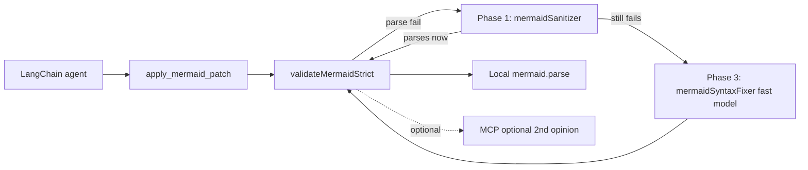

## Implementation summary (2026-05-12)

**Shipped:** Phases 0–4. Server tests 124/124 pass; offline bench reports `expectationMatch: 100%`, `rescueableHitRate: 100%`, `p95: 32 ms` over a 16-case corpus covering smart quotes, parens-in-labels, header typos, malformed init JSON, unbalanced subgraphs, reserved-word IDs, and truly-broken sources.

**Files added**
- `apps/server/src/metrics/agentTurnMetrics.js`
- `apps/server/src/agents/mermaidSanitizer.js`
- `apps/server/src/agents/inferDiagramType.js`
- `apps/server/src/agents/mermaidSyntaxFixer.js`
- `apps/server/src/prompts/mermaidSyntaxGuard.js`
- `apps/server/scripts/benchMermaid.js`
- five `apps/server/test/*.test.js` files for the above

**Files modified**
- `apps/server/src/agents/mermaidReliabilitySkill.js` — validator reorder, MCP contract, per-validator timings
- `apps/server/src/agents/mermaidLangChainAgent.js` — telemetry, enriched repair instruction, fast-fixer integration, repair-attempts default, `mode`/`profile`/`modelLabel` threading
- `apps/server/src/agents/llmProvider.js` — `resolveSyntaxFixerTarget`, `createSyntaxFixerModel`
- `apps/server/src/tools/mermaidDiffTool.js` — two-stage sanitizer rescue inside `validateAndPreparePatch`

**New environment variables (all optional, none required for default behavior)**
- `MERMAID_METRICS=1` — structured JSON telemetry per agent turn to stdout
- `MERMAID_MCP_AUTHORITATIVE=true` — let MCP override local (default: MCP advisory only)
- `MERMAID_REPAIR_MODEL=<id>` — override fast fixer's model id
- `MERMAID_REPAIR_BACKEND=vertex|openrouter` — override fast fixer's backend
- `MERMAID_REPAIR_MAX_ATTEMPTS=N` — full-agent repair attempts after fast fixer (default 2)

**Bench usage**
```
node apps/server/scripts/benchMermaid.js --tag before
# (apply changes)
node apps/server/scripts/benchMermaid.js --tag after-p1
```
Snapshots land in `apps/server/bench-results/`; exits non-zero on regressions.

---

# Mermaid-gen: fewer syntax errors, better and faster responses

## Context

The current pipeline (`mermaidLangChainAgent.js` → `apply_mermaid_patch` → `validateAndPreparePatch` → `validateMermaidStrict` → optional `invokeWithRepair` loop) is the right shape, but each layer leaves accuracy and latency on the table. Findings from reading the code:

- **Repair is mermaid-blind.** [`buildSyntaxRepairInstruction`](apps/server/src/agents/mermaidLangChainAgent.js) (`:526–537`) only says *"Return valid Mermaid syntax."* It includes the parser error but no diagram-type-specific rules and no examples. The LLM re-derives Mermaid syntax from priors on every failure.
- **Validator order is backwards for latency.** [`validateMermaidStrict`](apps/server/src/agents/mermaidReliabilitySkill.js) (`:154–188`) hits the MCP HTTP endpoint *before* the local parser. `ensureMermaidInitialized` is already warmed at boot ([`apps/server/src/index.js`](apps/server/src/index.js)`:120`), so local parse is ~1–5 ms in-process; MCP is ≥10–100 ms RTT. Local should win the fast path.
- **MCP contract is silently lax.** [`validateWithMcpServer`](apps/server/src/agents/mermaidReliabilitySkill.js) (`:128–137`) treats *any* response that lacks `valid: false` as `valid: true`, including `{}` or HTML. An accidental misconfig passes everything.
- **No deterministic auto-fix step exists.** A large fraction of LLM-emitted Mermaid failures are mechanical: smart quotes, unquoted labels with `()`/`:`/`/`, reserved-word node IDs (`end`, `class`, `style`), `flow chart` vs `flowchart`, stray semicolons in non-flowchart, missing `subgraph … end`. Today every one of those costs a full LLM round-trip.
- **Repair uses the full agent, tools, and intent model.** A single-shot, tool-less, fast-model "syntax fixer" call would be both faster and more reliable than re-running the LangChain react-agent through the whole system prompt + tools.
- **Zero telemetry.** No structured logging of validator choice, repair attempts, accept rate, or per-turn latency. We can't tell if a change helps — measurement comes before tuning.
- **`MERMAID_REPAIR_MAX_ATTEMPTS` default is 1.** Reasonable today (repair is expensive). Once Phases 1–3 make repair cheap, 2 is the right default.

Modes (`Go`, `Refine`, `Innovate`, `Go Mad`, `Critique`, `Explain`), the `SYSTEM_PROMPT` ([`mermaidLangChainAgent.js:376–387`](apps/server/src/agents/mermaidLangChainAgent.js)), the `applyTransformIntent` semantics, and the tool surface stay exactly as they are — the plan only changes the layers *below* "what the agent emits."



## Goals (measurable)

| Metric | Today (estimated) | Target after Phase 4 |
|---|---|---|
| First-try patch accept rate (Go) | ~85% | ≥97% |
| First-try patch accept rate (Go Mad) | ~60–70% | ≥90% |
| Total accept rate after repair | ~92% | ≥99% |
| p50 latency on accepted turns | baseline | ≤ baseline |
| p95 latency on accepted turns (Go Mad) | baseline | ≤ 0.85× baseline |
| Repair-LLM tokens per session | baseline | ≤ 0.5× baseline |

All numbers verified by the benchmark introduced in Phase 0; every later phase is gated on its before/after.

## Phase 0 — Measurement scaffold (prerequisite)

**Files**
- New: [`apps/server/src/metrics/agentTurnMetrics.js`](apps/server/src/metrics/agentTurnMetrics.js) — single `recordAgentTurn({mode, model, profile, durationMs, validator, repairAttempts, sanitizerHits, accepted, errorClass})` emitting one structured JSON line per turn (stdout; any log shipper consumes it).
- Edit: [`apps/server/src/agents/mermaidLangChainAgent.js`](apps/server/src/agents/mermaidLangChainAgent.js) — instrument `invokeWithRepair` (`:726–843`) to call `recordAgentTurn` at every return path; thread `mode`/`profile` through `applyIntent` / `applyTransformIntent` / `invoke`.
- Edit: [`apps/server/src/agents/mermaidReliabilitySkill.js`](apps/server/src/agents/mermaidReliabilitySkill.js) — measure per-validator wall time inside `validateMermaidStrict` and return it on the result; consumed by `recordAgentTurn`.
- New: [`apps/server/scripts/benchMermaid.js`](apps/server/scripts/benchMermaid.js) — offline driver that replays a fixed corpus of ~40 prompts × 4 modes × 2 profiles (fast/quality) against the in-process agent (no HTTP), aggregating accept rate and latency percentiles. Outputs a JSON snapshot to `apps/server/bench-results/<ts>.json`.
- New: `apps/server/test/agentTurnMetrics.test.js`.

**Why this is first.** Every other phase claims a win; without this we can't tell if changes regress Go Mad in service of Go, or trade accuracy for latency.

## Phase 1 — Deterministic sanitizer (single biggest win)

Mechanical post-LLM fixes for known-fixable failures. Cuts repair-LLM round-trips and raises first-try accept rate without changing any prompt.

**Files**
- New: [`apps/server/src/agents/mermaidSanitizer.js`](apps/server/src/agents/mermaidSanitizer.js) — composable fixers, applied in order:
  1. `normalizeSmartQuotes` — `" " ' '` → `" '`.
  2. `normalizeDiagramHeader` — `flow chart` → `flowchart`; `stateDiagram` → `stateDiagram-v2` only when V2 syntax (`-->`, composite states) is detected; tolerate case-variants of known prefixes.
  3. `escapeReservedNodeIds` — rename node IDs that are Mermaid keywords (`end`, `class`, `style`, `default`, `interpolate`, `linkStyle`, `subgraph`) to `n_end`, `n_class`, …; rewrite all references atomically.
  4. `quoteLabelsWithSpecials` — wrap node/edge labels containing `()`, `:`, `/`, `?`, `&`, `<`, `>`, non-ASCII in `["…"]` / `--|"…"|-->` form. Idempotent.
  5. `stripInvalidSemicolons` — drop trailing `;` outside flowchart/graph.
  6. `closeUnbalancedSubgraphs` — append missing `end` keywords when subgraph nesting is unbalanced and the gap is unambiguous.
  7. `repairInitDirective` — if `%%{init: …}%%` exists but isn't the first non-blank line, hoist it; if its JSON is malformed and trivially fixable (single-quote → double-quote, trailing comma), fix it.
- Edit: [`apps/server/src/tools/mermaidDiffTool.js`](apps/server/src/tools/mermaidDiffTool.js) — in `validateAndPreparePatch`, on parse failure call `sanitize(source, { parseError })`; re-validate; if it now parses, accept with `validator: 'sanitizer-rescue'` and surface applied fixers in patch metadata so the UI can show "auto-corrected: quoted labels, escaped reserved IDs" if desired.
- Edit: [`apps/server/src/agents/mermaidReliabilitySkill.js`](apps/server/src/agents/mermaidReliabilitySkill.js) — add `sanitizer` field to validation result shape; thread through.
- New: `apps/server/test/mermaidSanitizer.test.js` — one targeted test per fixer plus a corpus of 20+ real failing inputs that should now pass.

**No new dependencies. Zero LLM cost.** Expected: first-try accept rate ↑ 5–15 pts, p95 latency ↓ (repair RTTs avoided).

## Phase 2 — Validator reorder + MCP contract tightening

**Files**
- Edit: [`apps/server/src/agents/mermaidReliabilitySkill.js`](apps/server/src/agents/mermaidReliabilitySkill.js)
  - In `validateMermaidStrict` (`:154–188`), run **local parse first**. If it fails, return immediately — the local parser is authoritative for the bundled Mermaid version; MCP can't override a failure without dialect drift.
  - If local passes and `MERMAID_MCP_URL` is set, run MCP as a *second opinion* and emit a `warnings` entry on mismatch instead of overriding. Add an opt-in `MERMAID_MCP_AUTHORITATIVE=true` for stricter setups.
  - Tighten `validateWithMcpServer` (`:100–152`): require **explicit `data.valid === true`** to accept; anything else (missing, `null`, non-bool) → `valid: null` (unavailable) with a warning. Eliminates the `{}`/HTML-passes-everything footgun.
  - Optionally race local + MCP via `Promise.all` when MCP is set so the MCP RTT isn't on the hot path.

**No new files.** Bench-gated.

## Phase 3 — Diagram-type-aware repair (prompt + dedicated fixer model)

Two biggest leverage points: tell the LLM *what's wrong by Mermaid rule*, and ask the right model in the right shape.

**Files**
- New: [`apps/server/src/prompts/mermaidSyntaxGuard.js`](apps/server/src/prompts/mermaidSyntaxGuard.js) — exports `getRulePack(diagramType)` returning ≤25 lines of high-signal rules and 1–2 micro-examples per type. Sourced from our own failure corpus (Phase 0), not vendored wholesale from external skills. Types covered: `flowchart`/`graph`, `sequenceDiagram`, `classDiagram`, `stateDiagram-v2`, `erDiagram`, `mindmap`, `timeline`, `gitGraph`, `quadrantChart`, `pie`, `block-beta`, `C4*`, `sankey-beta`, `xychart-beta`. Each rule pack costs <300 prompt tokens.
- New: [`apps/server/src/agents/inferDiagramType.js`](apps/server/src/agents/inferDiagramType.js) — pure function: scan the first non-blank line of source, return canonical type slug or `null`.
- Edit: [`apps/server/src/agents/mermaidLangChainAgent.js`](apps/server/src/agents/mermaidLangChainAgent.js) — replace `buildSyntaxRepairInstruction` body (`:526–537`) to include (a) parser error, with the offending line excerpted when `error.message` carries a line number; (b) `getRulePack(inferDiagramType(brokenSource))`; (c) the broken source inline (today only in the agent's transcript); (d) explicit "output ONLY the corrected Mermaid source between fences" instruction.
- New: [`apps/server/src/agents/mermaidSyntaxFixer.js`](apps/server/src/agents/mermaidSyntaxFixer.js) — single-shot, tool-less LLM call. Inputs `{ brokenSource, parseError, diagramType }`. Uses model from `MERMAID_REPAIR_MODEL` / `MERMAID_REPAIR_BACKEND` env (default: same backend, *fast* profile). Strips fences, runs through `validateAndPreparePatch`, returns new source or null.
- Edit: [`apps/server/src/agents/mermaidLangChainAgent.js`](apps/server/src/agents/mermaidLangChainAgent.js) — in `invokeWithRepair` syntax-repair branch (`:805–837`), try `mermaidSyntaxFixer` *before* re-invoking the full agent. Order: (1) sanitizer (Phase 1, already in path); (2) syntax fixer (fast, no tools); (3) full-agent repair (existing path, kept as fallback). Cuts most repair latency ≥3× because the fast model is much faster than the quality model and the call has no react-agent overhead.
- Edit: [`apps/server/src/agents/llmProvider.js`](apps/server/src/agents/llmProvider.js) — expose `createSyntaxFixerModel(env)` reading `MERMAID_REPAIR_MODEL` / `MERMAID_REPAIR_BACKEND` with sensible defaults (Gemini 2.0 Flash on Vertex, Qwen3-8B on OpenRouter). Lower `temperature` (0.1) and a small `maxTokens` budget.
- New tests: `apps/server/test/mermaidSyntaxGuard.test.js` (rule pack snapshot per type), `apps/server/test/inferDiagramType.test.js`, `apps/server/test/mermaidSyntaxFixer.test.js` (mocked model).

## Phase 4 — Reliability dial + Go Mad temperature ceiling

After Phases 1–3, repair is cheap. Adjust defaults.

**Files**
- Edit: [`apps/server/src/agents/mermaidLangChainAgent.js`](apps/server/src/agents/mermaidLangChainAgent.js) and [`mermaidReliabilitySkill.js`](apps/server/src/agents/mermaidReliabilitySkill.js) — default `MERMAID_REPAIR_MAX_ATTEMPTS` from `1` → `2`. With Phase 1 sanitizer + Phase 3 fast fixer, two attempts add ~few-hundred ms p95 and recover a long failure tail.
- Edit: [`mermaidLangChainAgent.js`](apps/server/src/agents/mermaidLangChainAgent.js) Go Mad sampling (`transformModeModelOptions`, `:286–296`) — trim `GO_MAD_TEMP_MAX` from `1.7` → `1.55` *only if* the Phase 0 bench shows parse failures cluster at the high-temp end. Keep min at 1.48 so the character is preserved.
- Edit: [`mermaidReliabilitySkill.js`](apps/server/src/agents/mermaidReliabilitySkill.js) — short-circuit `validateMermaidStrict` early when source is unchanged from the previous accepted revision (already partially handled in [`diagramStateStore.js:38`](apps/server/src/state/diagramStateStore.js); mirror for the agent-side path).

## Phase 5 — Structural intermediate for Go Mad only (multi-day, optional)

If Phases 1–4 leave Go Mad below the 90% target, introduce a JSON-graph intermediate for Go Mad specifically (its temperature/exotic-type policy generates the most invalid Mermaid).

**Files**
- Edit: [`packages/shared/src/diagramSchema.js`](packages/shared/src/diagramSchema.js) — add a discriminated-union schema covering the diagram types Go Mad reaches for (mindmap, timeline, gitGraph, quadrantChart, pie, sankey-beta, block-beta, C4*, plus flowchart/sequenceDiagram/stateDiagram-v2).
- New: [`packages/shared/src/compileDiagramJsonToMermaid.js`](packages/shared/src/compileDiagramJsonToMermaid.js) — deterministic JSON → Mermaid emitter. Quoting, ID safety, label escaping handled in code; the LLM never needs to know.
- New: [`apps/server/src/agents/diagramJsonTool.js`](apps/server/src/agents/diagramJsonTool.js) — `apply_diagram_json` tool, parallel to `apply_mermaid_patch`. Validates against the schema, compiles, then runs the same `validateAndPreparePatch` for safety.
- Edit: [`apps/server/src/agents/mermaidLangChainAgent.js`](apps/server/src/agents/mermaidLangChainAgent.js) — Go Mad uses `apply_diagram_json`; all other modes keep `apply_mermaid_patch` unchanged.
- New tests: schema round-trip and emitter parity for each supported type.

Skip Phase 5 if Go Mad ≥ 90% after Phase 4.

## What is explicitly *not* in this plan

- **Vendoring agent-mermaid-skill / Smithery prompts wholesale.** Our own corpus-derived rule packs (Phase 3) are smaller, more targeted, and align with the failures `mermaid.parse` actually emits.
- **Building an MCP-protocol adapter for [hustcc/mcp-mermaid](https://github.com/hustcc/mcp-mermaid).** MCP is demoted to an *optional second-opinion warning* in Phase 2; stricter MCP enforcement is a small follow-up if ever needed, not a blocker.
- **Sidecar `mmdc` / Kroki render-validator on the hot path.** Adds ≥500 ms and Puppeteer/Java deps for negligible gain over `mermaid.parse` (same library version). Keep as an *offline bench-only* validator if you want render-faithful CI later.
- **Constrained decoding / Mermaid grammar.** Mermaid's grammar is not cleanly LL/LR and ecosystem support is thin; the JSON-intermediate route (Phase 5) achieves the same goal more practically.
- **Changing the character of any mode**, the `SYSTEM_PROMPT`, the tool API, or the patch/diff format.

## Critical files (quick map)

- Agent loop & repair: [`apps/server/src/agents/mermaidLangChainAgent.js`](apps/server/src/agents/mermaidLangChainAgent.js) `:340–387, 521–562, 726–843`
- Validation: [`apps/server/src/agents/mermaidReliabilitySkill.js`](apps/server/src/agents/mermaidReliabilitySkill.js) `:100–188`
- Patch tool entry: [`apps/server/src/agents/diagramTools.js`](apps/server/src/agents/diagramTools.js) `:22–39`
- Validate-and-prepare: [`apps/server/src/tools/mermaidDiffTool.js`](apps/server/src/tools/mermaidDiffTool.js) `:5–50`
- Boot warmup: [`apps/server/src/index.js`](apps/server/src/index.js) `:120`
- Model selection: [`apps/server/src/agents/llmProvider.js`](apps/server/src/agents/llmProvider.js), [`apps/server/src/agents/agentGraphConfig.js`](apps/server/src/agents/agentGraphConfig.js)
- Shared schema (Phase 5): [`packages/shared/src/diagramSchema.js`](packages/shared/src/diagramSchema.js)

## Verification

1. `pnpm -w test` — all existing tests must pass after every phase.
2. New tests per phase listed above; the sanitizer corpus and rule-pack snapshots are the *durable* contract — they outlive any individual model.
3. `node apps/server/scripts/benchMermaid.js --before` (Phase 0 baseline), then again after each phase. Commit JSON snapshots to `apps/server/bench-results/` so before/after is auditable. Advance to the next phase only when current numbers either meet the table above or show a clear, expected pattern (Phase 1 alone won't lift Go Mad to 90%; that's Phase 3).
4. Manual smoke: run the web app, exercise each mode (Go, Refine, Innovate, Go Mad, Critique, Explain) with two or three real prompts, confirm no character regressions in the UI.
5. Telemetry log review: spot-check 50 turns from `recordAgentTurn` to confirm `validator`, `sanitizerHits`, and `repairAttempts` look sane.
