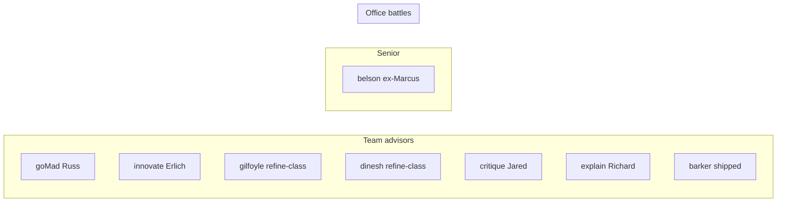

# Silicon Valley cast program (multi-session)

## Locked cast map

Named-replication fidelity for every SV character (same bar as Jack Barker: voice card → fidelity harness ≥4/5 sustained → seat wire-in). Invented office comedy (Pam, Linda, Chad, Dave, Gary, Ulrich, Sasha, Diane) stays unless a session explicitly re-voices it.

| Tier        | Seat / id             | Character         | Behavior contract (unchanged skeleton)                                                                                                                    |
| ----------- | --------------------- | ----------------- | --------------------------------------------------------------------------------------------------------------------------------------------------------- |
| team        | `goMad`               | Russ Hanneman     | Outrageous subject-rooted escalation; innuendo not explicit profanity                                                                                     |
| team        | `innovate`            | Erlich Bachman    | Courageous structural pivots; incubator swagger                                                                                                           |
| team        | `refine` → `gilfoyle` | Bertram Gilfoyle  | Always-actionable small incremental extensions                                                                                                            |
| team        | **new** `dinesh`      | Dinesh Chugtai    | Refine-class engineer (clone refine budgets/temps); competitive one-upmanship voice; floor desk adjacent to Gilfoyle                                      |
| team        | `critique` → `jared`  | Jared Dunn        | Findings-only Auditor; anxious compliance                                                                                                                 |
| team        | `explain` → `richard` | Richard Hendricks | Wise Architect: comment-only pattern/lore (no autonomous “deep work” production — ADR-0010); genius reads as over-specific insight, not a second Innovate |
| team+senior | `barker`              | Jack Barker       | Already shipped                                                                                                                                           |
| senior      | `cto` → `belson`      | Gavin Belson      | Replaces Marcus; steering + ≤1 email/session; named replication (not homage)                                                                              |

**Dual-home comedy:** Gilfoyle and Dinesh remain eligible for cubicle battles / office distraction set pieces (same pattern as Barker living in senior + advisor). Team seats stay non-claimable as Acting roles.

**User fiction:** the human on the floor is still the anxious builder the office interrupts; Richard-the-advisor is the alter-ego Wise Architect seat, not a second “you.”

**Kept as-is (not this program):** Pam (SAFe ceremony), Linda (weaponized HR cheerfulness), Chad, Dave, Gary, Ulrich, Sasha, Diane. Gary’s “Fridge Czar” bit is optional later polish, not a blocker.

## Hard decisions baked in

1. **Seventh engineer seat for Dinesh** — add wire mode `dinesh` to `TransformModeSchema` (and policies) as a refine clone: same node budgets/temps, distinct persona id, XP/radial/hotkey/mascot. Floor seat next to Gilfoyle in [`officeFloorPlan.js`](apps/web/src/utils/officeFloorPlan.js).
2. **Richard stays on `explain`** — comment-only; does not gain invent-transform powers. Helpful + funny via pattern-naming and anxious over-explain, not canvas mutation.
3. **Gavin Belson is a full named replication** of the CTO senior seat (retire Marcus/`cto` display id to `belson`), fidelity-harnessed like Barker — larger than a blurb rename.
4. **Public deploy naming** remains the existing open question from [`docs/office-parody.md`](docs/office-parody.md): keep HBO names locally; before production, decide real names vs legally-distinct aliases. Does not block the program.

## Delivery shape (one character ≈ one agent session)

Canonical playbook: [`docs/recipes/replicate-tv-character.md`](docs/recipes/replicate-tv-character.md) (§ voice card → harness → seat-inheritance or senior wire-in). Worked example: [`docs/agents/barker-seat-inheritance-plan.md`](docs/agents/barker-seat-inheritance-plan.md).

**Recommended session order** (risk / dependency):

1. **Program lock** (this plan’s doc pass) — update recipe status board + Endgame to the table above; note seventh seat + Belson; no character wire yet.
2. **Erlich → `innovate`** — medium voice risk; proves seat-inheritance again on a transform seat.
3. **Gilfoyle → `refine`/`gilfoyle`** — establishes the engineer pod.
4. **Dinesh seat** — new refine-class mode + floor adjacency + battle eligibility; depends on Gilfoyle existing so banter has a target.
5. **Jared → `critique`** — analyze-path seat; anxious Auditor.
6. **Russ → `goMad`** — highest content-policy / catchphrase risk; do after two clean inheritances.
7. **Richard → `explain`** — comment-only; fidelity without transform wire churn.
8. **Gavin Belson → senior CTO** — senior-tier drill (smaller than team, but full named card + TTS + face + retire Marcus).

Each character session ends with: registry/TTS/locale tests green, `npm run precommit`, live smoke (meeting + radial action where applicable), fidelity report in the PR body.

## Seams (for later `/to-spec`)

Prefer existing seams; do not invent a parallel cast framework.

- **Primary seam:** seat-inheritance / senior wire-in drill already proven by Barker (shared `TransformModeSchema` + advisor personas + office voice registries + client copy/i18n).
- **Quality seam:** generalize [`scripts/barker-fidelity.mjs`](scripts/barker-fidelity.mjs) once (parameterized speaker id + rubric), then reuse per character — do this in session 1 or at the start of session 2.
- **Battle seam:** existing cubicle-battle casting arrays; add Gilfoyle/Dinesh ids without new battle infrastructure.

When you run `/to-spec` later: one GitHub epic issue for the program + one `ready-for-agent` child issue per session above (or one issue per character with the recipe checklist pasted). Spec should say “behavior skeleton unchanged; voice + id replacement only,” except the explicit Dinesh new-mode and Belson id rename.

## Out of scope for this program

- Autonomous cast production / deep-work commissions (ADR-0010)
- Skinnable seats / Acting-role on team tiers
- Replacing Pam with Dinesh-as-Scrummaster
- Full office comedy rewrite (Gary, etc.)
- Shipping named HBO characters to public Cloud Run without the legal-name decision

## Success criteria

- All seven SV names (plus Barker) score ≥4/5 sustained on the fidelity harness where they speak.
- Radial/transform/analyze behavior budgets unchanged except Dinesh = refine clone.
- Gilfoyle–Dinesh pod reads as a pair on the floor and still appears in occasional battles.
- Marcus is gone from user-visible cast; Belson is unmistakably Belson in meetings/email.
- Recipe status board is the single source of truth for “what’s left.”
