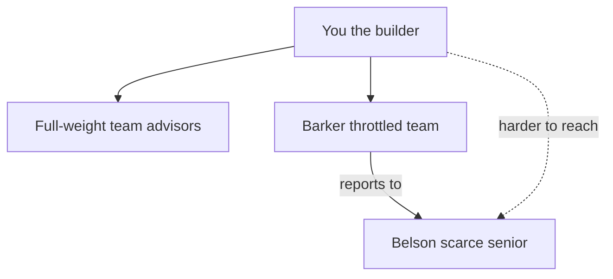

# Silicon Valley cast program (multi-session)

## Locked: reachability ladder

Owner decision (2026-07-27): Barker is **part of Your Team and partly accessible** — not as often as the other advisors. He reports to Gavin Belson; **Gavin is harder to reach**.

| Who                                                            | How you reach them                          | Frequency                                                                                                                                                                                                                    |
| -------------------------------------------------------------- | ------------------------------------------- | ---------------------------------------------------------------------------------------------------------------------------------------------------------------------------------------------------------------------------- |
| Team advisors (Erlich, Gilfoyle, Dinesh, Jared, Russ, Richard) | Roundtable + radial / hotkey / mascot       | Full peer weight in `ADVISOR_ORDER` / `pickNextPersona`                                                                                                                                                                      |
| **Jack Barker**                                                | Same surfaces (he is on Your Team)          | **Throttled** — in the roundtable pool, but lower pick weight than peers (~half as often as a typical advisor). Keep senior email scarcity (≤1/session). No office walk-by/IM spam. Light roster/radial discovery polish OK. |
| **Gavin Belson** (ex-Marcus CTO)                               | Steering meetings + ≤1 senior email/session | **Scarcer than Barker** — never proactive roundtable, never team radial advisor seat. Fiction: Barker reports to him.                                                                                                        |

---

## Audit: conversation vs project

| Conclusion                                      | Plan       | Project docs                                   | Code today                                        |
| ----------------------------------------------- | ---------- | ---------------------------------------------- | ------------------------------------------------- |
| Core SV crew on Your Team                       | Yes        | Yes                                            | Partial                                           |
| Barker dual-home advisor                        | Yes        | Yes                                            | Shipped; in the roundtable since Session 2        |
| Barker partly accessible (throttled)            | **Locked** | ✅ Recipe Session 2 + office-parody + GLOSSARY | ✅ `ADVISOR_ORDER` + `ADVISOR_PICK_WEIGHTS` = 0.5 |
| Belson harder to reach than Barker              | **Locked** | ✅ Contrasted with Barker in docs              | Marcus = CTO homage                               |
| Erlich shipped                                  | Yes        | Yes                                            | Yes                                               |
| Gilfoyle + Dinesh both team engineers + battles | Yes        | Yes                                            | Not yet                                           |
| Jared / Russ / Richard map                      | Yes        | Yes                                            | Not yet                                           |

---

## Locked cast map

| Tier        | Seat / id             | Character         | Notes                                                          |
| ----------- | --------------------- | ----------------- | -------------------------------------------------------------- |
| team+senior | `barker`              | Jack Barker       | Subtractive board-deck seat; **throttled roundtable** (locked) |
| team        | `erlich`              | Erlich Bachman    | Shipped                                                        |
| team        | `refine` → `gilfoyle` | Bertram Gilfoyle  | Engineer                                                       |
| team        | **new** `dinesh`      | Dinesh Chugtai    | Second engineer; desk by Gilfoyle; core team                   |
| team        | `critique` → `jared`  | Jared Dunn        | Auditor                                                        |
| team        | `russ` → Russ         | Russ Hanneman     | russ                                                           |
| team        | `explain` → `richard` | Richard Hendricks | Comment-only Wise Architect                                    |
| senior      | `cto` → `belson`      | Gavin Belson      | Jack’s boss; scarcer than Jack                                 |

**Dual-home battles:** Gilfoyle + Dinesh only (not their only home).

**Kept as-is:** Pam, Linda, Chad, Dave, Gary, Ulrich, Sasha, Diane.

---

## Doc suggestions for future agent runs (no code this pass)

Recipe stays the status board. Next agent should land docs with (or before) the Barker-access session.

### 1. `[docs/recipes/replicate-tv-character.md](docs/recipes/replicate-tv-character.md)`

- Barker status row: “throttled roundtable — part of team, lower pick weight; not summoned-only.”
- New small session checkbox: **Barker accessibility** (before Gilfoyle is fine).
- Guardrails: replace “Barker stays out of proactive roundtable” with the reachability ladder (Barker throttled; Belson never roundtable).
- Endgame hard decisions: paste the ladder; “Barker reports to Belson.”
- Belson session note: scarcer than Barker by design.

### 2. `[docs/office-parody.md](docs/office-parody.md)` §3

- Team / senior tables: Barker dual-home + throttled presence; Belson replaces Marcus when shipped.
- Barker experiment note: drop “never in the roundtable”; add throttle + reports-to-Belson fiction.

### 3. `[GLOSSARY.md](GLOSSARY.md)`

- Cast tiers: Barker on team roundtable at reduced weight; Belson senior-only scarcity.

### 4. This Cursor plan

- Keep progress log / todos in sync (agents read both plan + recipe).

### Barker-access session — shipped 2026-07-27

- `barker` appended to `ADVISOR_ORDER` in `useAdvisorOrchestrator.js`.
- `pickNextPersona` now walks cumulative weight via the exported `pickWeightedPersona(pool, roll)` over `ADVISOR_PICK_WEIGHTS` (peers 1, Barker 0.5); the ratio holds after the no-repeat filter.
- Belson / `cto` / `ciso` / `cfo` stay out — pinned by a regression test.
- Senior email cap untouched; roster + radial ordering already had Jack findable but not first, so no reorder.
- `castTiers.js` untouched (single-tier `senior` tag; `ADVISOR_ORDER` owns roundtable membership).

### Session order

1. ~~**Barker accessibility** (small — docs + throttle wire)~~ ✅
2. Gilfoyle → `gilfoyle`
3. Dinesh → new seat
4. Jared → `jared`
5. Russ → russ
6. Richard → `richard`
7. Belson → retire Marcus (scarce senior)

Later: `/to-spec` → epic + `ready-for-agent` children.

### Out of scope

- ADR-0010 deep-work commissions
- Dinesh-as-Scrummaster / replacing Pam
- Gary fridge rewrite
- Full team ambient for Barker (walk-bys like Chad)
- Public deploy legal rename (open question only)

---

## Hard decisions (do not re-litigate)

1. Gilfoyle + Dinesh both core team engineers; battles are extra.
2. Richard = explain (comment-only).
3. Belson = named CTO; scarcer than Barker; Barker reports to him.
4. Barker = Your Team + throttled roundtable (partly accessible, less than peers).

## Success criteria

- Reachability ladder feels true in product: peers often, Jack sometimes, Gavin rarely.
- Recipe status board tracks remaining sessions.
- Fidelity ≥4/5 per named character; ADR-0010 holds.

## Progress log

- **2026-07-26 — Session 0 (doc-lock) ✅.** Recipe + office-parody locked map.
- **2026-07-26 — Harness ✅.** Generalized `barker-fidelity.mjs`.
- **2026-07-27 — Erlich ✅.** `innovate` → `erlich`.
- **2026-07-27 — Plan audit.** Cast map already in docs; gap was Barker access.
- **2026-07-27 — Reachability locked.** Barker throttled team presence; Belson harder to reach (Jack reports to Gavin).
- **2026-07-27 — Docs pass ✅.** Recipe status board + Session 2 drill, office-parody §3, GLOSSARY cast tiers updated. **No Barker code this pass.**
- **2026-07-27 — Session 2 ✅.** Barker in `ADVISOR_ORDER` at 0.5 pick weight (`pickWeightedPersona`); seniors still excluded; docs flipped to shipped.
- **Next agent session:** Session 3 — Gilfoyle inherits `refine`.
