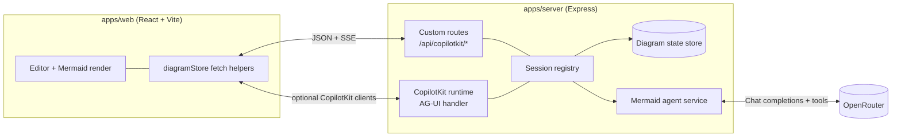
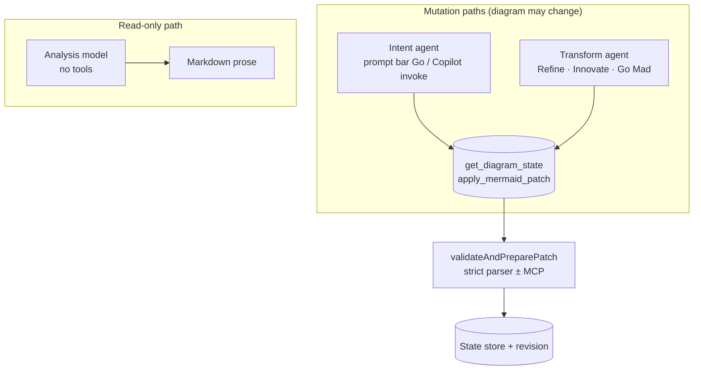
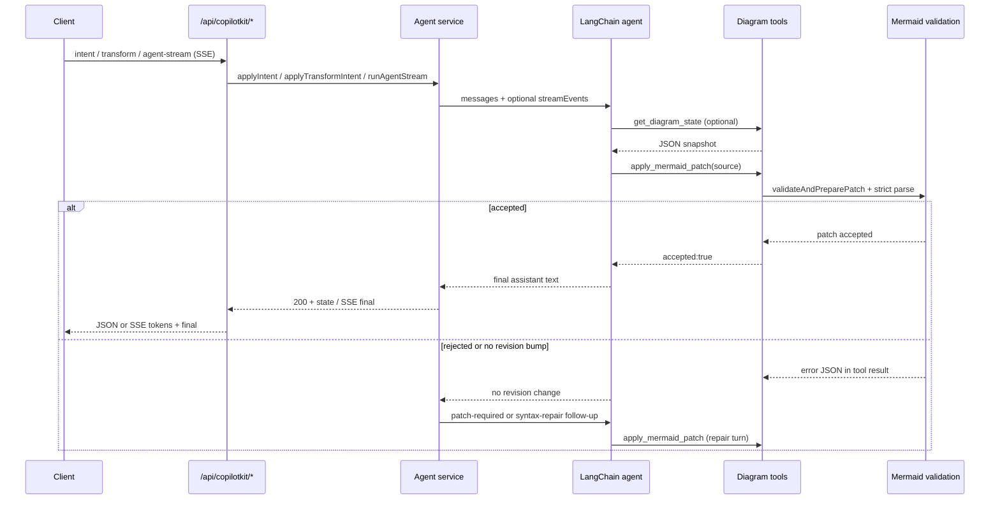
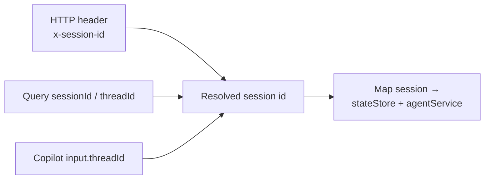

# Mermaid Architect

Single-repo JavaScript prototype for collaborative Mermaid diagram editing with a dual-agent authoring model.

## Product vision

- One always-visible user prompt captures the human's drawing intent; **Go** applies it faithfully via the **intent** path (default LangChain agent + diagram tools).
- **Refine**, **Innovate**, and **Go Mad** reuse the same tools but run under a **transform** agent with mode-specific prompts and sampling (hotter for bolder modes).
- **Critique** / **Explain** run read-only analysis into an insights pane; **Show Thinking** streams agent telemetry into the same pane (SSE).
- Optional focus on a diagram node or edge narrows transforms and explanations to that subgraph.

## How the pieces fit together

The browser owns the editor and renderer; the server owns authoritative diagram state, validation, and LLM calls. Each browser tab gets a stable `x-session-id` header so concurrent users do not share state.

**Custom routes** (`apps/server/src/routes/copilot.js`) power the main UI: structured JSON for intent/transform/analyze/style and Server-Sent Events for the insights stream.

**CopilotKit runtime** (`CopilotRuntime` + `createCopilotExpressHandler` in `apps/server/src/index.js`) exposes the same backend agent through AG-UI streaming events (`TEXT_MESSAGE_*`). It resolves the session from Copilot `threadId` so chat threads align with diagram sessions when clients send that field.

## Agent orchestration

Orchestration is **not** a separate workflow engine. It is **two cached LangChain agents** (plus a read-only analysis path) over shared **diagram tools**, wrapped in retry logic when patches fail validation.

### Roles: intent vs transform vs analysis

- **Intent agent** — `SYSTEM_PROMPT` plus user wording from the prompt bar (with optional focus instructions). Uses **fast** or **quality** OpenRouter models from env; sampling follows intent profile defaults from the client where applicable.
- **Transform agent** — Same system prompt and tools, but the **user message** is generated by `buildTransformUserContent` for `refine` | `innovate` | `goMad`, including Go Mad depth escalation. Model options override temperature/topP/maxTokens per mode (`transformModeModelOptions` / `goMadTransformModelOptions`).
- **Analysis** — Single model call with a read-only system prompt; streams tokens for SSE when `emit` is provided. Does **not** attach diagram tools.

Agents are created in `createMermaidLangChainAgent` (`apps/server/src/agents/mermaidLangChainAgent.js`) and cached per model key so repeated operations reuse instances.

### Mutation loop: stream, repair, require patch

Every mutation runs through `invokeWithRepair`: inject current diagram as a system context message, run the agent (stream events when streaming), then optionally retry if the patch did not land or validation failed.

Bounded syntax repair uses `MERMAID_REPAIR_MAX_ATTEMPTS`. Transform and intent paths set `requirePatch: true` so a missing patch triggers an explicit “must call apply_mermaid_patch” retry.

### Session alignment (REST vs CopilotKit)

Default session id is `default` when nothing is sent; the web client generates and persists a UUID in `localStorage` (`diagramStore.js`).

## Stack

- `apps/web`: React + Vite UI with Monaco editor + Mermaid live renderer
- `apps/server`: Express runtime with CopilotKit-compatible endpoints and LangChain-based dual-agent orchestration
- `packages/shared`: shared diagram schemas and patch logic

## Interaction flow

1. User edits source or loads state; client syncs via `GET`/`POST /api/copilotkit/state` (revision-checked agent calls follow).
2. **Go** (and streamed “Show Thinking”) use `POST /api/copilotkit/agent-stream` with `operation: intent`, or the non-streaming `POST /api/copilotkit/intent`.
3. **Refine / Innovate / Go Mad** use `agent-stream` or `POST /api/copilotkit/transform` with `mode` and optional `goMadDepth`.
4. **Critique / Explain** use `analyze` or `agent-stream` with `operation: analyze`; responses patch insights only, not diagram state.
5. **Clear** resets to the starter diagram via client + server state conventions documented in app code.

## Agent profiles

- **Intent** defaults: `temperature 0.7`, `topP 1`, `maxNodes 25`, `style balanced`, `persona creative architect` (see `INTENT_PROFILE_DEFAULTS` in `mermaidLangChainAgent.js`).
- **Transform** modes reuse the same tools with different prompts and model sampling (`refine` / `innovate` / `goMad` tiers).

## Protocol notes

- Primary UI traffic uses **REST + SSE** on the custom router under `/api/copilotkit`.
- **CopilotKit v2 runtime** is mounted on the same base path **after** the router so standard AG-UI requests fall through for integrations that expect `CopilotRuntime`.
- Optional **Mermaid MCP** validation layers on top of the strict local parser when `MERMAID_MCP_URL` is set (`diagramStateStore`, `mermaidDiffTool`).

## Setup

1. Install dependencies and CopilotKit skills:
   - `npm run setup`
   - This installs npm dependencies and runs `npx skills add copilotkit/skills --full-depth -y`.
2. Configure environment:
   - `cp .env.example .env` — copy to `.env` in the repo root.
3. Run both web and server:
   - `npm run dev`

### Skills folder behavior

- The generated `.agents/` directory is intentionally git-ignored.
- Re-run `npm run setup:skills` any time you want to refresh CopilotKit skills locally.

### Mermaid reliability settings

- `MERMAID_MCP_URL`: optional external Mermaid validator endpoint.
- `MERMAID_MCP_MAX_RETRIES`: retry count for transient MCP errors (`429`/`5xx`/network failures).
- `MERMAID_MCP_RETRY_DELAY_MS`: base delay between MCP retries.
- `MERMAID_REPAIR_MAX_ATTEMPTS`: bounded retry budget for agent-side syntax repair turns.

### LLM configuration

- `OPENROUTER_API_KEY`: required for agent routes; without it, `/api/health` reports `llmConfigured: false` and agent endpoints return `503`.
- `OPENROUTER_MODEL`, `OPENROUTER_MODEL_FAST`, `OPENROUTER_MODEL_QUALITY`: model slugs (see `resolveOpenRouterModelId`).

## Endpoints

| Method | Path | Purpose |
| --- | --- | --- |
| `GET` | `/api/health` | Liveness + `llmConfigured`, `runtimeReady`, MCP hint |
| `GET` | `/api/copilotkit/state` | Current diagram state for session |
| `POST` | `/api/copilotkit/state` | Client sync of editor source into server state |
| `POST` | `/api/copilotkit/intent` | Prompt-bar grounded edit (JSON response) |
| `POST` | `/api/copilotkit/transform` | Refine / innovate / goMad (JSON response) |
| `POST` | `/api/copilotkit/analyze` | Critique / explain (JSON response) |
| `POST` | `/api/copilotkit/style` | Style-only patch (`%%init%%` / theme shaping) |
| `POST` | `/api/copilotkit/agent-stream` | SSE: tokens, tool phases, `final`, `done` |
| `*` | `/api/copilotkit/...` | CopilotKit AG-UI routes (runtime handler) |

## Tests

- `npm test`

## VS Code run configs

- Shared tasks are in `.vscode/tasks.json`.
- A launch template is committed at `.vscode/launch.example.json`.
- Your local `.vscode/launch.json` is git-ignored (project/env specific).
