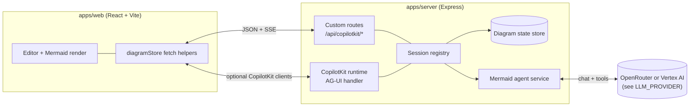
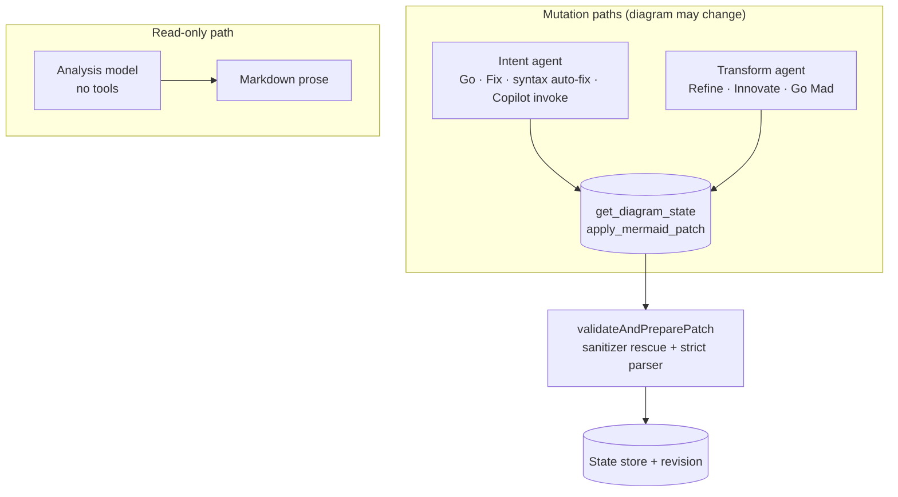
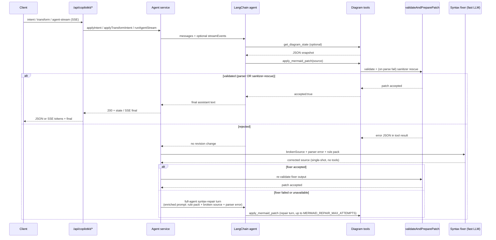
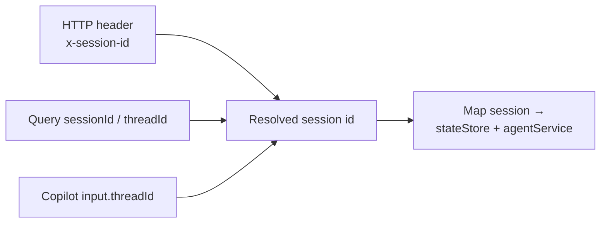

# Mermaid Architect

Single-repo JavaScript prototype for collaborative Mermaid diagram editing with a dual-agent authoring model.

## Product vision

- One always-visible user prompt captures the human's drawing intent; **Go** applies it via the **intent** path (default LangChain agent + diagram tools), grounded in the user’s own wording.
- **Refine**, **Innovate**, and **Go Mad** reuse the same tools but run under a **transform** agent with mode-specific prompts and sampling (hotter for bolder modes).
- **Critique** / **Explain** run read-only analysis into an insights pane; **Fix** turns critique into a diagram edit by reusing the **intent** path (the web app sends a long structured prompt as if it were a user request); **Show Thinking** streams agent telemetry into the same pane (SSE).
- Optional focus on a diagram node or edge narrows transforms, explanations, and critique-driven fixes to that subgraph.

## How the pieces fit together

The browser owns the editor and renderer; the server owns authoritative diagram state, validation, and LLM calls. Each browser tab gets a stable `x-session-id` header so concurrent users do not share state.

**Custom routes** (`apps/server/src/routes/copilot.js`) power the main UI: structured JSON for intent/transform/analyze/style and Server-Sent Events for the insights stream.

**CopilotKit runtime** (`CopilotRuntime` + `createCopilotExpressHandler` in `apps/server/src/index.js`) exposes the same backend agent through AG-UI streaming events (`TEXT_MESSAGE_*`). It resolves the session from Copilot `threadId` so chat threads align with diagram sessions when clients send that field.

## Agent orchestration

Orchestration is **not** a separate workflow engine. It is **two cached LangChain agents** (plus a read-only analysis path) over shared **diagram tools**, wrapped in retry logic when patches fail validation.

### Roles: intent vs transform vs analysis

- **Intent agent** — `SYSTEM_PROMPT` plus a single user turn. **Go** sends the prompt-bar text inside `applyIntent`’s “interpret and apply” template (with optional focus). **Fix** and **syntax auto-fix** are also intent: the web app composes a different user message but hits the same `POST /api/copilotkit/intent` (or `agent-stream` with `operation: intent`). Uses the **default** (non-transform) agent; model tier follows the UI **Fast** / **Quality** profile and `INTENT_PROFILE_DEFAULTS` merged with optional client `settings` (the shipped web UI currently sends `{}` for Go, Fix, and auto-fix, so defaults apply as-is).
- **Transform agent** — Same system prompt and tools as intent, but the **user message** is entirely produced by `buildTransformUserContent` for `refine` | `innovate` | `goMad` (budgets, tone, diagram-type rules). Go Mad adds **depth** (`goMadStreak + 1` in the client, capped at 12): hotter sampling and extra escalation text in the prompt. Cached **per mode** (and per Go Mad depth), not shared with intent.
- **Analysis** — Separate chat model path: read-only system prompt plus `buildCritiqueTask` or `buildExplainTask`. **No** diagram tools; output is Markdown only. Used for **Critique** and **Explain**.

Agents are created in `createMermaidLangChainAgent` (`apps/server/src/agents/mermaidLangChainAgent.js`) and cached per model key so repeated operations reuse instances.

### User-facing modes: character vs implementation

| Control | What it feels like | Server path and code |
| --- | --- | --- |
| **Go** | Does what you asked in the prompt bar—concrete diagram from your words (or a sensible default if you only name a topic). | `applyIntent` in `mermaidLangChainAgent.js`: user message = intent template + your prompt + optional `buildFocusScopeInstructions`. `requirePatch: true`. |
| **Refine** | Same diagram type and story; polish labels, grouping, clarity; modest new structure (prompt budgets ~4 nodes / 6 edges). | `applyTransformIntent` with `mode: refine`. Sampling ~`temperature 0.42`, shared transform caps in `TRANSFORM_MODEL_LIMITS`. |
| **Innovate** | Noticeable redesign; may switch Mermaid diagram type when justified; larger edits (~10 nodes / 14 edges). | `applyTransformIntent` with `mode: innovate`. Sampling ~`temperature 0.82`. |
| **Go Mad** | Wild reinterpretation, exotic diagram types, meme energy; first turn should patch immediately. | `applyTransformIntent` with `mode: goMad`. `goMadTransformModelOptions(depth)`: temperature from ~1.48 upward by tier, lower `maxTokens` (`GO_MAD_TRANSFORM_MAX_TOKENS`), stricter Go Mad copy in `buildTransformUserContent` + escalation paragraphs for depth ≥ 2. |
| **Critique** | Structured review (strengths, weaknesses, type fit, style, actionable list)—does **not** change the diagram. | `applyAnalyzeIntent` with `kind: critique`. Analysis model only; sections from `buildCritiqueTask`. |
| **Explain** | Walks a reader through meaning, flows, entities—read-only. | `applyAnalyzeIntent` with `kind: explain`. `buildExplainTask`. |
| **Fix** | Turns the last critique into an actual edit (whole critique, or only checked “actionable” bullets in the insights pane). | Still **`operation: intent`**: `App.jsx` builds a long “apply these improvements / this critique” prompt and calls the same route as Go. Resets Go Mad streak. Clears stored critique after success. |
| **Syntax auto-fix** (automatic) | When the editor shows a Mermaid parse error, a debounced run asks the model to repair syntax. | Also **`operation: intent`** with a fixed repair prompt (`runAutoFix` in `App.jsx`). |

**Style** (`POST /api/copilotkit/style`) is another mutation: same tools, but the user message is style-only (`%%{init: ...}%%`, `classDef`, etc.) and the service always uses the **fast** profile agent (`applyStyleIntent`), independent of the toolbar model toggle.

### Mutation loop: stream, repair, require patch

Every mutation runs through `invokeWithRepair`: inject the current diagram as a system context message, run the agent (stream events when streaming), then walk a **layered repair ladder** if the patch did not land or validation failed. Each rung is cheaper than the next so most failures are recovered without an LLM round-trip.

**The four-layer ladder, in order of cost:**

1. **Heuristic prefix check** — instant. Rejects source that doesn't start with a known diagram type.
2. **Deterministic sanitizer rescue** (`apps/server/src/agents/mermaidSanitizer.js`) — ~1–10 ms. Seven composable fixers (smart quotes, header typos like `flow chart`, malformed init JSON, reserved-word node IDs, parens/colons/slashes in labels, unbalanced subgraphs, stray semicolons). Runs at two points inside `validateAndPreparePatch`: once on `parseMermaidStyleConfig` failure (for init-directive issues), once on `validateMermaidStrict` failure (for everything else). Accepted source is tagged `validator: 'sanitizer-rescue'` with `metadata.sanitizerApplied` listing the fixers that fired.
3. **Single-shot syntax fixer** (`apps/server/src/agents/mermaidSyntaxFixer.js`) — one LLM call, no tools, low temperature, fast model. The repair prompt includes the parser error, the broken source verbatim, and a diagram-type-specific rule pack (`apps/server/src/prompts/mermaidSyntaxGuard.js`, 15+ packs). Output is re-run through the sanitizer + validator. Uses `MERMAID_REPAIR_MODEL` / `MERMAID_REPAIR_BACKEND` if set, otherwise the fast tier of the configured backend.
4. **Full-agent syntax-repair turns** — the original loop, kept as a fallback. The follow-up user message is now enriched with the same rule pack and broken-source block (`buildSyntaxRepairInstruction`). Bounded by `MERMAID_REPAIR_MAX_ATTEMPTS` (default **2**).

Transform and intent paths set `requirePatch: true` so a prose-only response triggers an explicit “must call `apply_mermaid_patch`” retry — that's separate from the syntax repair ladder above. The retry runs on a **stable fallback agent** (the fast non-transform agent at sane temperature), not the original hot transform agent, so a Go Mad turn that emitted high-temperature token soup doesn't get a second shot at the same dice. Successful retries are tagged `validator: 'patch-retry-stable'` in telemetry.

A heartbeat inside `streamReactAgentEvents` emits a low-frequency `status` event (default every 6 s, override via `MERMAID_STREAM_HEARTBEAT_MS`) while the SSE stream is open. That keeps the client watchdog from tripping when the model is internally working but not yet producing tokens.

When `MERMAID_METRICS=1`, every turn emits one structured JSON line (`tag: "agent_turn"`) with mode, model/profile, duration, validator outcome, repair attempts, sanitizer hits, and error class.

### Session alignment (REST vs CopilotKit)

Default session id is `default` when nothing is sent; the web client generates and persists a UUID in `localStorage` (`diagramStore.js`).

## Stack

- `apps/web`: React + Vite UI with Monaco editor + Mermaid live renderer
- `apps/server`: Express runtime with CopilotKit-compatible endpoints and LangChain-based dual-agent orchestration
- `packages/shared`: shared diagram schemas and patch logic

## Interaction flow

1. User edits source or loads state; client syncs via `GET`/`POST /api/copilotkit/state` (revision-checked agent calls follow).
2. **Go**, **Fix from critique**, and **syntax auto-fix** all use the **intent** operation: `POST /api/copilotkit/agent-stream` with `operation: intent`, or `POST /api/copilotkit/intent` without streaming.
3. **Refine / Innovate / Go Mad** use `agent-stream` or `POST /api/copilotkit/transform` with `mode` and optional `goMadDepth`.
4. **Critique / Explain** use `analyze` or `agent-stream` with `operation: analyze`; responses patch insights only, not diagram state.
5. **Clear** resets to the starter diagram via client + server state conventions documented in app code.

## Agent profiles

- **Intent** defaults: `temperature 0.7`, `topP 1`, `maxNodes 25`, `style balanced`, `persona creative architect` (see `INTENT_PROFILE_DEFAULTS` in `mermaidLangChainAgent.js`). The API merges optional `settings` from the client over these defaults; **`App.jsx` currently sends `{}`** for Go, Fix, and syntax auto-fix, so the defaults are what you get unless another client populates `settings`.
- **Transform** modes reuse the same tools with different **user** prompts and sampling (`transformModeModelOptions` / `goMadTransformModelOptions`), not the intent template.
- **Analysis** uses dedicated temperatures for streaming (see `applyAnalyzeIntent`); on Vertex stream failure with an OpenRouter key configured, analyze can **retry once on OpenRouter** with a fixed temperature.

## Protocol notes

- Primary UI traffic uses **REST + SSE** on the custom router under `/api/copilotkit`.
- **CopilotKit v2 runtime** is mounted on the same base path **after** the router so standard AG-UI requests fall through for integrations that expect `CopilotRuntime`.
- **Validation order**: the local Mermaid parser runs first (warmed at boot via `ensureMermaidInitialized` in `apps/server/src/index.js`). When `MERMAID_MCP_URL` is set, MCP runs as an **advisory** second opinion and disagreements surface as `warnings` in the patch metadata — local stays authoritative. Set `MERMAID_MCP_AUTHORITATIVE=true` to let MCP override (off by default). MCP responses must include explicit `valid: true` to count as a pass — anything else (`{}`, HTML, missing key) is treated as inconclusive, eliminating the silent-pass footgun.

## Setup

1. Install dependencies and CopilotKit skills:
   - `npm run setup`
   - This installs npm dependencies and runs `npx skills add copilotkit/skills --full-depth -y`.
2. Configure environment:
   - `cp .env.example .env` — copy to `.env` in the repo root.
3. Run both web and server:
   - `npm run dev`

### Skills folder behavior

- The generated `.agents/` directory is intentionally git-ignored.
- Re-run `npm run setup:skills` any time you want to refresh CopilotKit skills locally.

### Mermaid reliability settings

All are optional — the defaults make every layer of the validation/repair ladder above work out of the box.

| Variable | Default | What it does |
| --- | --- | --- |
| `MERMAID_METRICS` | unset | When `1`/`true`, emits one structured JSON line per agent turn (mode, model, duration, validator outcome, repair attempts, sanitizer hits, error class) to stdout. Used by the offline bench to capture before/after numbers. |
| `MERMAID_MCP_URL` | unset | Optional external Mermaid validator endpoint. When unset, only the local parser runs. |
| `MERMAID_MCP_AUTHORITATIVE` | `false` | When `true`, MCP can override the local parser. Default keeps MCP advisory (disagreements surface as `warnings` only); local stays authoritative. |
| `MERMAID_MCP_MAX_RETRIES` | `2` | Retry count for transient MCP errors (`429`/`5xx`/network failures). |
| `MERMAID_MCP_RETRY_DELAY_MS` | `150` | Base delay between MCP retries. |
| `MERMAID_REPAIR_MAX_ATTEMPTS` | `2` | Bounded retry budget for the full-agent syntax-repair fallback (the last rung in the ladder above). The single-shot syntax fixer runs once on top of this. |
| `MERMAID_REPAIR_MODEL` | (fast tier) | Override the model id used by the single-shot syntax fixer. |
| `MERMAID_REPAIR_BACKEND` | (auto) | Pin the syntax fixer to `vertex` or `openrouter` independently of the intent backend. Default: same backend as `resolveLlmBackend`, fast profile. |

### LLM configuration

Backends are selected in `apps/server/src/agents/llmProvider.js` via `LLM_PROVIDER` (`auto` | `vertex` | `openrouter`). **`auto`**: on Cloud Run with a GCP project and region, **Vertex** is preferred unless `OPENROUTER_PREFERRED=1` and an OpenRouter key exists; otherwise **OpenRouter** when `OPENROUTER_API_KEY` is set; else Vertex if the project is configured. Local dev usually sets `OPENROUTER_API_KEY` in `.env`.

**OpenRouter** (any host with a key):

- `OPENROUTER_API_KEY`: required when `LLM_PROVIDER=openrouter` or when `auto` chooses OpenRouter. If **no** backend resolves (`resolveLlmBackend` returns null), `/api/health` reports `llmConfigured: false` and agent endpoints return `503`. **Vertex-only** setups (GCP project + region, ADC or Cloud Run identity) satisfy `llmConfigured` without an OpenRouter key.
- `OPENROUTER_MODEL_FAST` / `OPENROUTER_MODEL_QUALITY`: slugs for the UI **Fast** / **Quality** toggles. If either tier is unset, **`OPENROUTER_MODEL`** can supply a single slug for both.
- **Built-in defaults** when all of the above are empty (see `DEFAULT_OPENROUTER_MODEL_*` in `mermaidLangChainAgent.js`): **Fast** = `google/gemini-2.5-flash-lite` (low latency, reliable tool calls); **Quality** = `qwen/qwen3-235b-a22b` (stronger, slower MoE). Override with any OpenRouter slug you prefer.
- **Regional availability**: some regions block or rate-limit certain providers. If the default **Gemini** fast model fails from your network, set `OPENROUTER_MODEL_FAST` to a model that works where you are (for example `qwen/qwen3-32b` or `qwen/qwen3-8b`; `.env.example` mentions Hong Kong). Error hints in the agent layer also suggest Qwen / DeepSeek slugs.

**Vertex AI** (GCP, Gemini):

- `VERTEX_PROJECT_ID` or `GOOGLE_CLOUD_PROJECT`, plus `VERTEX_LOCATION` (default `us-central1`).
- `VERTEX_MODEL_FAST` / `VERTEX_MODEL_QUALITY` / `VERTEX_MODEL`: same “per tier + optional shared” pattern as OpenRouter.
- **Built-in defaults** when unset: **Fast** = `gemini-2.0-flash-001`, **Quality** = `gemini-1.5-pro-002` (override per region if your console uses different ids).

The web client never sends raw model ids—only `modelProfile: "fast" | "quality"`; the server resolves slugs.

## Endpoints

| Method | Path | Purpose |
| --- | --- | --- |
| `GET` | `/api/health` | Liveness + `llmConfigured`, `runtimeReady`, MCP hint |
| `GET` | `/api/copilotkit/state` | Current diagram state for session |
| `POST` | `/api/copilotkit/state` | Client sync of editor source into server state |
| `POST` | `/api/copilotkit/intent` | **Intent** path: prompt-bar **Go**, **Fix from critique**, and syntax **auto-fix** (JSON; same schema, different `prompt` body) |
| `POST` | `/api/copilotkit/transform` | Refine / innovate / goMad (JSON response) |
| `POST` | `/api/copilotkit/analyze` | Critique / explain (JSON response) |
| `POST` | `/api/copilotkit/style` | Style-only patch (`%%init%%` / theme shaping) |
| `POST` | `/api/copilotkit/agent-stream` | SSE: tokens, tool phases, `final`, `done` |
| `*` | `/api/copilotkit/...` | CopilotKit AG-UI routes (runtime handler) |

## Tests

- `npm test` — full workspace test suite.
- `node apps/server/scripts/benchMermaid.js --tag <label>` — offline bench that replays a fixed corpus through `validateAndPreparePatch` and reports sanitizer-rescue rate, validator breakdown, and latency percentiles. Snapshots land in `apps/server/bench-results/<tag>-<iso>.json`; exits non-zero on regressions. Use `--tag before` / `--tag after-pN` to capture comparable before/after numbers when iterating on the sanitizer or rule packs.

## VS Code run configs

- Shared tasks are in `.vscode/tasks.json`.
- A launch template is committed at `.vscode/launch.example.json`.
- Your local `.vscode/launch.json` is git-ignored (project/env specific).
