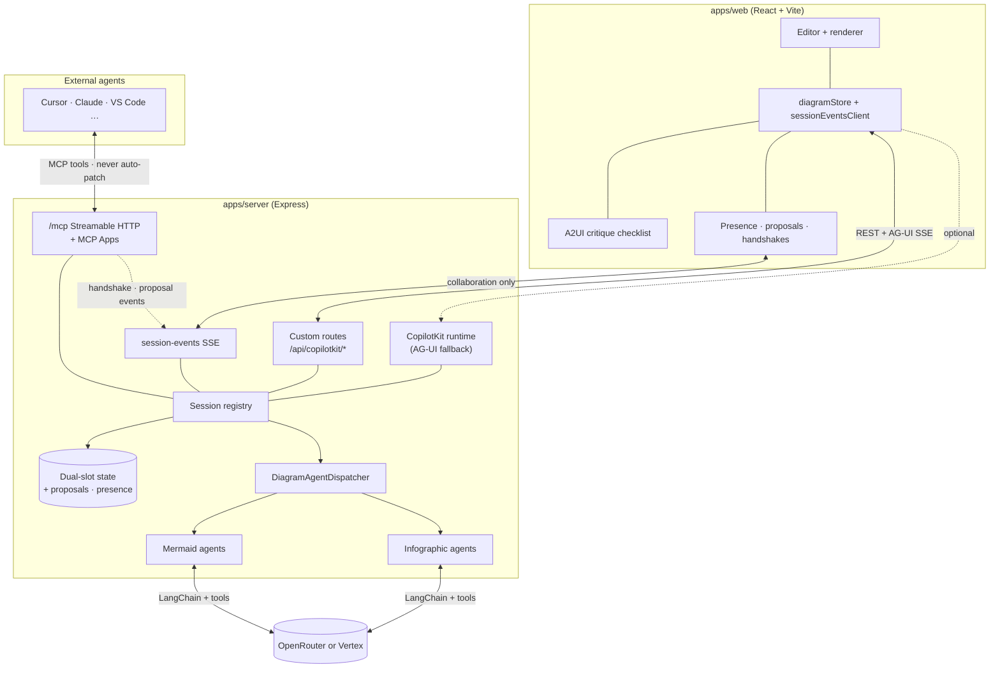
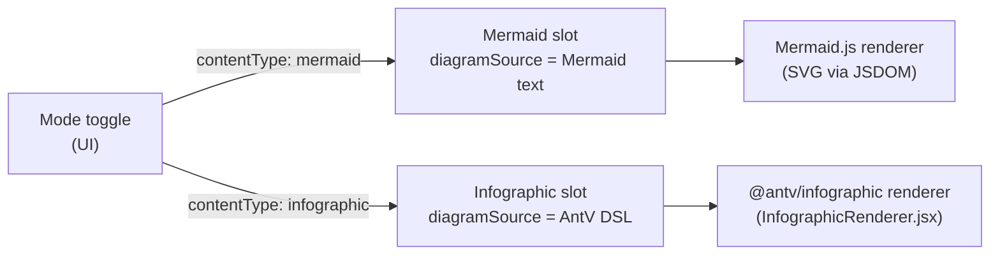
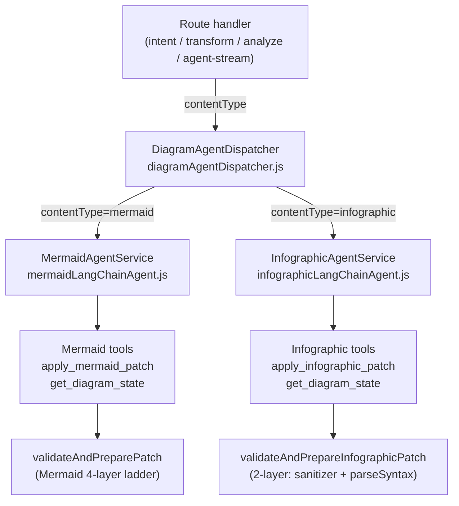
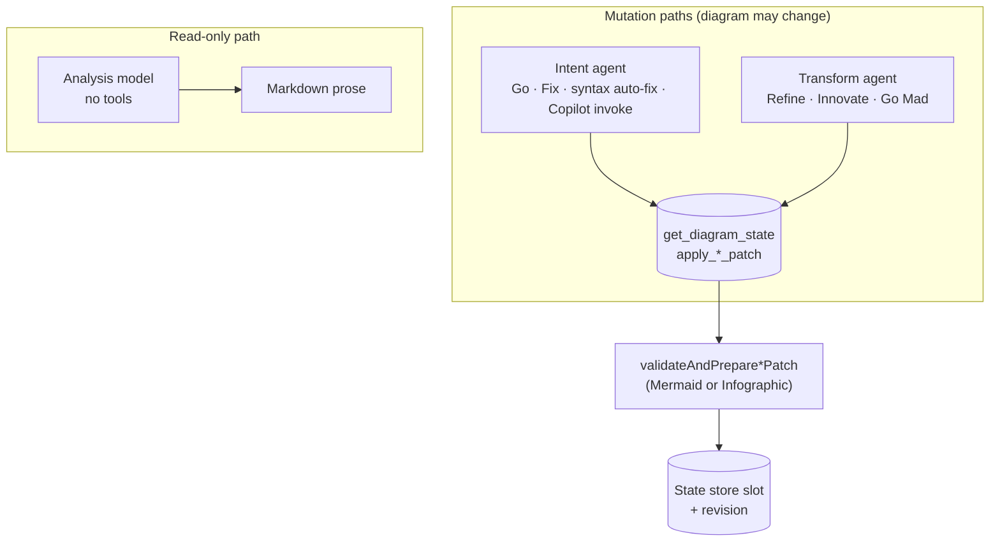
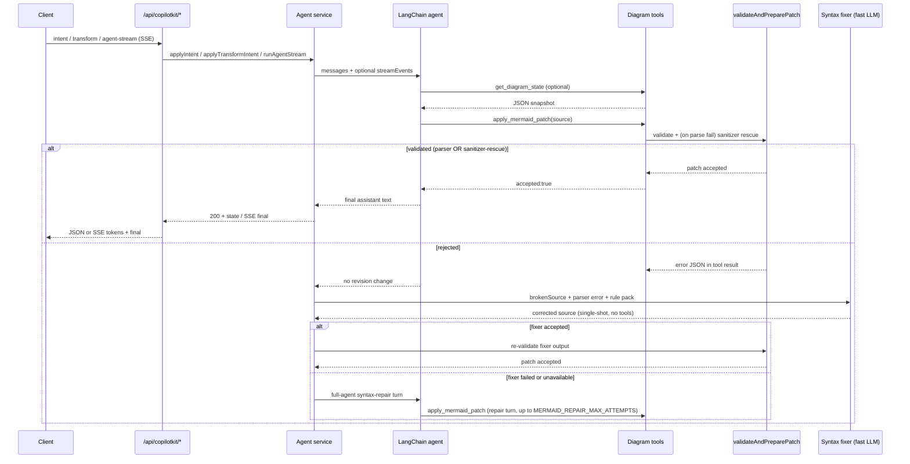
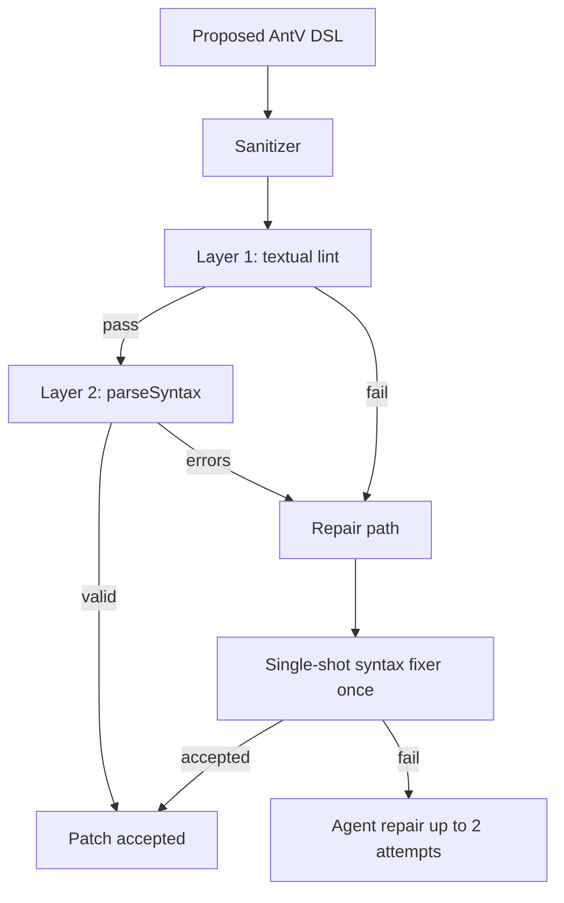
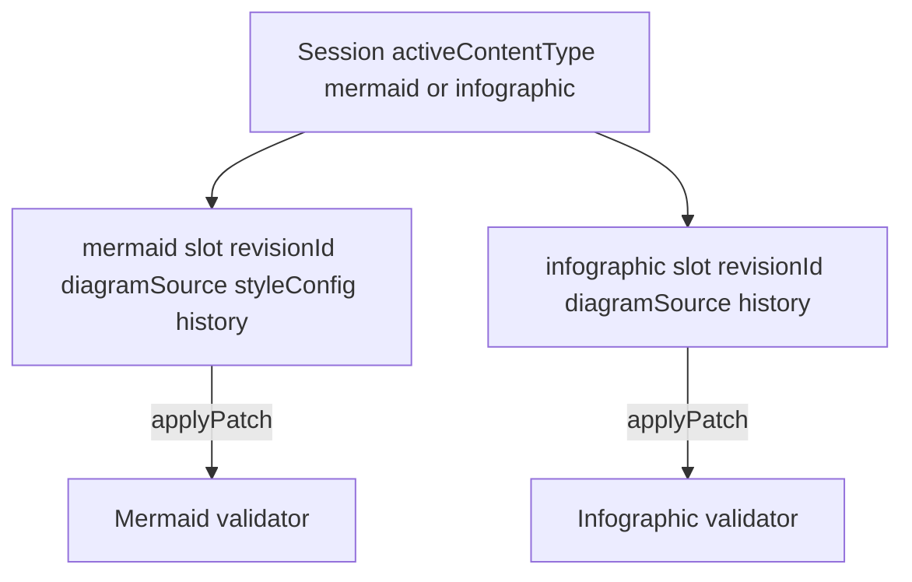
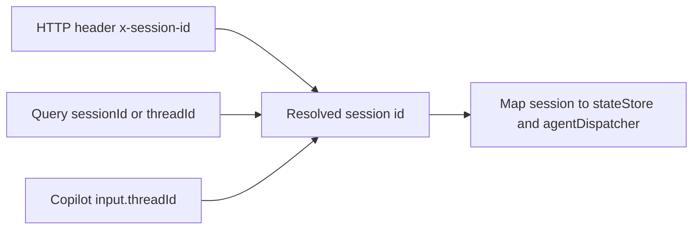
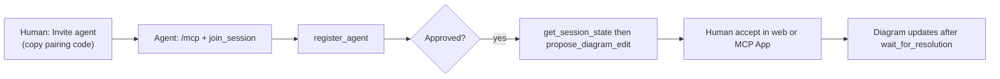

# ArchiSlop

Single-repo JavaScript prototype for **collaborative diagram editing**: humans in the browser, built-in LangChain agents, and **external agents over MCP** in the same session. Two canvas modes: **Mermaid** (flowcharts, sequences, etc.) and **Infographic** (AntV template-based layouts). The active mode is toggled from the UI and persisted across sessions.

## Documentation

| Doc | Audience | Contents |
| --- | --- | --- |
| This README | Humans, operators | Setup, stack, modes, validation, endpoints |
| [`docs/architecture-generative-ui.md`](docs/architecture-generative-ui.md) | **Integrators, UX** | **Map of all Gen UI layers** (AG-UI, A2UI, MCP Apps), MCP connectivity, host matrix, extension ideas |
| [`docs/architecture-external-agents.md`](docs/architecture-external-agents.md) | **Guest agents (Cursor, Claude, VS Code, …)** | MCP join flow, handshakes, proposals, MCP Apps, tool list |
| [`docs/architecture-ag-ui.md`](docs/architecture-ag-ui.md) | Integrators | AG-UI SSE contract for built-in agent streams |
| [`docs/architecture-a2ui.md`](docs/architecture-a2ui.md) | Integrators | A2UI critique checklists on AG-UI `CUSTOM` events |
| [`docs/deploy/gcp.md`](docs/deploy/gcp.md) | Operators | Cloud Run deploy and investigation |

## Quick start (local)

1. `npm run setup` then `cp .env.example .env` and set at least `OPENROUTER_API_KEY` (or Vertex vars) for AI features.
2. `npm run dev` — API on `http://localhost:4000` (`PORT`), Vite UI on `http://localhost:5173` (`VITE_API_BASE_URL` must point at the API).
3. Open the UI, edit in Monaco, use **Go** in the prompt bar. Toggle **Diagram** vs **Infographic** in the toolbar; each mode keeps its own source slot.
4. **Invite agent** (toolbar) copies an MCP URL + pairing code for Cursor / VS Code / Claude Desktop — see [External agents](#external-agents-mcp--quick-start).
5. `curl http://localhost:4000/api/health` — `llmConfigured: true` means intent/transform/analyze will run; the canvas still works when false.

## Product vision

- One always-visible user prompt captures the human's drawing intent; **Go** applies it via the **intent** path (default LangChain agent + diagram tools), grounded in the user's own wording.
- **Refine**, **Innovate**, and **Go Mad** reuse the same tools but run under a **transform** agent with mode-specific prompts and sampling (hotter for bolder modes).
- **Critique** / **Explain** run read-only analysis into an insights pane; **Fix** turns critique into a diagram edit by reusing the **intent** path (the web app sends a long structured prompt as if it were a user request); **Show Thinking** streams agent telemetry into the same pane (SSE).
- Optional focus on a diagram node or edge narrows transforms, explanations, and critique-driven fixes to that subgraph.
- Switching between **Diagram** and **Infographic** modes preserves both canvases independently; the active content type is forwarded in every agent call so the right agent and validator handles the request.

## Web UI (what you see)

| Area | Role |
| --- | --- |
| **Canvas** | Live Mermaid SVG or AntV Infographic render; click nodes/edges to set **focus** for scoped transforms and critique. |
| **Monaco editor** | Source for the active slot; syncs to the server on edit. Syntax errors trigger debounced **auto-fix** (Mermaid and Infographic). |
| **Prompt bar + radial menu** | **Go**, **Refine**, **Innovate**, **Go Mad**, **Critique**, **Explain**, **Style** (Mermaid only). On narrow viewports the same actions live in a **radial menu** over the canvas. |
| **Insights / Thinking pane** | Streaming tokens, tool phases, patch summaries, and critique output. **Show Thinking** mirrors AG-UI phases; critique **Fix** uses checkboxes (A2UI) when the model emits actionable bullets. |
| **Agent presence bar** | External agents that completed handshake; emoji reactions and focus highlights from the room. |
| **Handshakes & proposals** | Dialog when an MCP guest requests join; proposal cards when a guest submits an edit (accept / reject / request changes). |
| **Invite agent** | Pairing code, QR, **Add to Cursor** / **Install in VS Code** deeplinks, rotate code. |
| **Slopitect** (cosmetic) | Companion avatar, run HUD, streaks, and session achievements — feedback on agent runs, not a separate backend. |

Built-in agents never bypass validation; external agents never auto-apply (proposals only).

## Generative UI and MCP surfaces (overview)

ArchiSlop uses **three UI strategies** on purpose — full map: [`docs/architecture-generative-ui.md`](docs/architecture-generative-ui.md).

| Layer | What it is | Where it runs |
| --- | --- | --- |
| **AG-UI** | SSE: phases, tokens, tool calls, draft previews, final state | Web toolbar (`agent-stream`) |
| **A2UI** | Server-built checklist in AG-UI `CUSTOM` events | Web **Critique → Fix selected** |
| **MCP Apps** | `ui://archislop/*.html` opened by MCP tools | Cursor, VS Code, Claude Desktop, … |
| **session-events** | Collaboration SSE (not Gen UI) | Web + MCP Apps |

**MCP:** Streamable HTTP at `/mcp`; bind with pairing code; use **`open_web_companion`** when the browser is open; approve/accept in the **web UI** if host App buttons are read-only.

## How the pieces fit together

The browser owns the editor and renderer; the server owns authoritative diagram state, validation, and LLM calls. Each browser tab gets a stable `x-session-id` header so concurrent users do not share state. The server session carries **two independent slots** — Mermaid source and AntV Infographic DSL — plus an `activeContentType` pointer.

Three **parallel channels** serve different participants (see [`docs/architecture-external-agents.md`](docs/architecture-external-agents.md) for the guest-agent guide):

| Channel | Path | Used for |
| --- | --- | --- |
| **Built-in agents** | `/api/copilotkit/*` (REST + `agent-stream` AG-UI SSE) | Go, Refine, Critique, Fix, style, CopilotKit clients |
| **Collaboration** | `GET /api/copilotkit/session-events` | Handshakes, proposals, presence, focus, reactions, attributed insights |
| **External agents** | `GET/POST /mcp` | Join room, register, propose edits, insights; MCP Apps for human approval UI |

**Custom routes** (`apps/server/src/routes/copilot.js`) power the main UI.

**Critique checklist (A2UI)** — When **Critique** includes `## Actionable …`, the Thinking pane renders checkboxes via **A2UI v0.9** inside AG-UI `CUSTOM` events (`name: "a2ui"`). The model does not emit raw A2UI; the server builds messages from markdown. See [`docs/architecture-a2ui.md`](docs/architecture-a2ui.md).

**CopilotKit runtime** (`CopilotRuntime` + `createCopilotExpressHandler`) exposes the same backend through standard AG-UI for third-party CopilotKit clients; `threadId` maps to diagram session when provided.

## Content types

Each HTTP request and SSE payload carries `contentType`, which is forwarded from the UI to the `DiagramAgentDispatcher`. The dispatcher selects the Mermaid or Infographic service transparently; routes and stream events are otherwise identical from the client's perspective.

The active content type defaults to `mermaid` and is persisted in `localStorage` under `archislop:content-mode`.

## Agent orchestration

Orchestration is **not** a separate workflow engine. It is **two LangChain agents per content type** (plus a read-only analysis path) over shared session state, wrapped in repair logic when patches fail validation.

### Dispatcher and agent services

### Roles: intent vs transform vs analysis (shared across both content types)

- **Intent agent** — `SYSTEM_PROMPT` plus a single user turn. **Go** sends the prompt-bar text inside `applyIntent`'s "interpret and apply" template (with optional focus). **Fix** and **syntax auto-fix** are also intent: the web app composes a different user message but hits the same `POST /api/copilotkit/intent` (or `agent-stream` with `operation: intent`). Uses the **default** (non-transform) agent; model tier follows the UI **Fast** / **Quality** profile.
- **Transform agent** — Same system prompt and tools as intent, but the **user message** is entirely produced by `buildTransformUserContent` for `refine` | `innovate` | `goMad`. Go Mad adds **depth** (`goMadStreak + 1` in the client, capped at 12): hotter sampling and extra escalation text in the prompt. Cached **per mode** (and per Go Mad depth), not shared with intent.
- **Analysis** — Separate chat model path: read-only system prompt plus `buildCritiqueTask` or `buildExplainTask`. **No** diagram tools; output is Markdown only. Used for **Critique** and **Explain**.

Agents are created in `createMermaidLangChainAgent` / `createInfographicLangChainAgent` and cached per model key so repeated operations reuse instances.

### User-facing modes: character vs implementation

| Control | What it feels like | Server path and code |
| --- | --- | --- |
| **Go** | Does what you asked in the prompt bar — concrete diagram from your words (or a sensible default if you only name a topic). | `applyIntent` in the active agent: user message = intent template + your prompt + optional `buildFocusScopeInstructions`. `requirePatch: true`. |
| **Refine** | Same diagram type and story; polish labels, grouping, clarity; modest new structure (prompt budgets ~4 nodes / 6 edges). | `applyTransformIntent` with `mode: refine`. Sampling ~`temperature 0.42`, shared transform caps in `TRANSFORM_MODEL_LIMITS`. |
| **Innovate** | Noticeable redesign; may switch diagram type when justified; larger edits (~10 nodes / 14 edges). | `applyTransformIntent` with `mode: innovate`. Sampling ~`temperature 0.82`. |
| **Go Mad** | Wild reinterpretation, exotic types, meme energy; first turn should patch immediately. | `applyTransformIntent` with `mode: goMad`. `goMadTransformModelOptions(depth)`: temperature from ~1.48 upward by tier. |
| **Critique** | Structured review (strengths, weaknesses, type fit, style, actionable list) — does **not** change the diagram. | `applyAnalyzeIntent` with `kind: critique`. Analysis model only. |
| **Explain** | Walks a reader through meaning, flows, entities — read-only. | `applyAnalyzeIntent` with `kind: explain`. |
| **Fix** | Turns the last critique into an actual edit (whole critique, or only checked "actionable" bullets in the insights pane). | Still **`operation: intent`**: `App.jsx` builds a long "apply these improvements / this critique" prompt and calls the same route as Go. Resets Go Mad streak. Clears stored critique after success. |
| **Syntax auto-fix** (automatic) | When the editor shows a parse error, a debounced run asks the model to repair syntax. Mermaid-only; infographic uses the same `intent` path with a repair prompt. | Also **`operation: intent`** with a fixed repair prompt (`runAutoFix` in `App.jsx`). |

**Style** (`POST /api/copilotkit/style`) is another mutation: same tools, but the user message is style-only (`%%{init: ...}%%`, `classDef`, etc.). Mermaid-only; the route rejects `contentType !== 'mermaid'`.

### Mermaid validation and repair ladder

Every Mermaid mutation runs through `invokeWithRepair`: inject the current diagram as a system context message, run the agent (stream events when streaming), then walk a **four-layer repair ladder** if the patch did not land or validation failed.

**The four-layer ladder, in order of cost:**

1. **Heuristic prefix check** — instant. Rejects source that doesn't start with a known diagram type.
2. **Deterministic sanitizer rescue** (`packages/shared/src/mermaidSanitizer.js`, also used for thinking-pane Mermaid previews) — ~1–10 ms. Composable fixers (smart quotes, header typos, malformed init JSON, reserved-word node IDs, parens/colons/slashes in labels, **quoted labels with embedded `"` / newlines**, unbalanced subgraphs, stray semicolons).
3. **Single-shot syntax fixer** (`apps/server/src/agents/mermaidSyntaxFixer.js`) — one LLM call, no tools, low temperature, fast model. Includes the parser error, broken source, and a diagram-type-specific rule pack (`apps/server/src/prompts/mermaidSyntaxGuard.js`, 15+ packs).
4. **Full-agent syntax-repair turns** — the original loop, kept as a fallback. Enriched with the same rule pack and broken-source block. Bounded by `MERMAID_REPAIR_MAX_ATTEMPTS` (default **2**).

### Infographic validation pipeline

Infographic uses the same **validate → single-shot fixer → agent repair** shape as Mermaid, with a smaller deterministic front end:

- **Sanitizer** runs first (`strip-code-fence`, `tabs-to-spaces`, `smart-quotes-to-ascii`, `strip-leading-prose`).
- **Layer 1** checks the `infographic <template>` header, template whitelist (`@antv/infographic`), and indentation.
- **Layer 2** uses AntV `parseSyntax` for per-template structure.
- On failure, a **single-shot syntax fixer** (fast model, no tools) may apply corrected DSL once, then up to **two** full-agent repair turns with family-specific rule packs (list/sequence, chart, hierarchy, compare, relation).

### Session state: dual-slot model

The two slots are fully independent — switching modes does not touch the other slot's revision history. `applyPatch` in `packages/shared` enforces that a patch's `contentType` matches the slot it targets.

### Session alignment (REST vs CopilotKit)

Default session id is `default` when nothing is sent; the web client generates and persists a UUID in `localStorage` (`diagramStore.js`).

## Stack

- `apps/web`: React + Vite UI with Monaco editor, Mermaid live renderer, and AntV Infographic renderer (`InfographicRenderer.jsx`)
- `apps/server`: Express runtime with CopilotKit-compatible endpoints and LangChain-based agent orchestration; `DiagramAgentDispatcher` routes to the Mermaid or Infographic service
- `packages/shared`: shared diagram schemas (`SessionDiagramStateSchema` with dual slots), patch logic, and `ContentTypeSchema` (`mermaid` | `infographic`)

## Interaction flow

1. User picks **Mode** (Diagram or Infographic) in the toolbar; the UI persists the choice and includes `contentType` in every subsequent request.
2. User edits source or loads state; client syncs via `GET`/`POST /api/copilotkit/state` with `contentType`.
3. **Go**, **Fix from critique**, and **syntax auto-fix** all use the **intent** operation: `POST /api/copilotkit/agent-stream` with `operation: intent`, or `POST /api/copilotkit/intent` without streaming. The active `contentType` is forwarded.
4. **Refine / Innovate / Go Mad** use `agent-stream` or `POST /api/copilotkit/transform` with `mode` and optional `goMadDepth`.
5. **Critique / Explain** use `analyze` or `agent-stream` with `operation: analyze`; responses patch insights only, not diagram state.
6. **Style** is Mermaid-only; the route rejects `contentType: infographic` with a 400.
7. **Clear** resets to the starter diagram (Mermaid or Infographic depending on the active mode) via client + server state conventions.

## Agent profiles

- **Intent** defaults: `temperature 0.7`, `topP 1`, `maxNodes 25`, `style balanced`, `persona creative architect` (see `INTENT_PROFILE_DEFAULTS` in `mermaidLangChainAgent.js`). These apply to Mermaid intent; the Infographic agent uses the same LLM settings but different system prompt and tool (`INFOGRAPHIC_SYSTEM_PROMPT`).
- **Transform** modes reuse the same tools with different **user** prompts and sampling (`transformModeModelOptions` / `goMadTransformModelOptions`), shared between content types.
- **Analysis** uses dedicated temperatures for streaming; on Vertex stream failure with an OpenRouter key configured, analyze can **retry once on OpenRouter** with a fixed temperature.

## External agents (MCP) — quick start

**Goal:** let Cursor, Claude Desktop, VS Code Copilot, or any MCP client join the **same diagram room** as the human, propose edits, and comment — with explicit human approval for every change.

1. Open **Invite agent** in the web UI (pairing code + QR + **Add to Cursor** / **Install in VS Code**).
2. Configure MCP once: stable URL `https://<host>/mcp` (local: `http://localhost:4000/mcp`).
3. Agent calls `join_session({ pairingCode })` (or connect via `?pairing=` deeplink).
4. Agent calls `register_agent({ name, emoji?, color? })` → human approves in web or handshake MCP App.
5. Agent calls `open_diagram_canvas` (optional visual check), reads `get_session_state` (includes `webCanvasUrl`), then `propose_diagram_edit` with current `baseRevisionId` — **never** auto-applied.
6. Human accepts in Insights pane, **proposal-review** MCP App, or REST; agent polls `wait_for_resolution`.

**Using Cursor (or similar) while ArchiSlop is open in the browser?** Approve handshakes and accept proposals in the **web UI** (handshake dialog + Insights proposal cards). MCP Apps that Cursor opens when the agent calls `register_agent` or `propose_diagram_edit` are optional duplicates for MCP-only hosts; their buttons are often read-only in Cursor, and diagram previews may fall back to the diff tabs.

**Full guide** (tools, session-events, etiquette, REST parity): [`docs/architecture-external-agents.md`](docs/architecture-external-agents.md).

**Cloud Run:** set `PUBLIC_BASE_URL` (no trailing slash), e.g. `https://mermaid-gen-main-464241135431.us-central1.run.app`, so invites and deeplinks use production, not `localhost`.

### MCP Apps (SEP-1865)

Interactive HTML in MCP hosts that support Apps; bundles in [`apps/server/src/mcp/apps/`](apps/server/src/mcp/apps/).

| Tool | MCP App (`ui://…`) | Purpose |
| --- | --- | --- |
| `open_web_companion` | `archislop/web-companion.html` | **Hybrid default:** read-only queue + activity feed while you control approvals in the web UI |
| `join_session` / `open_session_pairing` | `archislop/session-pairing.html` | Paste pairing code from Invite agent |
| `register_agent` | `archislop/web-companion.html` | Opens web companion (handshake focus); approve in web or `open_handshake_review` for MCP-only |
| `open_handshake_review` | `archislop/handshake.html` | Legacy Approve/Deny for MCP-only hosts |
| `open_diagram_canvas` | `archislop/canvas-preview.html` | Live canvas preview + link to web editor |
| `propose_diagram_edit` | `archislop/web-companion.html` | Opens web companion (proposal focus); accept in web Insights |
| `open_proposal_review` | `archislop/proposal-review.html` | Full diff review for MCP-only hosts (optional in hybrid) |
| `open_my_proposals` | `archislop/proposal-inbox.html` | Your proposal status inbox |
| `open_session_dashboard` | `archislop/session-dashboard.html` | Presence + pending proposals; **Review** opens proposal App |
| `open_insights_feed` | `archislop/insights-feed.html` | Attributed insights (Thinking pane parity) |
| `open_critique_review` | `archislop/critique-map.html` | Actionable critique; `request_critique_fix` |
| `open_welcome` / `get_session_bootstrap` | `archislop/welcome.html` | Onboarding checklist + revision ids |
| `open_session_events` | `archislop/session-events.html` | Live collaboration feed (SSE + long-poll fallback) |
| `open_compose_insight` | `archislop/compose-insight.html` | Post note / suggestion / critique |
| `open_focus_picker` | `archislop/focus-picker.html` | Pick a node to highlight via `set_focus` |

Proposal review includes Mermaid preview (with CDN timeouts and fallback copy), unified diff, graph-level chips, and **Request changes** (proposal stays pending; agent gets session event + attributed insight). Apps share nav chrome and auto-refresh via the session event bridge where noted in [`docs/architecture-external-agents.md`](docs/architecture-external-agents.md).

### Other MCP tools (after handshake)

`open_web_companion` (hybrid read-only queue — prefer when ArchiSlop is open in the browser), `get_insights`, `open_insights_feed`, `get_my_proposals`, `drop_insight`, `set_focus`, `react`, `get_session_snapshot`, plus human-only `resolve_*` / `request_*` from Apps. Prompt `archislop_collaboration_guide` on the server summarizes guest etiquette.

See **[Generative UI and MCP surfaces](#generative-ui-and-mcp-surfaces-overview)** and [`docs/architecture-generative-ui.md`](docs/architecture-generative-ui.md).

## Protocol notes

| Layer | Protocol | Doc |
| --- | --- | --- |
| **Overview (all Gen UI + MCP UI)** | AG-UI + A2UI + MCP Apps matrix | [`docs/architecture-generative-ui.md`](docs/architecture-generative-ui.md) |
| Built-in agent runs | REST + **AG-UI** SSE on `agent-stream` | [`docs/architecture-ag-ui.md`](docs/architecture-ag-ui.md) |
| Critique checklists (web) | **A2UI** inside AG-UI `CUSTOM` | [`docs/architecture-a2ui.md`](docs/architecture-a2ui.md) |
| Multi-agent room sync | **session-events** SSE (not AG-UI) | [`docs/architecture-external-agents.md`](docs/architecture-external-agents.md) |
| External agents | **MCP** Streamable HTTP + MCP Apps | same |

- **CopilotKit v2 runtime** is mounted on `/api/copilotkit` **after** the custom router so AG-UI clients can fall through to `CopilotRuntime`.
- **`contentType`** is forwarded on every mutation — dispatcher, slot selection, and `applyPatch` enforce slot boundaries.
- **Validation (Mermaid)**: in-process `mermaid.parse` (JSDOM) + sanitizer rescue in `validateAndPreparePatch`.
- **Validation (Infographic)**: local `parseSyntax` only.
- **External edits**: validated at proposal time; applied only after human accept (same validators as built-in tools).

## Setup

1. Install dependencies and CopilotKit skills:
   - `npm run setup`
   - This installs npm dependencies and runs `npx skills add copilotkit/skills --full-depth -y`.
2. Configure environment:
   - `cp .env.example .env` — copy to `.env` in the repo root.
3. Run both web and server:
   - `npm run dev`

### Skills folder behavior

- The generated `.agents/` directory is intentionally git-ignored.
- Re-run `npm run setup:skills` any time you want to refresh CopilotKit skills locally.

### Mermaid reliability settings

All are optional — the defaults make every layer of the validation/repair ladder above work out of the box.

| Variable | Default | What it does |
| --- | --- | --- |
| `MERMAID_METRICS` | unset | When `1`/`true`, emits one structured JSON line per agent turn (mode, model, duration, validator outcome, repair attempts, sanitizer hits, error class) to stdout. |
| `MERMAID_AGENT_RUN_BUDGET_MS_FAST` / `MERMAID_AGENT_RUN_BUDGET_MS_QUALITY` | `75000` / `105000` | Absolute stream run budget for Fast and Quality. Quality still gets the first creative pass, but repair work is bounded and uses the stable fast path. |
| `MERMAID_REPAIR_MAX_ATTEMPTS` | Fast `2`, Quality `1` | Bounded retry budget for the full-agent syntax-repair fallback (the last rung in the Mermaid ladder). `MERMAID_REPAIR_MAX_ATTEMPTS_FAST` / `MERMAID_REPAIR_MAX_ATTEMPTS_QUALITY` can tune by profile. |
| `INFOGRAPHIC_REPAIR_MAX_ATTEMPTS` | Fast `2`, Quality `1` | Same full-agent fallback cap for Infographic mode. `INFOGRAPHIC_REPAIR_MAX_ATTEMPTS_FAST` / `INFOGRAPHIC_REPAIR_MAX_ATTEMPTS_QUALITY` can tune by profile. |
| `MERMAID_REPAIR_MODEL` | (fast tier) | Override the model id used by the single-shot syntax fixer (Mermaid and Infographic fixers). |
| `MERMAID_REPAIR_BACKEND` | (auto) | Pin the syntax fixer to `vertex` or `openrouter` independently of the intent backend. |
| `MERMAID_STREAM_HEARTBEAT_MS` | `6000` | SSE heartbeat when an `agent-stream` has no events (clamped 1s–60s). |
| `MERMAID_AGENT_RECURSION_LIMIT` | `50` | LangGraph ReAct step budget per run (clamped 25–200). |
| `MERMAID_AGENT_MAX_TOOL_CALLS_PER_RUN` | `6` | Cap tool invocations per run (`0` disables the cap). |

### Collaboration and production

| Variable | Default | What it does |
| --- | --- | --- |
| `PUBLIC_BASE_URL` | (derived) | Public origin for MCP invite URLs and deeplinks — **required on Cloud Run** (no trailing slash). |
| `ARCHISLOP_WEB_URL` | (optional) | Vite app origin for `webCanvasUrl` in MCP tools when the UI is not same-host as the API (e.g. local dev: `http://localhost:5173`). |
| `INVITE_TOKEN_SECRET` | dev placeholder | HMAC for signed `?token=` on `/mcp`; must be strong in production. |
| `PAIRING_CODE_TTL_MS` / `PAIRING_INVITE_TTL_MS` | 60m / 30m | Pairing code lifetime; refreshed when **Invite agent** opens. |
| `REDIS_URL` | unset | Share pairing codes across Cloud Run instances (diagram/session state stays in-process). |
| `MCP_RATE_LIMIT_*` / `API_*_RATE_LIMIT_*` | see `.env.example` | Per-IP sliding windows on failed MCP joins, `join-room`, and LLM routes. |
| `CORS_ALLOWED_ORIGINS` | unset | Extra allowed origins in production (`PUBLIC_BASE_URL` is always allowed). |

Cloud Run operators: see [`docs/deploy/gcp.md`](docs/deploy/gcp.md) for `PUBLIC_BASE_URL`, `INVITE_TOKEN_SECRET` via Secret Manager, optional Redis, and `min-instances` guidance for MCP session stickiness.

### LLM configuration

Backends are selected in `apps/server/src/agents/llmProvider.js` via `LLM_PROVIDER` (`auto` | `vertex` | `openrouter`). **`auto`**: on Cloud Run with a GCP project and region, **Vertex** is preferred unless `OPENROUTER_PREFERRED=1` and an OpenRouter key exists; otherwise **OpenRouter** when `OPENROUTER_API_KEY` is set; else Vertex if the project is configured.

**OpenRouter** (any host with a key):

- `OPENROUTER_API_KEY`: required when `LLM_PROVIDER=openrouter` or when `auto` chooses OpenRouter.
- `OPENROUTER_MODEL_FAST` / `OPENROUTER_MODEL_QUALITY`: slugs for the UI **Fast** / **Quality** toggles. If either tier is unset, **`OPENROUTER_MODEL`** can supply a single slug for both.
- **Built-in defaults** when all of the above are empty: **Fast** = `google/gemini-2.5-flash-lite`; **Quality** = `qwen/qwen3-235b-a22b`.

**Vertex AI** (GCP, Gemini):

- `VERTEX_PROJECT_ID` or `GOOGLE_CLOUD_PROJECT`, plus `VERTEX_LOCATION` (default `us-central1`).
- `VERTEX_MODEL_FAST` / `VERTEX_MODEL_QUALITY` / `VERTEX_MODEL`: same "per tier + optional shared" pattern as OpenRouter.
- **Built-in defaults** when unset: **Fast** = `gemini-2.0-flash-001`, **Quality** = `gemini-1.5-pro-002`.

The web client never sends raw model ids — only `modelProfile: "fast" | "quality"`; the server resolves slugs.

## Endpoints

| Method | Path | Purpose |
| --- | --- | --- |
| `GET` | `/api/health` | Liveness + `llmConfigured`, `runtimeReady` |
| `GET` | `/api/copilotkit/state` | Current diagram state for session (active slot by default; pass `contentType` for a specific slot) |
| `GET` | `/api/copilotkit/session-state` | Full session payload (both slots + `activeContentType`) |
| `POST` | `/api/copilotkit/state` | Client sync of editor source into server state (`contentType` selects the slot) |
| `POST` | `/api/copilotkit/intent` | **Intent** path: prompt-bar **Go**, **Fix from critique**, and syntax **auto-fix** (JSON; `contentType` routes to Mermaid or Infographic agent) |
| `POST` | `/api/copilotkit/transform` | Refine / innovate / goMad (JSON response; `contentType` forwarded) |
| `POST` | `/api/copilotkit/analyze` | Critique / explain (JSON response; `contentType` forwarded) |
| `POST` | `/api/copilotkit/style` | Style-only patch (`%%init%%` / theme shaping) — **Mermaid only**, rejects `contentType: infographic` |
| `POST` | `/api/copilotkit/agent-stream` | SSE: tokens, tool phases, `final`, `done` (`contentType` forwarded) |
| `*` | `/api/copilotkit/...` | CopilotKit AG-UI routes (runtime handler) |
| `GET` | `/api/copilotkit/invite` | MCP URL, pairing code, QR, Cursor/VS Code install links |
| `POST` | `/api/copilotkit/invite/rotate-pairing` | Invalidate current pairing code (same session) |
| `POST` | `/api/copilotkit/join-room` | Bind a room with `{ pairingCode }` → `{ sessionId }` (rate-limited) |
| `GET` | `/api/copilotkit/session-events` | SSE: handshakes, proposals, presence, insights, reactions |
| `GET` | `/api/copilotkit/presence` | Connected agents snapshot |
| `GET` | `/api/copilotkit/handshakes` | Pending handshake requests |
| `POST` | `/api/copilotkit/handshakes/:requestId/approve` | Approve external agent |
| `POST` | `/api/copilotkit/handshakes/:requestId/deny` | Deny external agent |
| `GET` | `/api/copilotkit/proposals` | Pending diagram proposals |
| `POST` | `/api/copilotkit/proposals/:proposalId/accept` | Accept proposal (applies patch) |
| `POST` | `/api/copilotkit/proposals/:proposalId/reject` | Reject proposal |
| `*` | `/mcp` | MCP Streamable HTTP (optional `?pairing=` / `?session=` on initialize) |

## Tests

- `npm test` — full workspace test suite.
- `node apps/server/scripts/benchMermaid.js --tag <label>` — offline bench that replays a fixed corpus through `validateAndPreparePatch` and reports sanitizer-rescue rate, validator breakdown, and latency percentiles. Snapshots land in `apps/server/bench-results/<tag>-<iso>.json`; exits non-zero on regressions.

## VS Code run configs

- Shared tasks are in `.vscode/tasks.json`.
- A launch template is committed at `.vscode/launch.example.json`.
- Your local `.vscode/launch.json` is git-ignored (project/env specific).
