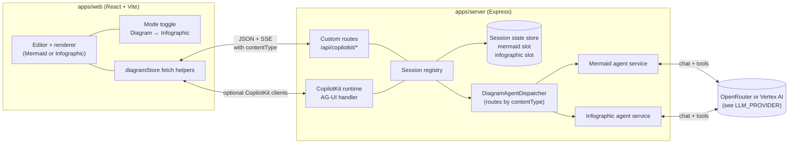
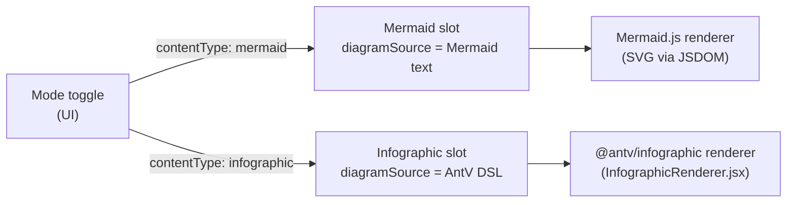
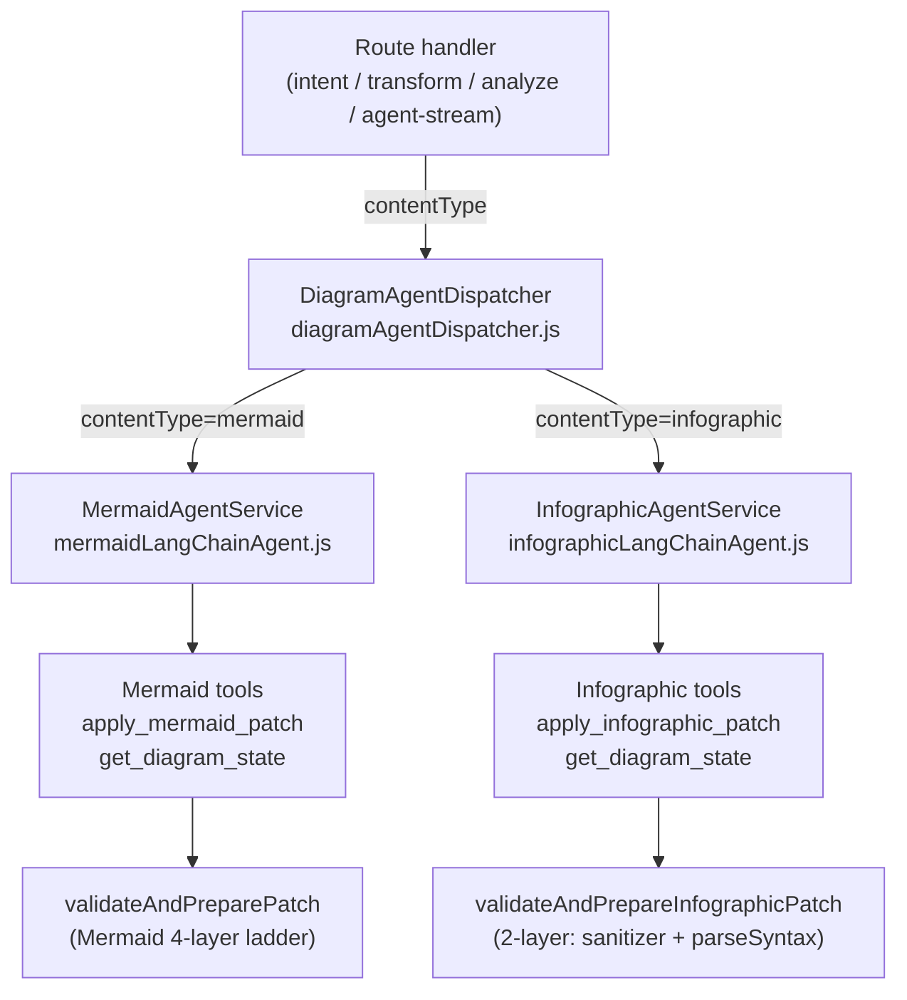
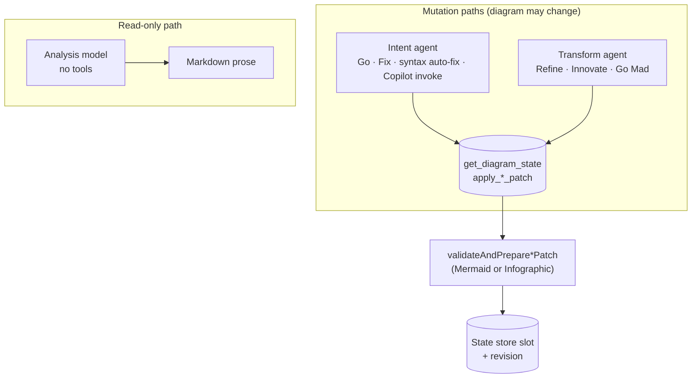
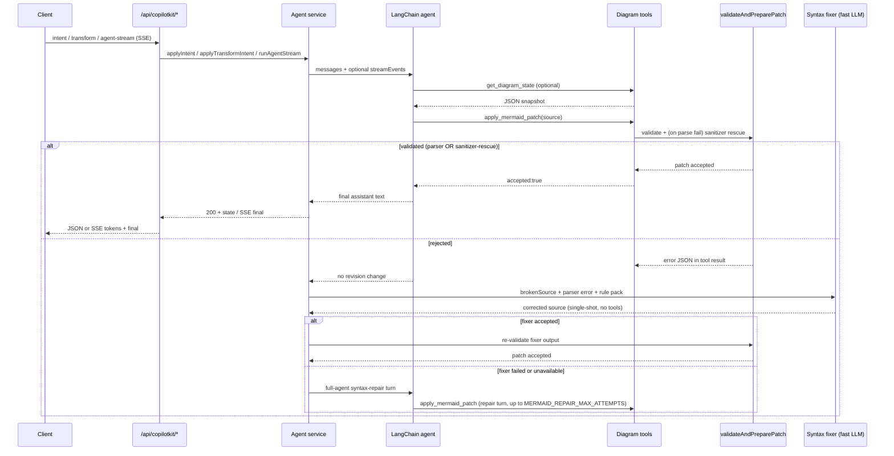
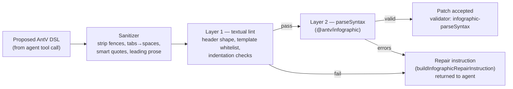
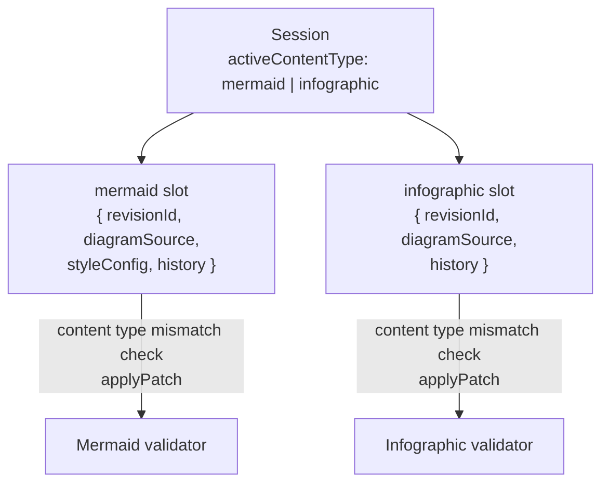
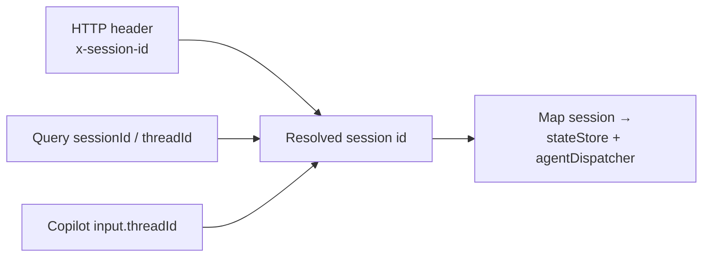

# ArchiSlop

Single-repo JavaScript prototype for collaborative diagram editing with a dual-agent, dual-content-type authoring model. Supports two canvas modes: **Mermaid** (flowcharts, sequences, etc.) and **Infographic** (AntV template-based visual layouts). The active mode is toggled from the UI and persisted across sessions.

## Product vision

- One always-visible user prompt captures the human's drawing intent; **Go** applies it via the **intent** path (default LangChain agent + diagram tools), grounded in the user's own wording.
- **Refine**, **Innovate**, and **Go Mad** reuse the same tools but run under a **transform** agent with mode-specific prompts and sampling (hotter for bolder modes).
- **Critique** / **Explain** run read-only analysis into an insights pane; **Fix** turns critique into a diagram edit by reusing the **intent** path (the web app sends a long structured prompt as if it were a user request); **Show Thinking** streams agent telemetry into the same pane (SSE).
- Optional focus on a diagram node or edge narrows transforms, explanations, and critique-driven fixes to that subgraph.
- Switching between **Diagram** and **Infographic** modes preserves both canvases independently; the active content type is forwarded in every agent call so the right agent and validator handles the request.

## How the pieces fit together

The browser owns the editor and renderer; the server owns authoritative diagram state, validation, and LLM calls. Each browser tab gets a stable `x-session-id` header so concurrent users do not share state. The server session now carries **two independent slots** — one for Mermaid source, one for AntV Infographic DSL — plus an `activeContentType` pointer.

**Custom routes** (`apps/server/src/routes/copilot.js`) power the main UI: structured JSON for intent/transform/analyze/style and Server-Sent Events for the insights stream.

**CopilotKit runtime** (`CopilotRuntime` + `createCopilotExpressHandler` in `apps/server/src/index.js`) exposes the same backend agent through AG-UI streaming events (`TEXT_MESSAGE_*`). It resolves the session from Copilot `threadId` so chat threads align with diagram sessions when clients send that field.

## Content types

Each HTTP request and SSE payload carries `contentType`, which is forwarded from the UI to the `DiagramAgentDispatcher`. The dispatcher selects the Mermaid or Infographic service transparently; routes and stream events are otherwise identical from the client's perspective.

The active content type defaults to `mermaid` and is persisted in `localStorage` under `archislop:content-mode`.

## Agent orchestration

Orchestration is **not** a separate workflow engine. It is **two LangChain agents per content type** (plus a read-only analysis path) over shared session state, wrapped in repair logic when patches fail validation.

### Dispatcher and agent services

### Roles: intent vs transform vs analysis (shared across both content types)

- **Intent agent** — `SYSTEM_PROMPT` plus a single user turn. **Go** sends the prompt-bar text inside `applyIntent`'s "interpret and apply" template (with optional focus). **Fix** and **syntax auto-fix** are also intent: the web app composes a different user message but hits the same `POST /api/copilotkit/intent` (or `agent-stream` with `operation: intent`). Uses the **default** (non-transform) agent; model tier follows the UI **Fast** / **Quality** profile.
- **Transform agent** — Same system prompt and tools as intent, but the **user message** is entirely produced by `buildTransformUserContent` for `refine` | `innovate` | `goMad`. Go Mad adds **depth** (`goMadStreak + 1` in the client, capped at 12): hotter sampling and extra escalation text in the prompt. Cached **per mode** (and per Go Mad depth), not shared with intent.
- **Analysis** — Separate chat model path: read-only system prompt plus `buildCritiqueTask` or `buildExplainTask`. **No** diagram tools; output is Markdown only. Used for **Critique** and **Explain**.

Agents are created in `createMermaidLangChainAgent` / `createInfographicLangChainAgent` and cached per model key so repeated operations reuse instances.

### User-facing modes: character vs implementation

| Control | What it feels like | Server path and code |
| --- | --- | --- |
| **Go** | Does what you asked in the prompt bar — concrete diagram from your words (or a sensible default if you only name a topic). | `applyIntent` in the active agent: user message = intent template + your prompt + optional `buildFocusScopeInstructions`. `requirePatch: true`. |
| **Refine** | Same diagram type and story; polish labels, grouping, clarity; modest new structure (prompt budgets ~4 nodes / 6 edges). | `applyTransformIntent` with `mode: refine`. Sampling ~`temperature 0.42`, shared transform caps in `TRANSFORM_MODEL_LIMITS`. |
| **Innovate** | Noticeable redesign; may switch diagram type when justified; larger edits (~10 nodes / 14 edges). | `applyTransformIntent` with `mode: innovate`. Sampling ~`temperature 0.82`. |
| **Go Mad** | Wild reinterpretation, exotic types, meme energy; first turn should patch immediately. | `applyTransformIntent` with `mode: goMad`. `goMadTransformModelOptions(depth)`: temperature from ~1.48 upward by tier. |
| **Critique** | Structured review (strengths, weaknesses, type fit, style, actionable list) — does **not** change the diagram. | `applyAnalyzeIntent` with `kind: critique`. Analysis model only. |
| **Explain** | Walks a reader through meaning, flows, entities — read-only. | `applyAnalyzeIntent` with `kind: explain`. |
| **Fix** | Turns the last critique into an actual edit (whole critique, or only checked "actionable" bullets in the insights pane). | Still **`operation: intent`**: `App.jsx` builds a long "apply these improvements / this critique" prompt and calls the same route as Go. Resets Go Mad streak. Clears stored critique after success. |
| **Syntax auto-fix** (automatic) | When the editor shows a parse error, a debounced run asks the model to repair syntax. Mermaid-only; infographic uses the same `intent` path with a repair prompt. | Also **`operation: intent`** with a fixed repair prompt (`runAutoFix` in `App.jsx`). |

**Style** (`POST /api/copilotkit/style`) is another mutation: same tools, but the user message is style-only (`%%{init: ...}%%`, `classDef`, etc.). Mermaid-only; the route rejects `contentType !== 'mermaid'`.

### Mermaid validation and repair ladder

Every Mermaid mutation runs through `invokeWithRepair`: inject the current diagram as a system context message, run the agent (stream events when streaming), then walk a **four-layer repair ladder** if the patch did not land or validation failed.

**The four-layer ladder, in order of cost:**

1. **Heuristic prefix check** — instant. Rejects source that doesn't start with a known diagram type.
2. **Deterministic sanitizer rescue** (`apps/server/src/agents/mermaidSanitizer.js`) — ~1–10 ms. Seven composable fixers (smart quotes, header typos, malformed init JSON, reserved-word node IDs, parens/colons/slashes in labels, unbalanced subgraphs, stray semicolons).
3. **Single-shot syntax fixer** (`apps/server/src/agents/mermaidSyntaxFixer.js`) — one LLM call, no tools, low temperature, fast model. Includes the parser error, broken source, and a diagram-type-specific rule pack (`apps/server/src/prompts/mermaidSyntaxGuard.js`, 15+ packs).
4. **Full-agent syntax-repair turns** — the original loop, kept as a fallback. Enriched with the same rule pack and broken-source block. Bounded by `MERMAID_REPAIR_MAX_ATTEMPTS` (default **2**).

### Infographic validation pipeline

Infographic uses a leaner **two-layer pipeline** (no multi-attempt LLM fixer; the DSL grammar is much more regular):

- **Sanitizer** runs first, tracking which fixes were applied (`strip-code-fence`, `tabs-to-spaces`, `smart-quotes-to-ascii`, `strip-leading-prose`).
- **Layer 1** checks the `infographic <template>` header, template against the whitelist loaded from `@antv/infographic` at startup, and indentation rules.
- **Layer 2** uses AntV's own `parseSyntax` to validate per-template structure (unknown keys, missing parents, malformed list items).
- On failure, `buildInfographicRepairInstruction` injects a family-specific rule pack (list/sequence, chart, hierarchy, compare, relation) into the next agent message. Up to `MAX_INFOGRAPHIC_REPAIR_ATTEMPTS` (2) retries.

### Session state: dual-slot model

The two slots are fully independent — switching modes does not touch the other slot's revision history. `applyPatch` in `packages/shared` enforces that a patch's `contentType` matches the slot it targets.

### Session alignment (REST vs CopilotKit)

Default session id is `default` when nothing is sent; the web client generates and persists a UUID in `localStorage` (`diagramStore.js`).

## Stack

- `apps/web`: React + Vite UI with Monaco editor, Mermaid live renderer, and AntV Infographic renderer (`InfographicRenderer.jsx`)
- `apps/server`: Express runtime with CopilotKit-compatible endpoints and LangChain-based agent orchestration; `DiagramAgentDispatcher` routes to the Mermaid or Infographic service
- `packages/shared`: shared diagram schemas (`SessionDiagramStateSchema` with dual slots), patch logic, and `ContentTypeSchema` (`mermaid` | `infographic`)

## Interaction flow

1. User picks **Mode** (Diagram or Infographic) in the toolbar; the UI persists the choice and includes `contentType` in every subsequent request.
2. User edits source or loads state; client syncs via `GET`/`POST /api/copilotkit/state` with `contentType`.
3. **Go**, **Fix from critique**, and **syntax auto-fix** all use the **intent** operation: `POST /api/copilotkit/agent-stream` with `operation: intent`, or `POST /api/copilotkit/intent` without streaming. The active `contentType` is forwarded.
4. **Refine / Innovate / Go Mad** use `agent-stream` or `POST /api/copilotkit/transform` with `mode` and optional `goMadDepth`.
5. **Critique / Explain** use `analyze` or `agent-stream` with `operation: analyze`; responses patch insights only, not diagram state.
6. **Style** is Mermaid-only; the route rejects `contentType: infographic` with a 400.
7. **Clear** resets to the starter diagram (Mermaid or Infographic depending on the active mode) via client + server state conventions.

## Agent profiles

- **Intent** defaults: `temperature 0.7`, `topP 1`, `maxNodes 25`, `style balanced`, `persona creative architect` (see `INTENT_PROFILE_DEFAULTS` in `mermaidLangChainAgent.js`). These apply to Mermaid intent; the Infographic agent uses the same LLM settings but different system prompt and tool (`INFOGRAPHIC_SYSTEM_PROMPT`).
- **Transform** modes reuse the same tools with different **user** prompts and sampling (`transformModeModelOptions` / `goMadTransformModelOptions`), shared between content types.
- **Analysis** uses dedicated temperatures for streaming; on Vertex stream failure with an OpenRouter key configured, analyze can **retry once on OpenRouter** with a fixed temperature.

## Protocol notes

- Primary UI traffic uses **REST + SSE** on the custom router under `/api/copilotkit`.
- **CopilotKit v2 runtime** is mounted on the same base path **after** the router so standard AG-UI requests fall through for integrations that expect `CopilotRuntime`.
- **`contentType` is forwarded in every request** — the dispatcher uses it to select the agent service; state routes use it to select the slot; `applyPatch` validates it against the slot's own `contentType` to catch cross-slot patches.
- **Validation (Mermaid)**: the server uses the in-process Mermaid parser (`mermaid.parse` in JSDOM) after style/init handling and the deterministic sanitizer rescue path in `validateAndPreparePatch`.
- **Validation (Infographic)**: always local only; AntV's `parseSyntax` is synchronous and requires no external service.

## Setup

1. Install dependencies and CopilotKit skills:
   - `npm run setup`
   - This installs npm dependencies and runs `npx skills add copilotkit/skills --full-depth -y`.
2. Configure environment:
   - `cp .env.example .env` — copy to `.env` in the repo root.
3. Run both web and server:
   - `npm run dev`

### Skills folder behavior

- The generated `.agents/` directory is intentionally git-ignored.
- Re-run `npm run setup:skills` any time you want to refresh CopilotKit skills locally.

### Mermaid reliability settings

All are optional — the defaults make every layer of the validation/repair ladder above work out of the box.

| Variable | Default | What it does |
| --- | --- | --- |
| `MERMAID_METRICS` | unset | When `1`/`true`, emits one structured JSON line per agent turn (mode, model, duration, validator outcome, repair attempts, sanitizer hits, error class) to stdout. |
| `MERMAID_REPAIR_MAX_ATTEMPTS` | `2` | Bounded retry budget for the full-agent syntax-repair fallback (the last rung in the Mermaid ladder). |
| `MERMAID_REPAIR_MODEL` | (fast tier) | Override the model id used by the single-shot syntax fixer. |
| `MERMAID_REPAIR_BACKEND` | (auto) | Pin the syntax fixer to `vertex` or `openrouter` independently of the intent backend. |

### LLM configuration

Backends are selected in `apps/server/src/agents/llmProvider.js` via `LLM_PROVIDER` (`auto` | `vertex` | `openrouter`). **`auto`**: on Cloud Run with a GCP project and region, **Vertex** is preferred unless `OPENROUTER_PREFERRED=1` and an OpenRouter key exists; otherwise **OpenRouter** when `OPENROUTER_API_KEY` is set; else Vertex if the project is configured.

**OpenRouter** (any host with a key):

- `OPENROUTER_API_KEY`: required when `LLM_PROVIDER=openrouter` or when `auto` chooses OpenRouter.
- `OPENROUTER_MODEL_FAST` / `OPENROUTER_MODEL_QUALITY`: slugs for the UI **Fast** / **Quality** toggles. If either tier is unset, **`OPENROUTER_MODEL`** can supply a single slug for both.
- **Built-in defaults** when all of the above are empty: **Fast** = `google/gemini-2.5-flash-lite`; **Quality** = `qwen/qwen3-235b-a22b`.

**Vertex AI** (GCP, Gemini):

- `VERTEX_PROJECT_ID` or `GOOGLE_CLOUD_PROJECT`, plus `VERTEX_LOCATION` (default `us-central1`).
- `VERTEX_MODEL_FAST` / `VERTEX_MODEL_QUALITY` / `VERTEX_MODEL`: same "per tier + optional shared" pattern as OpenRouter.
- **Built-in defaults** when unset: **Fast** = `gemini-2.0-flash-001`, **Quality** = `gemini-1.5-pro-002`.

The web client never sends raw model ids — only `modelProfile: "fast" | "quality"`; the server resolves slugs.

## Endpoints

| Method | Path | Purpose |
| --- | --- | --- |
| `GET` | `/api/health` | Liveness + `llmConfigured`, `runtimeReady` |
| `GET` | `/api/copilotkit/state` | Current diagram state for session (active slot by default; pass `contentType` for a specific slot) |
| `POST` | `/api/copilotkit/state` | Client sync of editor source into server state (`contentType` selects the slot) |
| `POST` | `/api/copilotkit/intent` | **Intent** path: prompt-bar **Go**, **Fix from critique**, and syntax **auto-fix** (JSON; `contentType` routes to Mermaid or Infographic agent) |
| `POST` | `/api/copilotkit/transform` | Refine / innovate / goMad (JSON response; `contentType` forwarded) |
| `POST` | `/api/copilotkit/analyze` | Critique / explain (JSON response; `contentType` forwarded) |
| `POST` | `/api/copilotkit/style` | Style-only patch (`%%init%%` / theme shaping) — **Mermaid only**, rejects `contentType: infographic` |
| `POST` | `/api/copilotkit/agent-stream` | SSE: tokens, tool phases, `final`, `done` (`contentType` forwarded) |
| `*` | `/api/copilotkit/...` | CopilotKit AG-UI routes (runtime handler) |

## Tests

- `npm test` — full workspace test suite.
- `node apps/server/scripts/benchMermaid.js --tag <label>` — offline bench that replays a fixed corpus through `validateAndPreparePatch` and reports sanitizer-rescue rate, validator breakdown, and latency percentiles. Snapshots land in `apps/server/bench-results/<tag>-<iso>.json`; exits non-zero on regressions.

## VS Code run configs

- Shared tasks are in `.vscode/tasks.json`.
- A launch template is committed at `.vscode/launch.example.json`.
- Your local `.vscode/launch.json` is git-ignored (project/env specific).
