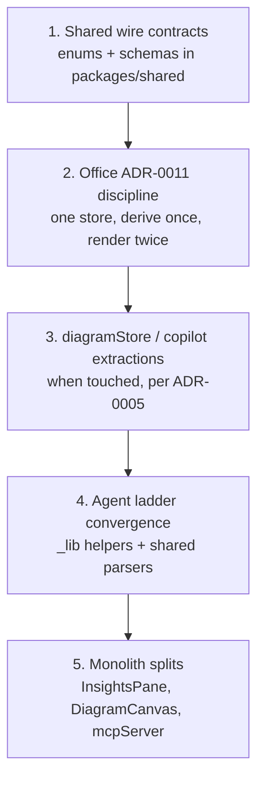

# Balanced coupling priorities

Where **archislop** should invest modularity work, ranked with Vlad Khononov's [Balanced Coupling Model](https://coupling.dev). This is the repo-specific companion to [`modularity.md`](modularity.md) (how to run a review) and the static sensors in [`sensors.md`](sensors.md).

**Last reviewed:** 2026-08-16

## How to use this doc

Run a full `/modularity:review` (Claude) or follow [`.cursor/skills/modularity/review/SKILL.md`](../../.cursor/skills/modularity/review/SKILL.md) (Cursor) when you need a scoped analysis of one directory. Use **this page** when you need the standing priority order across the whole monorepo.

### Balance rule (short)

Coupling is healthy when **integration strength** and **distance** counterbalance:

| Strength × distance | Name               | When it is fine                                                    |
| ------------------- | ------------------ | ------------------------------------------------------------------ |
| High × low          | High cohesion      | Parts must co-evolve and live together                             |
| Low × high          | Loose coupling     | Independent boundaries with explicit contracts                     |
| High × high         | **Tight coupling** | Frequent, expensive, unpredictable changes — **fix when volatile** |
| Low × low           | Low cohesion       | Unrelated parts piled together — cognitive load and drift          |

**Volatility** (how often the business area changes) decides urgency:

```
BALANCE = (STRENGTH XOR DISTANCE) OR NOT VOLATILITY
```

Unbalanced coupling in a stable corner is tolerable debt. Unbalanced coupling in a **core, fast-moving** area is daily pain.

## Domain map

| Area                                                                                   | Subdomain type                    | Volatility                              | Notes                                               |
| -------------------------------------------------------------------------------------- | --------------------------------- | --------------------------------------- | --------------------------------------------------- |
| Six-slot diagram generation (mermaid, infographic, metaphor3d, chart, anything, forms) | **Core** — product differentiator | High                                    | New slots, validation ladders, agent behaviour      |
| Office parody layer (moments, floor, meetings, cadence)                                | **Core** — active product surface | Very high                               | Dual renderers (ADR-0011); slices still shipping    |
| Wire contracts (AG-UI, session-events, MCP, Zod)                                       | **Core infrastructure**           | High                                    | Every feature crosses web ↔ server ↔ shared         |
| Collaboration / external agents (MCP join, handshakes, proposals)                      | **Supporting**                    | Medium                                  | Needed; not the main differentiator                 |
| LLM backends, TTS, identity                                                            | **Generic** — solved problems     | Low functional; variable implementation | Provider swaps are realistic; keep behind contracts |

**Core subdomain** — what gives the product its edge; the organisation keeps investing here.

**Supporting subdomain** — necessary custom work that does not differentiate the product.

**Generic subdomain** — mature problem space with off-the-shelf options (auth, payments, TTS).

## What is already balanced — protect it

### `packages/shared` as the contract boundary

Zod schemas, sanitizers, wire constants, and `applyPatch` give **contract coupling** at package distance between `apps/web` and `apps/server`. [ADR-0003](../decisions/0003-no-state-store-in-shared.md) (no state in shared) keeps that boundary clean. **Default:** new wire knowledge lands here first; apps import, never copy.

### ADR-0011 — one office state, two renderers

Desk chrome (`OfficeLayer`) and the isometric floor (`OfficeFloor`) share `officeMomentStore`, `officeCadence`, and IM history. That is deliberate **high cohesion** at low distance. New office features must extend the store once and render in both worlds — not fork state per mode. See [`docs/decisions/0011-two-office-renderers.md`](../decisions/0011-two-office-renderers.md).

### Shared agent repair ladder

[`invokePatchAgentWithRepair`](../../apps/server/src/agents/_lib/invokePatchAgentWithRepair.js) consolidates repair-loop semantics for chart, metaphor3d, anything, and forms. Extend this pattern instead of copying repair logic per agent.

### Static sensors

`verify:boundaries`, [`docs/agent-blast-radius.md`](../agent-blast-radius.md), and `check:wire` catch structural mistakes. They do **not** catch semantic coupling (duplicated business rules, hub files). Use this doc + modularity reviews for that layer.

---

## Priority 1 — Urgent

**Profile:** high integration strength × high distance × **high volatility**. Changes here are frequent and expensive.

### 1. Wire contracts without a single source of truth

[`docs/agent-blast-radius.md`](../agent-blast-radius.md) lists the correct touch set for each contract (shared → server → web → tests → docs). Pain appears when **knowledge is duplicated** instead of imported from shared.

| Hotspot                                                                                             | Symptom                                       | Fix                                                           |
| --------------------------------------------------------------------------------------------------- | --------------------------------------------- | ------------------------------------------------------------- |
| Office enums copied verbatim (e.g. `MEETING_VENUES` in `officePersonas.js` **and** `officeCast.js`) | One side books a room the other cannot script | One constant in `packages/shared`; both sides import          |
| AG-UI / session-events / MCP behaviour reimplemented per layer                                      | Producer-only diffs that pass lint            | Types and parsers in shared; translators only map shape       |
| New `contentType` or route field                                                                    | Server works; web silent                      | Schema in `diagramSchema.ts` first; follow blast-radius table |

**Focus rule:** every new wire field or enum → **`packages/shared` first**, then blast-radius checklist.

### 2. Office layer — dual-renderer discipline

Fastest-moving core area (~930 LOC `officeMomentStore.js`; 60+ files touch cast/presence). ADR-0011 violations look like small shortcuts but create **functional coupling** between desk and floor.

| Rule                                                                                                             | Rationale                                                                           |
| ---------------------------------------------------------------------------------------------------------------- | ----------------------------------------------------------------------------------- |
| Extend `officeMomentStore` / `officeCadence` — no floor-only or desk-only parallel store                         | One model, two views                                                                |
| Derive activity once in `officeFloorActivity.js` (`floorActivityFor`, `meetingActivityFor`)                      | Six components already draw figures; second composition sites disagree              |
| Sample diagram content via getters in `OfficeLayerSlot` — never subscribe the floor to `diagramStore` keystrokes | Floor re-render budget; whiteboard shows what was _drawn_, not live typing          |
| Use `isSpokenLine` for voice vs written — never inline `channel` checks                                          | Floor and desk already disagreed once on IM vs TTS                                  |
| Locale: `officeChromeCopy()` swaps whole bundles; UI locale deep-merges                                          | Different silent-failure modes — extend `officeLocale.test.js` / `uiLocale.test.js` |

Related ADRs and docs: [0011](../decisions/0011-two-office-renderers.md), [`docs/office-parody.md`](../office-parody.md), [`docs/office-isometric-mode.md`](../office-isometric-mode.md).

### 3. `diagramStore.js` — web-side hub

~1,045 LOC central state for intent/transform/analyze, streaming, collaboration, and locale. Theoretically cohesive; in practice **accidental volatility** — unrelated features serialize through one file.

ADR-0005 already split `App.jsx` into `features/*` hooks. **`diagramStore` is the next bottleneck** for diagram and collaboration work.

**Focus:** extract along existing seams (streaming, session hydrate, per-verb actions) **when you touch that area** — not a standalone "split diagramStore" project unless blocked.

---

## Priority 2 — Important

**Profile:** volatile areas where coupling is **trending wrong** or hub files amplify change cost.

### 4. Per-slot agent symmetry

Six content types each carry: shared parser → server tool → syntax fixer → LangChain agent → web renderer. Chart/metaphor/anything/forms share `invokePatchAgentWithRepair`; **Mermaid and Infographic still use bespoke repair loops** (intentional deferral per [ADR-0005](../decisions/0005-monolith-splits.md)).

| Risk                                       | Mitigation                                                                                        |
| ------------------------------------------ | ------------------------------------------------------------------------------------------------- |
| Same repair semantics implemented six ways | Put shared logic in `_lib/` or `packages/shared` when editing any agent                           |
| New metaphor **kind**                      | Ten touch points — see `CLAUDE.md` metaphor kind checklist; never add kind logic on one side only |
| New slot                                   | Follow [`docs/recipes/`](../recipes/) + blast-radius; schema before routes                        |

### 5. Monolith files (ADR-0005 in progress)

Split **on contact** when a feature already requires editing the file. Pattern: closure helpers → sibling `*Helpers.{js,ts}` → per-feature `register*` / feature hooks.

| File                                        | ~LOC  | Primary concern                                              |
| ------------------------------------------- | ----- | ------------------------------------------------------------ |
| `apps/web/src/components/InsightsPane.jsx`  | 1,835 | Thinking pane + critique + explain + timeline                |
| `apps/web/src/components/DiagramCanvas.jsx` | 1,849 | Renderer + selection + diff + highlight                      |
| `apps/server/src/mcp/mcpServer.js`          | 1,406 | Tool registration hub (`register*.js` pattern started)       |
| `apps/server/src/routes/copilot.ts`         | 1,195 | Routes + collaboration surface                               |
| `apps/web/src/state/officeMomentStore.js`   | 930   | Growing office hub — extract mutators when adding set pieces |

Progress tracker: [`docs/decisions/0005-monolith-splits.md`](../decisions/0005-monolith-splits.md).

### 6. Locale and copy coupling

Product behaviour is often gated by copy keys. Office bundles (`office.*.js`) and UI bundles (`controls.*.js`) have **opposite merge semantics** (swap whole bundle vs deep-merge onto English). Missing keys fail silently.

**Focus:** add parity assertions in `officeLocale.test.js` and `uiLocale.test.js` when shipping copy-driven features — cheaper than retroactive translation archaeology.

---

## Priority 3 — Maintain, do not over-invest

**Profile:** correct contract shape exists; keep provider knowledge encapsulated.

### 7. LLM provider boundary

[`llmProvider.js`](../../apps/server/src/agents/llmProvider.js) + `modelProfile: "fast" | "quality"` is the right **generic subdomain** contract. Prioritise only if provider-specific imports leak outside `apps/server/src/agents/` and cost config. See [`docs/llm-config.md`](../llm-config.md).

### 8. TTS and baked audio

Cast/voice tables live in `officeTts.js`; assets via `scripts/generate-office-audio.sh`. Never wire ElevenLabs/Chirp into routes or CI. See [`docs/audio-assets.md`](../audio-assets.md).

### 9. Metaphor3D scene internals

High local complexity (camera framing, fog, ten-place kind registration) but **lower change frequency** than office or diagram agents unless adding kinds. Use the scoped verify skill under `apps/web/.claude/skills/verify/` for visual regressions.

---

## Priority 4 — Deprioritise

| Item                                                                                 | Why                                                                              |
| ------------------------------------------------------------------------------------ | -------------------------------------------------------------------------------- |
| Legacy monolith internals you are not touching                                       | Unbalanced but **low volatility** — tolerable per balance rule                   |
| Big-bang microservice extraction                                                     | Single Cloud Run deploy; artificial distance raises cost without team boundaries |
| Forcing Mermaid/Infographic onto `invokePatchAgentWithRepair` before a concrete need | Incremental `_lib/` extraction beats a flag-day refactor                         |
| "Coupling purity" passes on stable generic code                                      | Volatility neutralises unbalanced coupling                                       |

---

## Recommended focus order



### If you only do three things

1. **Stop duplicating wire knowledge** — shared owns enums and Zod; web and server import.
2. **Treat the office as one domain model** — store + cadence + derivation utilities; desk and floor are views.
3. **Extract hubs on contact** — `diagramStore`, `copilot.ts`, `InsightsPane` along existing `features/*` seams.

---

## Anti-patterns to watch for

| Symptom                                                                | Likely imbalance                                             |
| ---------------------------------------------------------------------- | ------------------------------------------------------------ |
| Fixed server; forgot web translator                                    | Contract not centralized in shared                           |
| Floor and desk disagree about headset / coffee / meeting               | Second composition site — violates `floorActivityFor`        |
| Green floor tests; wrong card after layout change                      | Functional coupling to geometry without full-tile assertions |
| New `contentType` works server-side only                               | High-distance change without shared schema                   |
| Feature missing in `en-AU` only                                        | Locale functional coupling without parity test               |
| PR touches `officePersonas.js` but not `officeCast.js` (or vice versa) | Model coupling across prompt and client cast                 |

---

## Related

- [`modularity.md`](modularity.md) — how to run a Balanced Coupling review
- [`sensors.md`](sensors.md) — automated lint, boundaries, formatter guidance
- [`domain.md`](domain.md) — ADR conflicts and vocabulary
- [`docs/agent-blast-radius.md`](../agent-blast-radius.md) — wire change checklist
- [`docs/decisions/0005-monolith-splits.md`](../decisions/0005-monolith-splits.md) — monolith extraction progress
- [`docs/decisions/0011-two-office-renderers.md`](../decisions/0011-two-office-renderers.md) — office state vs renderers
- [`.cursor/skills/modularity/balanced-coupling/SKILL.md`](../../.cursor/skills/modularity/balanced-coupling/SKILL.md) — full model reference
