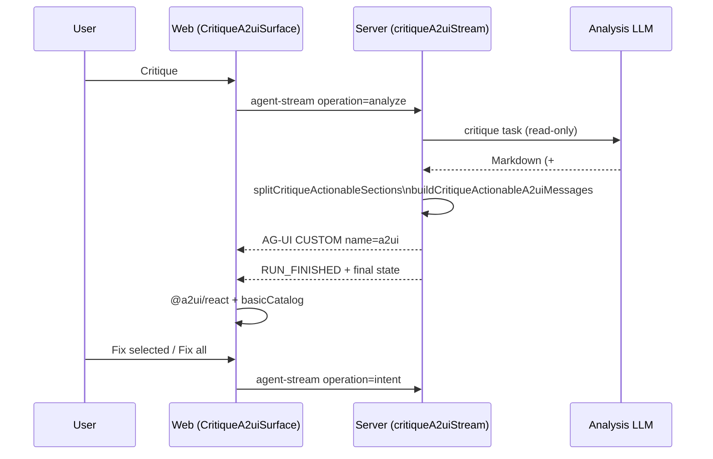
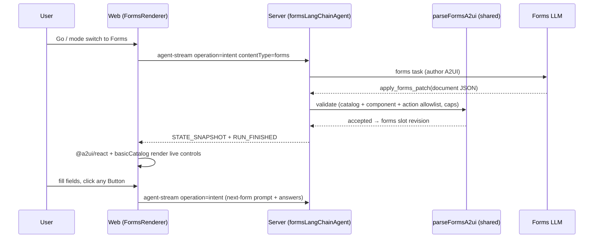

# A2UI in ArchiSlop — two deliberately different strategies

> **See also:** [`architecture-generative-ui.md`](architecture-generative-ui.md) — where A2UI sits among the three UI strategies and how MCP **critique-map** parallels the checklist. For where A2UI sits on the abstraction spectrum (vs. content DSLs and freeform HTML), see the [visual tour](https://acuhlmann.github.io/mermaid-gen/architecture-generative-ui-visual.html).

ArchiSlop uses **A2UI v0.9** (the [`basicCatalog`](https://a2ui.org/specification/v0_9/basic_catalog.json) allowlist) in **two places, with opposite trust models**. The distinction is the whole point of this doc — do not conflate them:

| Strategy                    | Where                      | Who writes the A2UI JSON?                                               | Wire                                                             | Interactivity                                                                 |
| --------------------------- | -------------------------- | ----------------------------------------------------------------------- | ---------------------------------------------------------------- | ----------------------------------------------------------------------------- |
| **Server-built (critique)** | Thinking pane, Style edits | **The server**, deterministically, from the model's **Markdown** signal | AG-UI `CUSTOM` `name: "a2ui"` (an insight artifact)              | Two fixed actions → the existing **intent** path (`Fix selected` / `Fix all`) |
| **Model-authored (forms)**  | The **Forms** canvas slot  | **The model**, directly — the A2UI document _is_ the slot content       | The slot's `diagramSource` (validated JSON, like chart/anything) | Every control is live; any button → generate the next form                    |

**Server-built** is A2UI as a _rendering target_: the LLM never emits UI JSON, so the component types and actions are structurally impossible to escape. **Model-authored** is A2UI _the way the spec intends_ — the agent designs the interface — and safety comes from a validation gate (`parseFormsA2ui`) instead of a builder. The rest of this doc covers both.

---

## Strategy 1 — Server-built A2UI (Critique checklist, Style edits)

For **Critique** runs that include an `## Actionable …` section, ArchiSlop renders an interactive checklist in the web **Thinking** pane. The wire format is **A2UI v0.9** carried inside **AG-UI** `CUSTOM` events — not a separate transport.

External MCP hosts get a parallel experience via the **critique-map MCP App** (`ui://archislop/critique-map.html`); see [`architecture-external-agents.md`](architecture-external-agents.md).

## Data flow (web, built-in Critique)



**Trust boundary:** the LLM does **not** author raw A2UI JSON. The server (and, as fallback, the client) builds messages deterministically from critique markdown. That keeps component types and actions allowlisted.

## Web UI

- Host: [`apps/web/src/components/CritiqueA2uiSurface.jsx`](../apps/web/src/components/CritiqueA2uiSurface.jsx) with `@a2ui/react` and `basicCatalog` (`https://a2ui.org/specification/v0_9/basic_catalog.json`).
- If the stream omits `a2ui` messages, the client rebuilds them with `buildCritiqueActionableA2uiMessages` from the same markdown (same trust model).
- **Fix selected** / **Fix all** map to fixed action names and trigger the existing **intent** path (`archislop_fixSelected`, `archislop_fixAll`).

## Trust model

| Concern                  | Mitigation                                                                                  |
| ------------------------ | ------------------------------------------------------------------------------------------- |
| Arbitrary UI components  | Allowlisted catalog only; no inline catalog from the model                                  |
| Arbitrary actions        | Fixed action names → intent flows only                                                      |
| Untrusted text in labels | Bullets sliced from critique markdown; treat like any rendered markdown (CSP, sanitization) |

## Server and shared code

| Piece                               | Location                                                                                          |
| ----------------------------------- | ------------------------------------------------------------------------------------------------- |
| Message builder                     | [`packages/shared/src/critiqueA2uiMessages.js`](../packages/shared/src/critiqueA2uiMessages.js)   |
| Stream hook (before `RUN_FINISHED`) | [`apps/server/src/agents/critiqueA2uiStream.js`](../apps/server/src/agents/critiqueA2uiStream.js) |
| AG-UI mapping                       | [`packages/shared/src/agentStreamEmitter.ts`](../packages/shared/src/agentStreamEmitter.ts)       |
| Client decode                       | [`apps/web/src/state/diagramStore.js`](../apps/web/src/state/diagramStore.js)                     |

## AG-UI envelope

Emitted as:

- AG-UI: `CUSTOM` with `name: "a2ui"`, `value: { messages }`
- Legacy reducer: `{ type: 'a2ui', messages }`

Full AG-UI contract: [`architecture-ag-ui.md`](architecture-ag-ui.md).

## MCP critique-map (external hosts)

When an external agent calls `drop_insight` with `variant: critique`, then `open_critique_review`, the host can render the same actionable sections in an MCP App iframe. Humans use `request_critique_fix` (`APP_ONLY_UI`) to queue items; the web client receives `critique_fix_request` on session-events and can run **Fix** like the native checklist.

## Explain sections (non-A2UI artifact)

Explain analyze runs emit AG-UI `CUSTOM` artifact `explain_sections` (server-parsed `##` headings) before `RUN_FINISHED`. The web Thinking pane renders [`ExplainSectionsPanel.jsx`](../apps/web/src/components/ExplainSectionsPanel.jsx) when the insight entry carries `explainSections` (see `packages/shared/src/explainSections.ts`).

## Style edits (artifact + optional A2UI)

Style, critique, and intent streams may include numbered lines such as icon replacements (`Replace ::icon(fa fa-fire) with 🔥`) or color shifts (`#4b3b00` → `#3a2a00`). The server parses these deterministically into AG-UI `CUSTOM` artifact `style_edits` (`packages/shared/src/styleEdits.ts`) before `RUN_FINISHED`. The web Thinking pane renders [`StyleEditsPanel.jsx`](../apps/web/src/components/StyleEditsPanel.jsx) (swatches, ramps, icon rows) and optionally [`StyleEditsA2uiSurface.jsx`](../apps/web/src/components/StyleEditsA2uiSurface.jsx) when `buildStyleEditsA2uiMessages` emits a second `CUSTOM` `a2ui` payload (`surfaceId: style-edits`, action `archislop_applyStyleEdits` → intent).

Streaming prose also passes through [`thinkingProseEnrich.jsx`](../apps/web/src/utils/thinkingProseEnrich.jsx) so partial tokens show inline swatches and chips without waiting for the artifact.

---

## Strategy 2 — Model-authored A2UI (Forms mode)

**Forms** is the sixth diagram slot and the one place where an ArchiSlop agent authors A2UI JSON directly. It exists to use A2UI _as intended_ — the agent designs a live, interactive interface — inside the app's corporate-IT parody: endless, tedious, faintly menacing intake forms. The user fills the controls in place; when they submit, the agent issues the **next** form. There is always another form.

Because the model writes the UI, the slot content **is** an A2UI document (not a chart DSL, not HTML). It is stored as the `forms` slot's `diagramSource`, a JSON wrapper:

```json
{
  "archislopFormsVersion": 1,
  "formTitle": "Form 27-B/6 — Request for Permission to Request",
  "formCode": "IT-INTK-0042-C",
  "messages": [
    /* A2UI v0.9 server→client messages: createSurface, updateComponents, updateDataModel */
  ]
}
```

### Data flow (web, Forms)



**Trust boundary:** the model _does_ author the A2UI JSON, so the gate is [`parseFormsA2ui`](../packages/shared/src/formsA2ui.ts) (shared, pure — runs identically on server apply and web preview), not a deterministic builder. It enforces:

| Concern                    | Mitigation (`parseFormsA2ui`)                                                                                                                                                                                                                                          |
| -------------------------- | ---------------------------------------------------------------------------------------------------------------------------------------------------------------------------------------------------------------------------------------------------------------------- |
| Arbitrary components       | `basicCatalog` allowlist only; any unknown `component` name is rejected                                                                                                                                                                                                |
| Arbitrary actions          | Every Button action must be `{ event: { name } }` — **no** `functionCall`. **Every** event name collapses to one capability on the client: capture answers → generate the next form. A form can never route to a diagram edit, navigation, or any other host behaviour |
| Inline catalog             | `catalogId` is normalized to the fixed basic-catalog id; the model cannot ship its own catalog                                                                                                                                                                         |
| Surface confusion          | Every message's `surfaceId` is normalized to `FORMS_A2UI_SURFACE_ID` so the renderer always knows what to read                                                                                                                                                         |
| Untrusted text in labels   | Rendered as A2UI text/markdown — same CSP/sanitization as the critique checklist                                                                                                                                                                                       |
| Payload / component blowup | JSON ≤ `FORMS_A2UI_MAX_LENGTH`, components ≤ `MAX_FORM_COMPONENTS`, messages ≤ `MAX_FORM_MESSAGES`; must have ≥1 input and ≥1 Button                                                                                                                                   |

There is deliberately **no A2UI runtime on the server** — that would pull `@a2ui/web_core` into the backend. The structural allowlist is the server-side gate; the client's `MessageProcessor` is the render-time check. This mirrors chart, where the shared parser precedes the `vega-lite/compile()` gate.

### The endless-forms loop

Any button click routes through `FormsRenderer` → `onFormSubmit` → `App.handleFormSubmit`, which summarizes the user's answers into a structured prompt (like **Fix**) and re-enters the **intent** path with `contentType: forms`. The agent acknowledges the answers with bureaucratic non-sequiturs, bumps the form code, and issues a fresh form. The visible prompt bar is untouched. On the empty canvas, `FormsRenderer` shows a client-side seed form (`buildFormsSeedDoc`) so the gauntlet is interactive from the first paint.

### Validation ladder (Forms)

`JSON.parse` → wrapper shape → catalog/component/action allowlist + caps (`parseFormsA2ui`, shared) → single-shot repair turns bounded by `FORMS_REPAIR_MAX_ATTEMPTS` (the agent re-prompts with the exact validator error). There is intentionally no deterministic sanitizer and no dedicated syntax-fixer model on day one — the allowlist errors are precise enough that agent repair turns carry the load. Add either layer only when bench data shows a recurring failure class.

### Forms code map

| Piece                        | Location                                                                                                                                                                   |
| ---------------------------- | -------------------------------------------------------------------------------------------------------------------------------------------------------------------------- |
| Parser / validator / seed    | [`packages/shared/src/formsA2ui.ts`](../packages/shared/src/formsA2ui.ts)                                                                                                  |
| Server validation gate       | [`apps/server/src/tools/formsA2uiTool.js`](../apps/server/src/tools/formsA2uiTool.js)                                                                                      |
| Agent + lazy service         | [`apps/server/src/agents/formsLangChainAgent.js`](../apps/server/src/agents/formsLangChainAgent.js)                                                                        |
| Tools (`apply_forms_patch`)  | [`apps/server/src/agents/diagramTools.js`](../apps/server/src/agents/diagramTools.js)                                                                                      |
| System prompt / repair guide | [`apps/server/src/prompts/formsSystemPrompt.js`](../apps/server/src/prompts/formsSystemPrompt.js), [`formsSyntaxGuard.js`](../apps/server/src/prompts/formsSyntaxGuard.js) |
| Web renderer + submit loop   | [`apps/web/src/components/FormsRenderer.jsx`](../apps/web/src/components/FormsRenderer.jsx)                                                                                |

---

## Extending Gen UI safely

| Approach                                                  | Fits ArchiSlop? | Notes                                                                                                                                                           |
| --------------------------------------------------------- | --------------- | --------------------------------------------------------------------------------------------------------------------------------------------------------------- |
| More server-built A2UI from Markdown                      | Yes             | Same trust model — new catalogs/actions must map to known routes (e.g. intent only).                                                                            |
| Server-built `CUSTOM` artifacts (e.g. `explain_sections`) | Yes             | Parsed markdown → structured UI without model-authored JSON.                                                                                                    |
| Model-authored A2UI JSON **as an insight/edit action**    | Discouraged     | For diagram editing, keep it on validated tool paths — use Markdown + builder instead.                                                                          |
| Model-authored A2UI JSON **as slot content** (Forms)      | Yes, gated      | The A2UI document _is_ the content; validate with a shared allowlist parser (`parseFormsA2ui`) and collapse all actions to one safe capability. See Strategy 2. |
| AG-UI `CUSTOM` artifacts (non-A2UI)                       | Possible        | Add a `name` in `agUiWireConstants.js` + reducer in `applyAgentStreamInsightEvent.js`.                                                                          |
| MCP App for new human workflows                           | Yes             | New `ui://` bundle + `registerAppResource` + tool with `UI_META`.                                                                                               |

Proposal review in the **web** today uses React (`AgentProposalCard`), not A2UI — MCP **proposal-review** App is the rich host-side counterpart. Unifying those is a documented roadmap item in [`architecture-generative-ui.md`](architecture-generative-ui.md).
