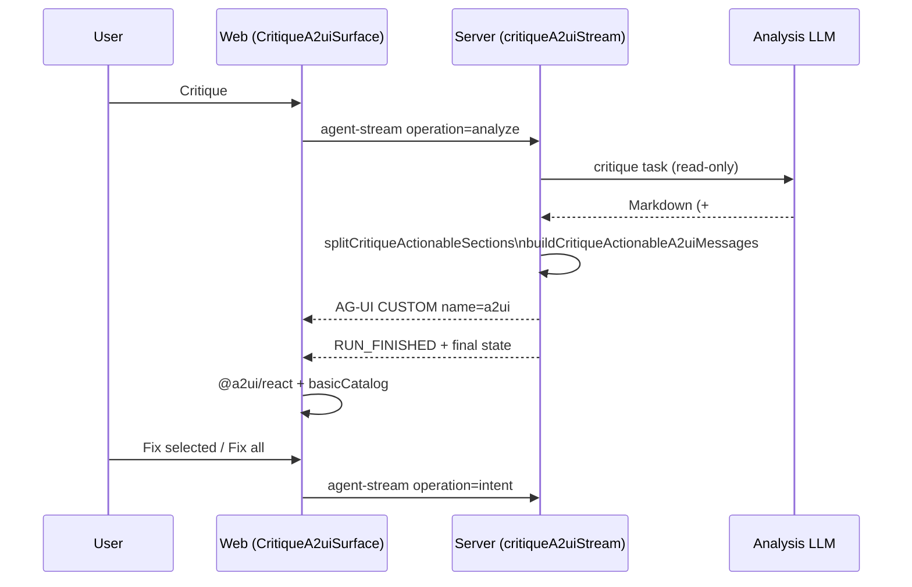

# A2UI payloads on the critique stream

> **See also:** [`architecture-generative-ui.md`](architecture-generative-ui.md) — why A2UI is limited to critique and how MCP **critique-map** parallels it. For where A2UI sits on the abstraction spectrum (vs. content DSLs and freeform HTML), see the [visual tour](https://acuhlmann.github.io/mermaid-gen/architecture-generative-ui-visual.html).

For **Critique** runs that include an `## Actionable …` section, ArchiSlop renders an interactive checklist in the web **Thinking** pane. The wire format is **A2UI v0.9** carried inside **AG-UI** `CUSTOM` events — not a separate transport.

External MCP hosts get a parallel experience via the **critique-map MCP App** (`ui://archislop/critique-map.html`); see [`architecture-external-agents.md`](architecture-external-agents.md).

## Data flow (web, built-in Critique)

**Trust boundary:** the LLM does **not** author raw A2UI JSON. The server (and, as fallback, the client) builds messages deterministically from critique markdown. That keeps component types and actions allowlisted.

## Web UI

- Host: [`apps/web/src/components/CritiqueA2uiSurface.jsx`](../apps/web/src/components/CritiqueA2uiSurface.jsx) with `@a2ui/react` and `basicCatalog` (`https://a2ui.org/specification/v0_9/basic_catalog.json`).
- If the stream omits `a2ui` messages, the client rebuilds them with `buildCritiqueActionableA2uiMessages` from the same markdown (same trust model).
- **Fix selected** / **Fix all** map to fixed action names and trigger the existing **intent** path (`archislop_fixSelected`, `archislop_fixAll`).

## Trust model

| Concern | Mitigation |
| --- | --- |
| Arbitrary UI components | Allowlisted catalog only; no inline catalog from the model |
| Arbitrary actions | Fixed action names → intent flows only |
| Untrusted text in labels | Bullets sliced from critique markdown; treat like any rendered markdown (CSP, sanitization) |

## Server and shared code

| Piece | Location |
| --- | --- |
| Message builder | [`packages/shared/src/critiqueA2uiMessages.js`](../packages/shared/src/critiqueA2uiMessages.js) |
| Stream hook (before `RUN_FINISHED`) | [`apps/server/src/agents/critiqueA2uiStream.js`](../apps/server/src/agents/critiqueA2uiStream.js) |
| AG-UI mapping | [`packages/shared/src/agentStreamEmitter.js`](../packages/shared/src/agentStreamEmitter.js) |
| Client decode | [`apps/web/src/state/diagramStore.js`](../apps/web/src/state/diagramStore.js) |

## AG-UI envelope

Emitted as:

- AG-UI: `CUSTOM` with `name: "a2ui"`, `value: { messages }`
- Legacy reducer: `{ type: 'a2ui', messages }`

Full AG-UI contract: [`architecture-ag-ui.md`](architecture-ag-ui.md).

## MCP critique-map (external hosts)

When an external agent calls `drop_insight` with `variant: critique`, then `open_critique_review`, the host can render the same actionable sections in an MCP App iframe. Humans use `request_critique_fix` (`APP_ONLY_UI`) to queue items; the web client receives `critique_fix_request` on session-events and can run **Fix** like the native checklist.

## Explain sections (non-A2UI artifact)

Explain analyze runs emit AG-UI `CUSTOM` artifact `explain_sections` (server-parsed `##` headings) before `RUN_FINISHED`. The web Thinking pane renders [`ExplainSectionsPanel.jsx`](../apps/web/src/components/ExplainSectionsPanel.jsx) when the insight entry carries `explainSections` (see `packages/shared/src/explainSections.ts`).

## Style edits (artifact + optional A2UI)

Style, critique, and intent streams may include numbered lines such as icon replacements (`Replace ::icon(fa fa-fire) with 🔥`) or color shifts (`#4b3b00` → `#3a2a00`). The server parses these deterministically into AG-UI `CUSTOM` artifact `style_edits` (`packages/shared/src/styleEdits.ts`) before `RUN_FINISHED`. The web Thinking pane renders [`StyleEditsPanel.jsx`](../apps/web/src/components/StyleEditsPanel.jsx) (swatches, ramps, icon rows) and optionally [`StyleEditsA2uiSurface.jsx`](../apps/web/src/components/StyleEditsA2uiSurface.jsx) when `buildStyleEditsA2uiMessages` emits a second `CUSTOM` `a2ui` payload (`surfaceId: style-edits`, action `archislop_applyStyleEdits` → intent).

Streaming prose also passes through [`thinkingProseEnrich.jsx`](../apps/web/src/utils/thinkingProseEnrich.jsx) so partial tokens show inline swatches and chips without waiting for the artifact.

## Extending Gen UI safely

| Approach | Fits ArchiSlop? | Notes |
| --- | --- | --- |
| More server-built A2UI from Markdown | Yes | Same trust model — new catalogs/actions must map to known routes (e.g. intent only). |
| Server-built `CUSTOM` artifacts (e.g. `explain_sections`) | Yes | Parsed markdown → structured UI without model-authored JSON. |
| Model-authored A2UI JSON | Discouraged | Bypasses allowlist; use Markdown + builder instead. |
| AG-UI `CUSTOM` artifacts (non-A2UI) | Possible | Add a `name` in `agUiWireConstants.js` + reducer in `applyAgentStreamInsightEvent.js`. |
| MCP App for new human workflows | Yes | New `ui://` bundle + `registerAppResource` + tool with `UI_META`. |

Proposal review in the **web** today uses React (`AgentProposalCard`), not A2UI — MCP **proposal-review** App is the rich host-side counterpart. Unifying those is a documented roadmap item in [`architecture-generative-ui.md`](architecture-generative-ui.md).
