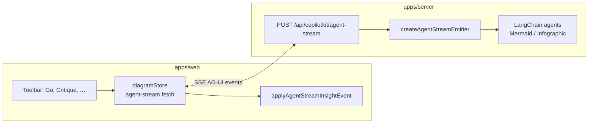

# AG-UI wire contract (built-in agent streams)

> **See also:** [`architecture-generative-ui.md`](architecture-generative-ui.md) — how AG-UI relates to A2UI, MCP Apps, and session-events.

The **web UI’s built-in agents** (Go, Refine, Critique, Show Thinking, etc.) stream over **AG-UI** on Server-Sent Events. LangChain services emit through `createAgentStreamEmitter` in `@archislop/shared` (re-exported from `apps/server/src/agents/agUiEvents.js`). The client decodes with `@ag-ui/client` and `createAgUiTranslator` in `apps/web/src/state/diagramStore.js`, then reduces events in `applyAgentStreamInsightEvent.js`.

**External agents do not use this channel.** They use **MCP** at `/mcp` and sync collaboration through **session-events** — see [`architecture-external-agents.md`](architecture-external-agents.md).

## Where AG-UI sits

CopilotKit’s **runtime handler** on the same base path also speaks AG-UI for clients that use `CopilotRuntime` directly (`apps/server/src/agents/copilotRuntimeAgent.js`). The primary ArchiSlop UI uses the custom router first.

## Lifecycle (route-owned)

The route opens and closes the run; agents must not emit `RUN_STARTED`.

| Event | When |
| --- | --- |
| `RUN_STARTED` | First event on `agent-stream` |
| `STEP_STARTED` (`planning`) | Immediately after `RUN_STARTED` |
| Agent events | Via `createAgentStreamEmitter` |
| Heartbeat | When the stream is quiet for `MERMAID_STREAM_HEARTBEAT_MS` (default 6s) — keeps proxies from closing idle SSE |
| `RUN_ERROR` | Uncaught exception in route handler |

## Semantic agent API (`emit` helpers)

| Helper | Legacy shape | AG-UI output |
| --- | --- | --- |
| `emit.phase(id, label)` | `{ type:'phase', id, label }` | `STEP_STARTED` / `STEP_FINISHED` |
| `emit.status(text)` | `{ type:'status', text }` | `CUSTOM(status)` |
| `emit.token(text)` | `{ type:'token', text }` | `TEXT_MESSAGE_*` |
| `emit.a2ui(messages)` | `{ type:'a2ui', messages }` | `CUSTOM(a2ui)` |
| `emit.patchSummary(...)` | `{ type:'artifact', kind:'patch_summary' }` | `STATE_DELTA` |
| `emit.toolStart(name, id?)` | `{ type:'tool_start' }` | `TOOL_CALL_START` |
| `emit.toolEnd(name, id?)` | `{ type:'tool_end' }` | `TOOL_CALL_END` |
| `emit.draftPreview(ct, source)` | `{ type:'draftPreview' }` | `STATE_DELTA` on `/<slot>/draftSource` |
| `emit.final(payload)` | `{ type:'final', ... }` | `STATE_SNAPSHOT` + `RUN_FINISHED` |
| `emit.error(message, code?)` | `{ type:'error' }` | `RUN_ERROR` |

Pass-through: if `emit` receives an object whose `type` is already an `AGUI_EVENT_TYPE` value, it is written unchanged.

## `CUSTOM` event names

From [`packages/shared/src/agUiWireConstants.js`](../packages/shared/src/agUiWireConstants.js):

| `name` | `value` | Web legacy |
| --- | --- | --- |
| `status` | `{ text }` | `{ type:'status', text }` |
| `a2ui` | `{ messages }` | `{ type:'a2ui', messages }` |
| `artifact` | opaque artifact object | passthrough |
| `legacy` | unknown | dropped |

Critique checklists use `CUSTOM` + `name: "a2ui"` — details in [`architecture-a2ui.md`](architecture-a2ui.md).

## `STATE_DELTA` paths

| Path | Purpose | Web legacy |
| --- | --- | --- |
| `/mermaid/draftSource` | Live Mermaid draft during tool streaming | `draftPreview` |
| `/infographic/draftSource` | Live Infographic DSL draft | `draftPreview` |
| `/mermaid/revisionId` | Patch summary (with `/lastPatchSummary`) | `artifact` `patch_summary` |
| `/infographic/revisionId` | Same for infographic slot | `artifact` `patch_summary` |
| `/lastPatchSummary` | Line stats for insights chips | `artifact` `patch_summary` |

`STATE_SNAPSHOT` is cached on the client and merged into the next `RUN_FINISHED` → `{ type:'final', state }`.

## Session identity

`resolveSessionIdFromRequest` accepts, in order:

1. Header `x-session-id`
2. Query `sessionId` or `threadId`

All `/api/copilotkit/*` routes use this resolver. The web client persists a UUID in `localStorage` and sends the header on REST and `sessionId` on `EventSource` for collaboration.

## What the web renders (Gen UI surface)

| Stream data | AG-UI mechanism | Web consumer |
| --- | --- | --- |
| Status line | `CUSTOM(status)` | Insights status chip |
| Streaming prose | `TEXT_MESSAGE_*` | Critique / explain text |
| Tool progress | `TOOL_CALL_*` | Phase labels in Thinking pane |
| Live diagram while patching | `STATE_DELTA` `/mermaid|infographic/draftSource` | Draft preview on canvas |
| Patch stats | `STATE_DELTA` revision + `/lastPatchSummary` | Insight artifacts |
| Critique checkboxes | `CUSTOM(a2ui)` | [`CritiqueA2uiSurface.jsx`](../apps/web/src/components/CritiqueA2uiSurface.jsx) — see [`architecture-a2ui.md`](architecture-a2ui.md) |
| Final diagram | `STATE_SNAPSHOT` + `RUN_FINISHED` | `diagramStore` applies revision |

External agents do **not** consume this stream; they use MCP + MCP Apps ([`architecture-generative-ui.md`](architecture-generative-ui.md)).

## Related docs

- Generative UI map: [`architecture-generative-ui.md`](architecture-generative-ui.md)
- A2UI critique payloads: [`architecture-a2ui.md`](architecture-a2ui.md)
- External agents (MCP): [`architecture-external-agents.md`](architecture-external-agents.md)
- CopilotKit runtime agent: `apps/server/src/agents/copilotRuntimeAgent.js`
