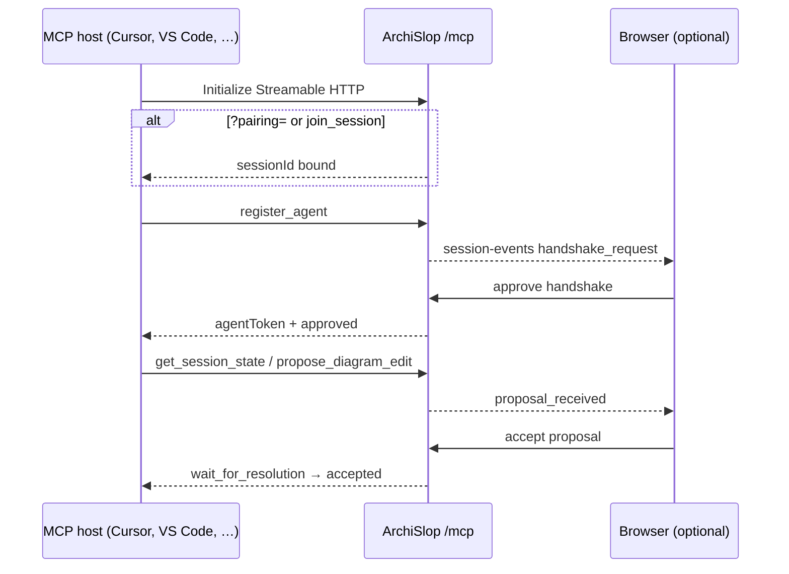
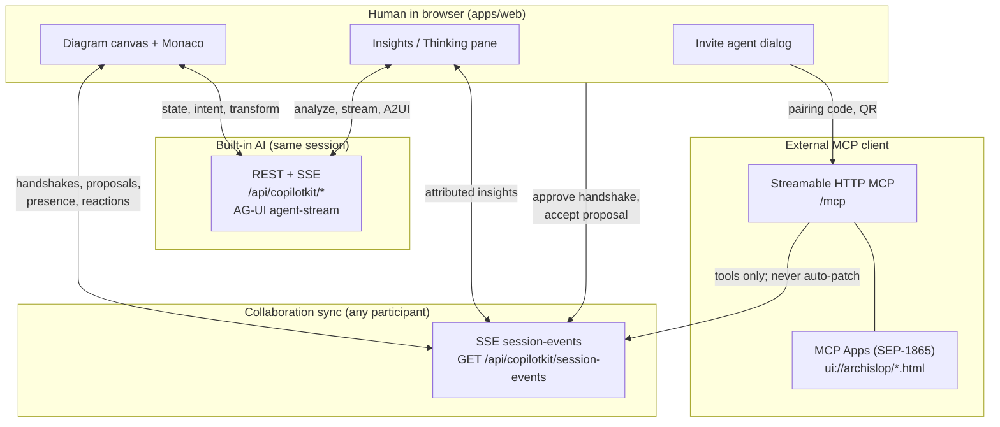
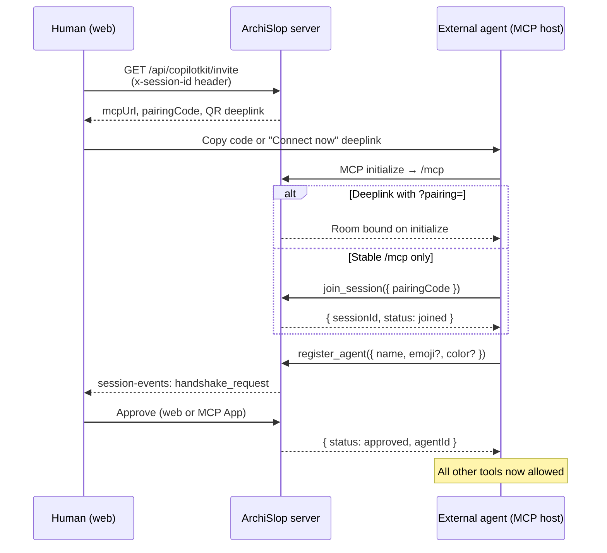
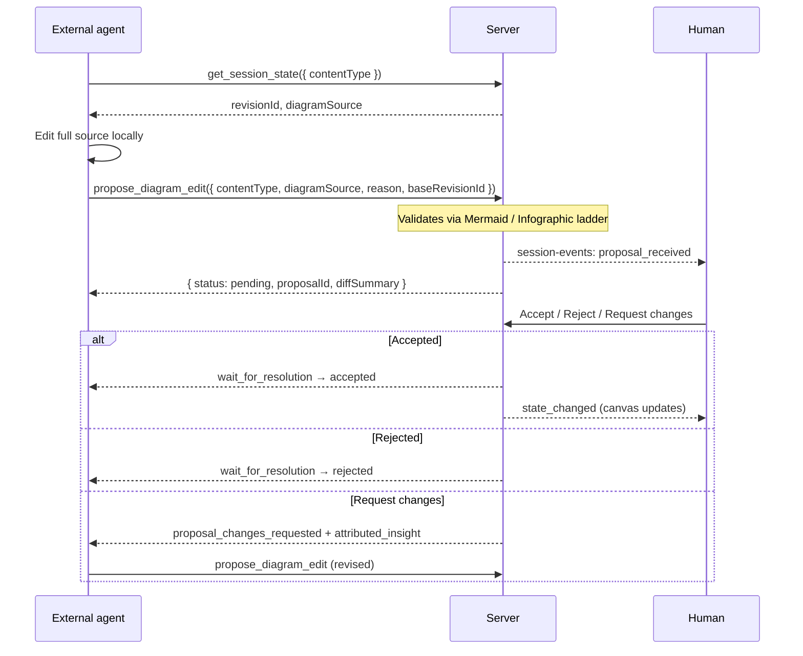

# External agents: MCP, collaboration, and MCP Apps

ArchiSlop is built for **humans and external agents in the same room**. A human edits in the web UI; Cursor, Claude Desktop, VS Code Copilot, Claude Code, or any MCP-capable client can join the same session, read diagram state, propose edits, drop insights, and react — without bypassing human approval.

This doc is the **operator guide for guest agents**. For built-in LangChain runs (Go, Critique, etc.) see [`architecture-ag-ui.md`](architecture-ag-ui.md). For critique checklists in the web Thinking pane see [`architecture-a2ui.md`](architecture-a2ui.md).

## Hybrid workflow (browser + MCP host)

Most teams run **ArchiSlop in the browser** and **Cursor / VS Code / Claude** as the guest agent. In that setup:

1. Use the **web UI** for handshake approval, proposal accept/reject, and canvas edits.
2. Call `open_web_companion` (or let `register_agent` / `propose_diagram_edit` open it) for a read-only queue in the MCP host — links point back to the web UI for real actions.
3. Treat MCP App **Approve/Deny** buttons as optional; in Cursor they are often non-interactive. The **handshake** and **proposal-review** Apps remain useful when no browser tab is open.

**Full Gen UI map (AG-UI vs A2UI vs MCP Apps, host matrix, roadmap):** [`architecture-generative-ui.md`](architecture-generative-ui.md).

## MCP connectivity (quick reference)

| Step | Mechanism |
| --- | --- |
| Install server | `GET /api/copilotkit/invite` → `mcpUrl`, `cursorInstallUrl`, `vscodeInstallUrl` |
| Bind room | `join_session({ pairingCode })` or `GET /mcp?pairing=` / `?token=` on init |
| Real-time sync | `subscribe_session_events` → SSE URL + `agentToken`; Apps use shared bridge with long-poll fallback |
| Human UI in host | MCP Apps (`_meta.ui.resourceUri`); see tool table below |
| Sticky transport | In-process per instance — Cloud Run: `min-instances=1` or tolerate re-init |
| Shared pairing | `REDIS_URL` — diagram/proposal state not shared across instances yet |

## Three channels (do not confuse them)

| Channel | Protocol | Who uses it | What it carries |
| --- | --- | --- | --- |
| **Custom Copilot routes** | REST + AG-UI SSE | Web UI built-in agents | Intent, transform, analyze, style, diagram patches |
| **Session events** | SSE (`session-events`) | Web UI + all participants | Handshakes, proposals, presence, focus, reactions, attributed insights, `state_changed` from accepted proposals |
| **MCP** | Streamable HTTP at `/mcp` | External agents | Tools, resources, MCP App HTML; proposals and handshakes that mirror session events |

**Rule:** diagram source on the server is authoritative. External agents **never** call a “write diagram” tool. They call `propose_diagram_edit`; a human accepts in the web UI, an MCP App, or via REST.

## Join a session

Use a **stable MCP URL** (`https://<host>/mcp`) plus a **pairing code** from **Invite agent** in the web UI. Pairing codes map to the browser’s `x-session-id` room and rotate when you open a new tab session.

**Ways to bind the MCP transport to a room**

| Method | When to use |
| --- | --- |
| `join_session({ pairingCode })` | Recommended: configure `/mcp` once, paste fresh code per room |
| `join_session({ sessionId })` | Advanced: legacy session-in-URL style |
| `GET /mcp?pairing=<code>` on initialize | One-click **Connect now** deeplinks from Invite agent |
| `GET /mcp?session=<id>` on initialize | Legacy; prefer pairing |

On Cloud Run set `PUBLIC_BASE_URL` (no trailing slash) so invites and deeplinks use the production host, not `localhost`.

**Cursor / VS Code one-click install:** `GET /api/copilotkit/invite` returns `cursorInstallUrl` and `vscodeInstallUrl` (see `apps/server/src/mcp/mcpInviteLinks.js`).

## Handshake (register before anything else)

1. External agent calls `register_agent({ name, emoji?, color? })`.
2. Server creates a handshake request and publishes `handshake_request` on session-events.
3. Human approves in:
   - ArchiSlop web (`AgentHandshakeDialog`), or
   - MCP App `ui://archislop/handshake.html` via `resolve_handshake`, or
   - REST `POST /api/copilotkit/handshakes/:requestId/approve`
4. Agent receives `{ status: approved, agentId, … }` and appears in the presence bar.

Until approved, every tool except `join_session`, `open_session_pairing`, `get_mcp_binding`, `get_session_bootstrap`, `register_agent`, and `get_handshake_status` returns an error asking for registration (or room binding).

`register_agent` returns immediately with `{ status: 'pending', requestId }` by default. Pass `wait: true` to block up to ~50s for approval. Poll `get_handshake_status({ requestId })` or use `subscribe_session_events` / `wait_for_session_event` after approval. On approve, the agent receives `agentToken` for authenticated session-events SSE.

Pairing codes expire (refreshed when **Invite agent** opens). Humans can **Rotate code** in the invite dialog; agents receive `pairing_rotated` on session-events and should call `join_session` again.

MCP initialize also accepts `?token=` (signed invite JWT from `GET /invite`) as an alternative to `?pairing=`.

## Propose an edit (human-in-the-loop)

- Always pass the current `baseRevisionId` from `get_session_state`. Stale proposals return `stale_revision` or are marked stale on accept.
- Proposals are **full replacement** source, not patches. Read → edit → propose.
- `wait_for_resolution({ proposalId })` long-polls (~50s) for accept / reject / stale.

**Human resolution surfaces**

| Surface | Tools / routes |
| --- | --- |
| Web Insights pane | Proposal cards, accept / reject |
| MCP App `ui://archislop/proposal-review.html` | `resolve_proposal`, `request_proposal_changes` |
| REST | `POST /api/copilotkit/proposals/:id/accept` or `…/reject` |

**Web + MCP host at once (e.g. Cursor + ArchiSlop in the browser):** use the **web** handshake dialog and Insights proposal cards. MCP Apps that open in Cursor are the same actions duplicated for MCP-only workflows; Accept/Reject buttons in Cursor’s MCP App panel are often non-interactive. Ignore those panels when the web UI is open.

The proposal-review App shows Mermaid preview (CDN, with load/render timeouts), unified diff, graph-level node/edge chips (`mermaidDiffTool` / shared infographic diff). If previews hang, use **Unified diff** / **Source** tabs or the web proposal card.

## MCP Apps (SEP-1865)

Tools that declare `_meta.ui.resourceUri` open interactive HTML in MCP hosts that support Apps (Claude, Claude Desktop, VS Code Copilot, Goose, etc.). HTML bundles live in [`apps/server/src/mcp/apps/`](../apps/server/src/mcp/apps/).

### UI visibility

| Pattern | `_meta.ui` | Who should call the tool |
| --- | --- | --- |
| **Default** | `{ resourceUri }` | Agent or human — host opens App when tool runs |
| **App-only** | `{ resourceUri, visibility: ['app'] }` | Human inside the App iframe (`resolve_handshake`, `resolve_proposal`, `request_proposal_changes`, `request_critique_fix`) |

Registration helpers: `UI_META` / `APP_ONLY_UI` in [`registerMcpApps.js`](../apps/server/src/mcp/registerMcpApps.js).

### Choosing an MCP App

| Situation | Open this |
| --- | --- |
| Browser + Cursor both open | `open_web_companion` (read-only queue; act in web) |
| First join / new pairing code | `open_session_pairing` or `join_session` |
| Agent onboarding | `open_welcome` / `get_session_bootstrap` |
| See diagram while proposing | `open_diagram_canvas` |
| MCP-only human review | `open_proposal_review`, `open_handshake_review` |
| Critique with fix bullets | `open_critique_review` |
| No App support in host | JSON tools + `wait_for_resolution` / `wait_for_session_event` |

| `ui://` resource | Tool(s) | Audience | Purpose |
| --- | --- | --- | --- |
| `ui://archislop/web-companion.html` | `open_web_companion`, `register_agent`, `propose_diagram_edit` | Human in MCP host (hybrid) | Read-only: action queue, activity feed, links to approve in **web** |
| `ui://archislop/handshake.html` | `open_handshake_review`, `resolve_handshake` | Human in MCP-only host | Approve / deny agent join (legacy; not room pairing) |
| `ui://archislop/session-pairing.html` | `join_session`, `open_session_pairing`, `get_mcp_binding` | Agent | Paste pairing code; bind MCP transport to browser room |
| `ui://archislop/canvas-preview.html` | `open_diagram_canvas` | Agent (+ human) | Live Mermaid / infographic DSL preview + web link |
| `ui://archislop/proposal-review.html` | `open_proposal_review`, `resolve_proposal`, `request_proposal_changes` | Human in MCP-only host | Full diff review, accept / reject / request changes |
| `ui://archislop/proposal-inbox.html` | `open_my_proposals`, `get_my_proposals` | Agent | Your proposals (pending / resolved) |
| `ui://archislop/session-dashboard.html` | `open_session_dashboard`, `get_session_snapshot` | Either | War room: presence, proposals, **Review** per proposal |
| `ui://archislop/insights-feed.html` | `open_insights_feed`, `get_insights` | Agent (+ human) | Thinking-pane attributed insights (server ring buffer) |
| `ui://archislop/critique-map.html` | `open_critique_review`, `request_critique_fix` | Human (+ agent opens map) | Actionable critique checklist |
| `ui://archislop/session-events.html` | `open_session_events`, `subscribe_session_events` | Either | Live SSE feed (long-poll fallback) for proposals, presence, insights |
| `ui://archislop/welcome.html` | `open_welcome`, `get_session_bootstrap` | Agent | Onboarding checklist, revisions, next-step shortcuts |
| `ui://archislop/compose-insight.html` | `open_compose_insight` | Either | Post note / suggestion / critique without editing the diagram |
| `ui://archislop/focus-picker.html` | `open_focus_picker` | Agent | Pick a node to highlight via `set_focus` |

`resolve_*` and `request_proposal_changes` / `request_critique_fix` use `visibility: ['app']` — intended for MCP App iframes, not the proposing agent.

MCP Apps share a **session event bridge** (SSE + `wait_for_session_event` fallback) and **nav chrome** to jump between Apps without retyping tool names. Session-events SSE accepts `agentToken` as a query param when `EventSource` cannot send `x-agent-token`.

Built-in web critique still uses **A2UI** on AG-UI streams ([`architecture-a2ui.md`](architecture-a2ui.md)); the critique-map MCP App reuses the same actionable-bullet parsing for external hosts.

## MCP tool reference

| Tool | After handshake? | Role |
| --- | --- | --- |
| `open_web_companion` | Bound session | Hybrid read-only dashboard (queue + activity); human approves in web |
| `join_session` | No | Bind room; opens **session-pairing** MCP App when code omitted |
| `open_session_pairing` | No | Open pairing MCP App (paste code from Invite agent) |
| `get_mcp_binding` | No | JSON binding status + bootstrap snapshot |
| `get_session_bootstrap` | Bound room | One-shot join checklist, revisions, handshake status |
| `register_agent` | No | Request join; opens handshake MCP App (`wait?` optional) |
| `get_handshake_status` | Bound room | Poll handshake approval; returns `agentToken` when approved |
| `subscribe_session_events` | Yes | SSE URL + `agentToken` for real-time events |
| `wait_for_session_event` | Yes | Long-poll next event after `sinceSeq` |
| `get_session_state` | Yes | Read slot or full session; includes `webCanvasUrl` and slot previews |
| `open_diagram_canvas` | Yes | Canvas-preview MCP App (Mermaid render + web link) |
| `propose_diagram_edit` | Yes | Submit validated proposal |
| `open_proposal_review` | Bound session | Re-open proposal-review App by `proposalId` |
| `wait_for_resolution` | Yes | Long-poll proposal outcome |
| `get_my_proposals` / `open_my_proposals` | Yes | List / inbox UI for this agent’s proposals |
| `drop_insight` | Yes | Post note / critique / suggestion (stored + session event) |
| `get_insights` / `open_insights_feed` | Yes | Read attributed insights (catch up after late join) |
| `open_critique_review` | Yes | Open critique-map App for structured review |
| `set_focus` | Yes | Highlight node on canvas for humans |
| `react` | Yes | Emoji on revision, insight, or node |
| `get_session_snapshot` | Bound session | Presence + pending proposals (JSON, diff summary) |
| `open_session_dashboard` | Bound session | Same snapshot + dashboard MCP App |
| `open_session_events` | Yes | Live events MCP App + SSE URL |
| `open_welcome` | Bound room | Onboarding MCP App + bootstrap JSON |
| `open_compose_insight` | Yes | Compose-insight MCP App |
| `open_focus_picker` | Yes | Focus-picker MCP App (visual node list) |
| `resolve_handshake` | App (human) | Approve / deny handshake |
| `resolve_proposal` | App (human) | Accept / reject proposal |
| `request_proposal_changes` | App (human) | Comment without closing proposal |
| `request_critique_fix` | App (human) | Queue fix for selected critique bullets |

**Prompt:** `archislop_collaboration_guide` — short system-style brief registered on the MCP server; point external agents at it on connect.

## Session events (web sync)

`GET /api/copilotkit/session-events?sessionId=…` (browser also sends `x-session-id`).

Initial `snapshot` includes presence and pending proposals. Subsequent events include:

| Event type | Meaning |
| --- | --- |
| `handshake_request` | New external agent wants in |
| `handshake_resolved` | Approved or denied |
| `pairing_rotated` | New pairing code; external agents should re-`join_session` |
| `proposal_received` | New pending edit |
| `proposal_resolved` | Accepted, rejected, or stale |
| `proposal_changes_requested` | Human asked for revision (proposal stays pending) |
| `presence_update` | Agents online / focus changed |
| `attributed_insight` | Agent or human comment in Insights |
| `reaction` | Emoji on revision, insight, or node |
| `state_changed` | Diagram updated (e.g. accepted proposal) |
| `critique_fix_request` | MCP App queued fix for web **Fix** flow |

Implementation: [`apps/server/src/state/sessionEventBus.js`](../apps/server/src/state/sessionEventBus.js), web client [`apps/web/src/state/sessionEventsClient.js`](../apps/web/src/state/sessionEventsClient.js).

## REST collaboration API (web UI parity)

Same stores as MCP; useful for integrators who do not speak MCP.

| Method | Path |
| --- | --- |
| `GET` | `/api/copilotkit/invite` |
| `POST` | `/api/copilotkit/invite/rotate-pairing` |
| `POST` | `/api/copilotkit/join-room` (`{ pairingCode }` → `sessionId`) |
| `GET` | `/api/copilotkit/session-events` (optional header `x-agent-token` for external agents) |
| `GET` | `/api/copilotkit/presence` |
| `GET` | `/api/copilotkit/handshakes` |
| `POST` | `/api/copilotkit/handshakes/:requestId/approve` |
| `POST` | `/api/copilotkit/handshakes/:requestId/deny` |
| `GET` | `/api/copilotkit/proposals` |
| `POST` | `/api/copilotkit/proposals/:proposalId/accept` |
| `POST` | `/api/copilotkit/proposals/:proposalId/reject` |

## Guest agent etiquette (summary)

1. `open_session_pairing` or `join_session` → `register_agent` → wait for approval.
2. `open_diagram_canvas` once to align visually; `get_session_state` before every proposal (both return `webCanvasUrl`).
3. `get_insights` or `open_insights_feed` if you joined mid-session.
4. Small, motivated proposals with a clear `reason`; track via `open_my_proposals`.
5. `set_focus` when discussing a specific node.
6. `drop_insight` for commentary; `propose_diagram_edit` only when you want a real edit.
7. Never expect auto-apply — poll `wait_for_resolution` or watch session events.
8. Use `archislop_collaboration_guide` prompt on the MCP server for a fuller brief.

Set `ARCHISLOP_WEB_URL` (or `PUBLIC_BASE_URL`) so `webCanvasUrl` points at the Vite app, not only the API host.

## Code map

| Area | Path |
| --- | --- |
| MCP server + tools | [`apps/server/src/mcp/mcpServer.js`](../apps/server/src/mcp/mcpServer.js) |
| Accept / reject / handshake | [`apps/server/src/mcp/mcpCollaborationActions.js`](../apps/server/src/mcp/mcpCollaborationActions.js) |
| MCP App HTML | [`apps/server/src/mcp/apps/`](../apps/server/src/mcp/apps/) |
| Invite + install links | [`apps/server/src/routes/copilot.js`](../apps/server/src/routes/copilot.js) (`/invite`) |
| Stores | `agentHandshakeStore`, `agentProposalStore`, `agentPresenceStore`, `insightStore`, `pairingCodeStore` under `apps/server/src/state/` |
