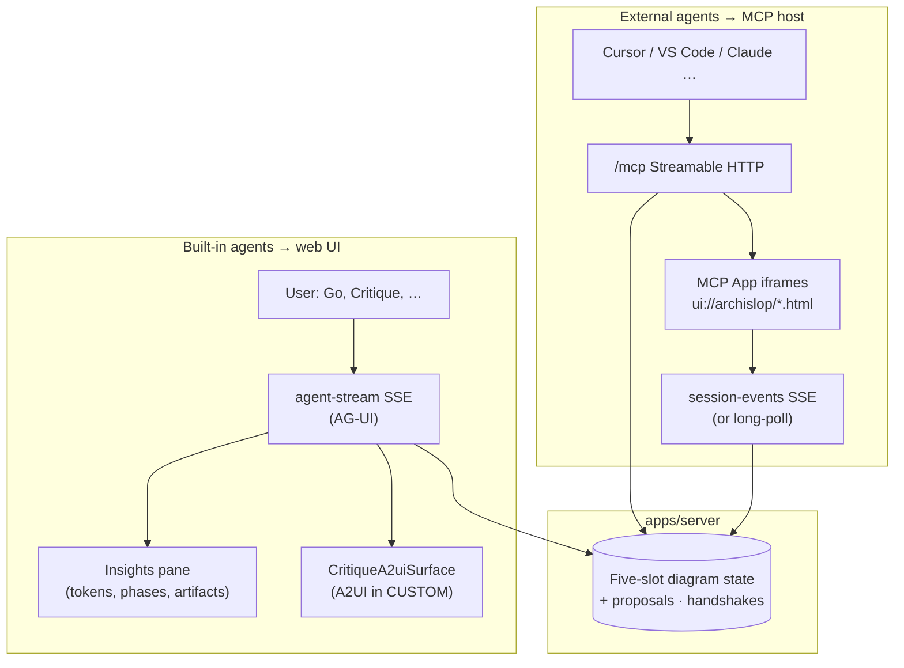

# Generative UI and MCP surfaces

> **Prefer pictures?** [architecture-generative-ui-visual.html](https://acuhlmann.github.io/mermaid-gen/architecture-generative-ui-visual.html) is a self-contained visual tour of this map — the three axes (transport / payload / placement), the abstraction spectrum from fixed components to freeform HTML, and where MCP Apps fit. [GitHub Pages](https://acuhlmann.github.io/mermaid-gen/) hosts the rendered page; clone locally to open the file without the network.

ArchiSlop uses **three different UI strategies** on purpose. They share session state but use different wires, trust boundaries, and hosts. This doc is the map; deep dives live in the linked files below.

| Strategy                | Wire                                                      | Primary host                                | Model authors UI?                                          |
| ----------------------- | --------------------------------------------------------- | ------------------------------------------- | ---------------------------------------------------------- |
| **AG-UI** (SSE)         | `POST /api/copilotkit/agent-stream`                       | ArchiSlop web (built-in agents)             | No — server emits phases, tokens, tool calls, state deltas |
| **A2UI v0.9**           | AG-UI `CUSTOM` `name: "a2ui"`                             | Web **Thinking** pane (Critique only today) | No — server builds messages from critique markdown         |
| **MCP Apps** (SEP-1865) | MCP tool `_meta.ui.resourceUri` → `ui://archislop/*.html` | Cursor, VS Code, Claude Desktop, …          | No — static HTML bundles; tools return JSON payloads       |

**Not generative UI (but often confused with it):** `GET /api/copilotkit/session-events` — collaboration sync (handshakes, proposals, presence). React components in `apps/web` render those events; external hosts use MCP Apps or the same SSE URL.

## How the layers stack

## When to use which approach

| Goal                                                       | Use                                                               | Avoid                                                                   |
| ---------------------------------------------------------- | ----------------------------------------------------------------- | ----------------------------------------------------------------------- |
| Stream Go / Refine / Critique from the **web toolbar**     | AG-UI `agent-stream`                                              | MCP (external agents cannot call intent/transform directly)             |
| Interactive **Fix selected** after Critique in the browser | A2UI via [`architecture-a2ui.md`](architecture-a2ui.md)           | Raw model-generated UI JSON                                             |
| Human approves **guest agent** join or diagram edit        | Web handshake dialog + proposal cards **or** MCP Apps `resolve_*` | Expecting `propose_diagram_edit` to auto-apply                          |
| **Cursor + browser** open at once                          | Web for actions; `open_web_companion` for context                 | Relying on MCP App Approve buttons in Cursor (often read-only)          |
| Third-party **CopilotKit** client                          | CopilotKit runtime on `/api/copilotkit` (AG-UI)                   | Reimplementing custom SSE unless you need ArchiSlop-specific operations |

## AG-UI (built-in agent streaming)

Full contract: [`architecture-ag-ui.md`](architecture-ag-ui.md).

**What the web renders from the stream:**

- **Phases** — `STEP_STARTED` / `STEP_FINISHED` (planning, syntax fixer, etc.) → Thinking pane timeline.
- **Tokens** — `TEXT_MESSAGE_*` → streaming critique/explain prose.
- **Tool calls** — `TOOL_CALL_*` → “calling apply_mermaid_patch” style status.
- **Draft previews** — `STATE_DELTA` on `/mermaid/draftSource` or `/infographic/draftSource` → live partial diagram while tools stream.
- **Patch summaries** — `STATE_DELTA` on revision paths + `/lastPatchSummary` → chips in Insights.
- **Final** — `STATE_SNAPSHOT` + `RUN_FINISHED` → canvas revision update.

Implementation spine: `createAgentStreamEmitter` (`packages/shared`) → `diagramStore.js` + `applyAgentStreamInsightEvent.js`.

**Implemented extensions:** `CUSTOM` artifact `explain_sections` (server-parsed Explain ## headings → structured Thinking pane); `CUSTOM` artifact `style_edits` (numbered style/critique lines → visual tweak cards); client-side **prose micro-viz** in [`thinkingProseEnrich.jsx`](../apps/web/src/utils/thinkingProseEnrich.jsx) (hex swatches, color ramps, icon replace rows, theme variable pills); shared `enrichProposalForReview` (web proposal cards + MCP `proposal-review` diff parity). **Still open:** infographic-specific A2UI templates, CopilotKit frontend tools for focus picking — today focus is React + canvas clicks.

## A2UI (critique checklists only)

Full contract: [`architecture-a2ui.md`](architecture-a2ui.md).

**Design choice:** the LLM outputs **Markdown** with an `## Actionable …` section; the server deterministically builds A2UI messages (`buildCritiqueActionableA2uiMessages`). The client allowlists `basicCatalog` only and maps two actions to **intent** (`archislop_fixSelected`, `archislop_fixAll`).

**Why not model-authored A2UI everywhere?** Safety and consistency — diagram editing stays on validated tool paths, not arbitrary UI actions.

**Parity for MCP:** `drop_insight` + `open_critique_review` → **critique-map** MCP App; humans use `request_critique_fix` → `critique_fix_request` on session-events → web **Fix** flow.

## MCP connectivity (transport and session binding)

Guest-agent guide: [`architecture-external-agents.md`](architecture-external-agents.md). Production: [`deploy/gcp.md`](deploy/gcp.md).

### Transport

| Item     | Value                                                                                                     |
| -------- | --------------------------------------------------------------------------------------------------------- |
| URL      | `https://<host>/mcp` (local: `http://localhost:4000/mcp`)                                                 |
| Protocol | **Streamable HTTP** (MCP SDK handler on `app.all('/mcp', …)`)                                             |
| Install  | `GET /api/copilotkit/invite` → `cursorInstallUrl`, `vscodeInstallUrl`, JSON snippet (`mcpInviteLinks.js`) |

### Binding a room (pick one)

| Method                                      | Use when                                                      |
| ------------------------------------------- | ------------------------------------------------------------- |
| `join_session({ pairingCode })`             | Default — stable `/mcp` URL, fresh code from **Invite agent** |
| `GET /mcp?pairing=<code>` on initialize     | One-click deeplink from invite dialog                         |
| `GET /mcp?token=<jwt>` on initialize        | Signed invite (`INVITE_TOKEN_SECRET`); alternative to pairing |
| `join_session({ sessionId })` / `?session=` | Legacy; prefer pairing                                        |

After **`register_agent`** is approved, the agent receives **`agentToken`** for authenticated `session-events` and MCP tools.

### Operational limits

| Concern                  | Behavior                                                                                                                                                                |
| ------------------------ | ----------------------------------------------------------------------------------------------------------------------------------------------------------------------- |
| MCP transport state      | **In-process** per Cloud Run instance (`mcpSessionAffinity: in-process` on `/api/health`) — scale-out may require client re-initialize; consider **`min-instances=1`**. |
| Pairing codes            | **Redis** when `REDIS_URL` set; else in-memory per instance.                                                                                                            |
| Diagram / proposal state | In-memory per instance (not Redis-backed yet).                                                                                                                          |
| Rate limits              | Failed MCP joins, `join-room`, LLM routes — see `.env.example`.                                                                                                         |

## MCP Apps (UI options)

Apps are registered in [`registerMcpApps.js`](../apps/server/src/mcp/registerMcpApps.js) via `@modelcontextprotocol/ext-apps/server`. Each `ui://archislop/<name>.html` bundle is inline HTML in [`apps/server/src/mcp/apps/`](../apps/server/src/mcp/apps/).

### Tool → App mapping

| MCP App URI                             | Opens from (tools)                                                     | `visibility`              | Best for                                                |
| --------------------------------------- | ---------------------------------------------------------------------- | ------------------------- | ------------------------------------------------------- |
| `ui://archislop/web-companion.html`     | `open_web_companion`, `register_agent`, `propose_diagram_edit`         | default                   | **Hybrid:** read-only queue + links; approve in **web** |
| `ui://archislop/session-pairing.html`   | `join_session`, `open_session_pairing`                                 | default                   | Paste pairing code                                      |
| `ui://archislop/welcome.html`           | `open_welcome`, `get_session_bootstrap`                                | default                   | Onboarding checklist                                    |
| `ui://archislop/canvas-preview.html`    | `open_diagram_canvas`                                                  | default                   | Mermaid SVG preview + `webCanvasUrl`                    |
| `ui://archislop/session-events.html`    | `open_session_events`, `subscribe_session_events`                      | default                   | Live feed (SSE → long-poll fallback)                    |
| `ui://archislop/session-dashboard.html` | `open_session_dashboard`, `get_session_snapshot`                       | default                   | War room: presence + proposals                          |
| `ui://archislop/proposal-inbox.html`    | `open_my_proposals`, `get_my_proposals`                                | default                   | Agent’s proposal history                                |
| `ui://archislop/insights-feed.html`     | `open_insights_feed`, `get_insights`                                   | default                   | Attributed insights                                     |
| `ui://archislop/compose-insight.html`   | `open_compose_insight`                                                 | default                   | Post note / suggestion / critique                       |
| `ui://archislop/focus-picker.html`      | `open_focus_picker`                                                    | default                   | Visual node pick → `set_focus`                          |
| `ui://archislop/critique-map.html`      | `open_critique_review`, `request_critique_fix`                         | default / **app** for fix | Actionable critique bullets                             |
| `ui://archislop/handshake.html`         | `open_handshake_review`, `resolve_handshake`                           | **app**                   | MCP-only approve/deny join                              |
| `ui://archislop/proposal-review.html`   | `open_proposal_review`, `resolve_proposal`, `request_proposal_changes` | **app**                   | Full diff + accept/reject                               |

**`UI_META` vs `APP_ONLY_UI`:** `APP_ONLY_UI` sets `visibility: ['app']` so human resolution tools (`resolve_handshake`, `resolve_proposal`, …) are intended for **iframe / MCP App** callers, not the proposing agent.

### Shared App infrastructure

- **Nav chrome** — `mcpAppShell.js` jumps between companion, welcome, events, canvas, dashboard, inbox, insights.
- **Session bridge** — `mcpAppSessionBridge.js`: `EventSource` on `subscribe_session_events` URL, falls back to `wait_for_session_event` long-poll.
- **Diagram preview** — `mcpAppDiagramPreview.js`: Mermaid via CDN (timeouts + sanitized SVG); infographic tab shows DSL source (no AntV render in iframe yet).
- **CSP** — `connectDomains` includes `PUBLIC_BASE_URL` and `ARCHISLOP_WEB_URL` for API calls from Apps.

### MCP host compatibility (practical)

| Host                   | MCP tools | MCP Apps                 | Human actions in Apps                  | Recommended workflow                                  |
| ---------------------- | --------- | ------------------------ | -------------------------------------- | ----------------------------------------------------- |
| **ArchiSlop web**      | —         | —                        | Full (native React)                    | Primary surface for edits + approvals                 |
| **Cursor**             | Yes       | Often opens on tool call | Buttons frequently **non-interactive** | Web for approve/accept; **web-companion** for context |
| **VS Code Copilot**    | Yes       | Varies by build          | Test `resolve_*` in App panel          | Use install deeplink from invite                      |
| **Claude Desktop**     | Yes       | Strong App support       | Good for MCP-only review               | `proposal-review` + `handshake` Apps                  |
| **Agent without Apps** | Yes       | Ignored                  | N/A                                    | JSON tools + `wait_for_resolution` / session-events   |

## Improvement opportunities (roadmap hints)

These are gaps worth knowing when extending the project — not bugs.

1. **Unify human approval UX further** — Web proposal cards and MCP `proposal-review` now share `enrichProposalForReview` / `buildDiagramDiffSummary` from `@archislop/shared`; full A2UI proposal surface in the web app remains optional.
2. **Infographic MCP preview** — Canvas and proposal Apps render Mermaid well; infographic slots show DSL text, not AntV output, in iframes.
3. **Richer AG-UI artifacts** — Only critique uses A2UI; explain/transform could emit structured sections (still server-built) without new transports.
4. **MCP App actions in Cursor** — Hybrid **web-companion** is the current answer; upstream host support for `visibility: ['app']` tool calls from iframes may improve over time.
5. **Cross-instance collaboration** — Redis covers pairing only; proposals/handshakes on another instance won’t see events until shared stores exist.
6. **CopilotKit frontend tools** — Runtime path exists; ArchiSlop UI uses custom routes first — frontend tools could expose focus/clear/accept to chat UIs without MCP.

## Code map

| Area                 | Path                                                                                          |
| -------------------- | --------------------------------------------------------------------------------------------- |
| AG-UI emitter        | `packages/shared/src/agentStreamEmitter.js`, `apps/server/src/agents/agUiEvents.js`           |
| A2UI messages        | `packages/shared/src/critiqueA2uiMessages.js`, `apps/server/src/agents/critiqueA2uiStream.js` |
| Web stream client    | `apps/web/src/state/diagramStore.js`, `applyAgentStreamInsightEvent.js`                       |
| A2UI host            | `apps/web/src/components/CritiqueA2uiSurface.jsx`                                             |
| MCP server + tools   | `apps/server/src/mcp/mcpServer.js`                                                            |
| MCP App registration | `apps/server/src/mcp/registerMcpApps.js`, `apps/server/src/mcp/mcpAppUris.js`                 |
| MCP App HTML         | `apps/server/src/mcp/apps/*.js`                                                               |
| Session-events       | `apps/server/src/state/sessionEventBus.js`, `apps/web/src/state/sessionEventsClient.js`       |

## Related docs

- [`architecture-ag-ui.md`](architecture-ag-ui.md) — SSE event types and `emit` helpers
- [`architecture-a2ui.md`](architecture-a2ui.md) — critique checklist trust model
- [`architecture-external-agents.md`](architecture-external-agents.md) — join, handshake, proposals, tool list
- [`deploy/gcp.md`](deploy/gcp.md) — `PUBLIC_BASE_URL`, secrets, Redis, `min-instances`
