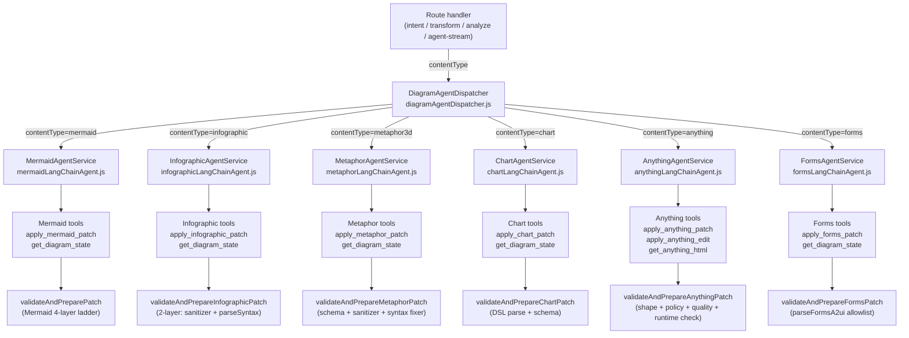
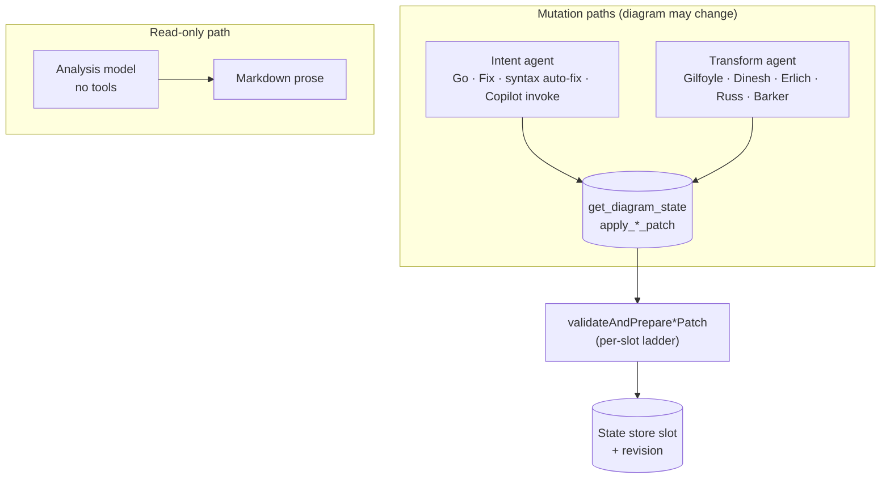

# Agents

Orchestration is **not** a separate workflow engine. It is **one or two LangChain agents per content type** (intent + optional transform, plus a shared read-only analysis path) over shared session state, wrapped in repair logic when patches fail validation. Six content types are dispatched: `mermaid`, `infographic`, `metaphor3d`, `chart`, `anything`, and `forms` (the one agent that authors A2UI JSON directly — see [Content types](content-types.md#forms) and [`architecture-a2ui.md`](../architecture-a2ui.md)).

## Dispatcher and agent services

## Roles: intent vs transform vs analysis

- **Intent agent** — `SYSTEM_PROMPT` plus a single user turn. **Go** sends the prompt-bar text inside `applyIntent`'s "interpret and apply" template (with optional focus). **Fix** and **syntax auto-fix** are also intent: the web app composes a different user message but hits the same `POST /api/copilotkit/intent` (or `agent-stream` with `operation: intent`). Uses the **default** (non-transform) agent; model tier follows the UI **Fast** / **Quality** profile.
- **Transform agent** — Same system prompt and tools as intent, but the **user message** is entirely produced by `buildTransformUserContent` for `gilfoyle` | `dinesh` | `erlich` | `russ` | `barker`. Russ adds **depth** (`russStreak + 1` in the client, capped at 12): hotter sampling and extra escalation text in the prompt. Cached **per mode** (and per Russ depth), not shared with intent.
- **Analysis** — Separate chat model path: read-only system prompt plus `buildCritiqueTask` or `buildExplainTask`. **No** diagram tools; output is Markdown only. Wire ids `jared` and `richard` (radial labels **Critique** / **Explain**).

Agents are created in `createMermaidLangChainAgent` / `createInfographicLangChainAgent` and cached per model key so repeated operations reuse instances.

### `createLazyAgentService` (shared streaming wrapper)

Every diagram slot exposes a lazy service built by `createLazyAgentService` (`apps/server/src/agents/_lib/createLazyAgentService.js`). It defers `buildService()` until the first call (throws `LlmNotConfiguredError` when no backend resolves) and routes SSE streaming for analyze, intent, and transform through one implementation.

| Config field                                                        | Purpose                                                               |
| ------------------------------------------------------------------- | --------------------------------------------------------------------- |
| `contentType`                                                       | Slot id passed to stream result emitters                              |
| `buildService`                                                      | Factory that returns the real agent service                           |
| `streamLabels`                                                      | `{ analyze, intent, transform }` phase labels in the SSE stream       |
| `intentExtraFields` / `transformExtraFields` / `analyzeExtraFields` | Optional payload keys forwarded beyond the common set                 |
| `supportsInvoke` / `supportsStyleIntent`                            | Mermaid-only today — wires `invoke` / `applyStyleIntent` on the proxy |

**Common payload fields** forwarded on every stream operation: `modelProfile`, `focusNode`, `emit`, `uiLocale`, plus operation-specific fields (`prompt`, `mode`, `russDepth`, `kind`, …). **`uiLocale` must stay on this path** — bypassing the wrapper duplicates ~120 lines of streaming protocol per slot and is the usual cause of "UI locale stopped reaching the agent".

Adding a slot: call `createLazyAgentService` from `create*LangChainAgentService`, declare any extra fields in `*ExtraFields`, and mirror the pattern in `chartLangChainAgent.js` or `formsLangChainAgent.js`. Tests: `apps/server/test/createLazyAgentService.test.js`.

Output language: agents append `buildLanguageInstruction` / `buildProseLanguageInstruction` inside their user-message builders; the wrapper only forwards `uiLocale`. See [Content types — UI locale](content-types.md#ui-locale-and-diagram-output-language).

## User-facing modes

| Control                         | What it feels like                                                                                                                                                                                                                                                                                                                                                                                                                      | Server path and code                                                                                                                                                                                                                 |
| ------------------------------- | --------------------------------------------------------------------------------------------------------------------------------------------------------------------------------------------------------------------------------------------------------------------------------------------------------------------------------------------------------------------------------------------------------------------------------------- | ------------------------------------------------------------------------------------------------------------------------------------------------------------------------------------------------------------------------------------ |
| **Go**                          | Does what you asked in the prompt bar — concrete diagram from your words (or a sensible default if you only name a topic).                                                                                                                                                                                                                                                                                                              | `applyIntent` in the active agent: user message = intent template + your prompt + optional `buildFocusScopeInstructions`. `requirePatch: true`.                                                                                      |
| **Gilfoyle**                    | Same diagram type and story; polish labels, grouping, clarity; modest new structure (prompt budgets ~4 nodes / 6 edges).                                                                                                                                                                                                                                                                                                                | `applyTransformIntent` with `mode: gilfoyle`. Sampling ~`temperature 0.42`, shared transform caps in `TRANSFORM_MODEL_LIMITS`.                                                                                                       |
| **Dinesh**                      | Gilfoyle-class fix seat with a different voice: same diagram type, same ~4 node / 6 edge budget, one correct change — then he makes sure the credit lands.                                                                                                                                                                                                                                                                              | `applyTransformIntent` with `mode: dinesh`. Sampling ~`temperature 0.42`; shares the gilfoyle branch in `mermaidTransformPolicy.ts` / `infographicTransformPolicy.ts`.                                                               |
| **Erlich**                      | Noticeable redesign; may switch diagram type when justified; larger edits (~10 nodes / 14 edges).                                                                                                                                                                                                                                                                                                                                       | `applyTransformIntent` with `mode: erlich`. Sampling ~`temperature 0.82`.                                                                                                                                                            |
| **Russ**                        | Wild reinterpretation, exotic types, meme energy; first turn should patch immediately.                                                                                                                                                                                                                                                                                                                                                  | `applyTransformIntent` with `mode: russ`. `russTransformModelOptions(depth)`: moderate temperature (~0.95) with a gentle per-tier ramp — the chaos is prompt-driven (escalation tiers + diagram-type roulette), not sampling-driven. |
| **Barker**                      | Board-deck simplification; subtractive only — merges/drops nodes, never adds (lands 4–8 nodes, sometimes deliberately collapses to 2–3 for the CEO).                                                                                                                                                                                                                                                                                    | `applyTransformIntent` with `mode: barker`. Sampling ~`temperature 0.35`; shared subtractive caps in `mermaidTransformPolicy.ts`.                                                                                                    |
| **Jared / Critique**            | Structured review (strengths optional, weaknesses, type fit, style, actionable list) — does **not** change the diagram. Anxious-compliance voice (`jared`).                                                                                                                                                                                                                                                                             | `applyAnalyzeIntent` with `kind: jared`. Analysis model only.                                                                                                                                                                        |
| **Explain**                     | Walks a reader through meaning, flows, entities — read-only (Richard Hendricks voice).                                                                                                                                                                                                                                                                                                                                                  | `applyAnalyzeIntent` with `kind: richard`.                                                                                                                                                                                           |
| **Fix**                         | Turns the last critique into an actual edit (whole critique, or only checked "actionable" bullets in the insights pane).                                                                                                                                                                                                                                                                                                                | Still **`operation: intent`**: `App.jsx` builds a long "apply these improvements / this critique" prompt and calls the same route as Go. Resets Russ streak. Clears stored critique after success.                                   |
| **Syntax auto-fix** (automatic) | When the editor shows a parse error (Mermaid) or an Anything page throws during load, a debounced run repairs it. **Mermaid and Anything** take a cheap fast-path first: `POST /api/diagram/render-error` runs only the single-shot fixer (`routes/diagramRepair.js`) — one LLM call, no agent loop — and falls back to the full intent ladder only if that rejects. Other slots go straight to the `intent` path with a repair prompt. | Fast path `POST /api/diagram/render-error` (with `contentType`), else **`operation: intent`** with a fixed repair prompt (`runAutoFix` in `App.jsx`).                                                                                |

**Style** (`POST /api/copilotkit/style`) is another mutation: same tools, but the user message is style-only (`%%{init: ...}%%`, `classDef`, Vega theme, etc.). Supported by **Mermaid and Chart**; the route rejects other content types.

Validation and repair ladders: [Validation & repair](validation.md).

## Interaction flow

1. User picks **Mode** (**Auto**, Diagram, Infographic, 3D, Chart, Forms, or Anything) from the AI corner controls; the UI persists the choice in `archislop:content-mode` and includes `contentType` in every subsequent request.
2. User edits source or loads state; client syncs via `GET`/`POST /api/copilotkit/state` with `contentType`. Canvas **Add / Delete / Rename / Link** (Mermaid flowchart, mindmap, stateDiagram-v2, and sequenceDiagram; Infographic tree, dagre, network, and flat lists/sequences) is a discrete `POST /api/copilotkit/user-edit` (`origin: user`) so it does not go through Monaco debounce or auto-fix. Family list and next slices: [`docs/canvas-graph-edit.md`](../canvas-graph-edit.md).
3. **Go** and **Fix from critique** use the **intent** operation: `POST /api/copilotkit/agent-stream` with `operation: intent`, or `POST /api/copilotkit/intent` without streaming. The active `contentType` is forwarded. **Syntax auto-fix** for Mermaid and Anything tries the fast-path `POST /api/diagram/render-error` first (one fixer call, no agent loop) and only falls back to the intent operation on rejection.
4. **Gilfoyle / Dinesh / Erlich / Russ / Barker** use `agent-stream` or `POST /api/copilotkit/transform` with `mode` and optional `russDepth`.
5. **Jared / Richard** (radial **Critique** / **Explain**) use `analyze` or `agent-stream` with `operation: analyze` and `kind: jared` \| `richard`; responses patch insights only, not diagram state.
6. **Style** is Mermaid or Chart only; the route rejects other `contentType` values with a 400.
7. **Clear** resets to the starter diagram for the active mode via client + server state conventions.

## Agent profiles

- **Intent** defaults: `temperature 0.7`, `topP 1`, `maxNodes 25`, `style balanced`, `persona creative architect` (see `INTENT_PROFILE_DEFAULTS` in `mermaidLangChainAgent.js`). These apply to Mermaid intent; the Infographic agent uses the same LLM settings but different system prompt and tool (`INFOGRAPHIC_SYSTEM_PROMPT`).
- **Transform** modes reuse the same tools with different **user** prompts and sampling (`transformModeModelOptions` / `russTransformModelOptions`), shared between content types.
- **Analysis** uses dedicated temperatures for streaming; on Vertex stream failure with an OpenRouter key configured, analyze can **retry once on OpenRouter** with a fixed temperature.
