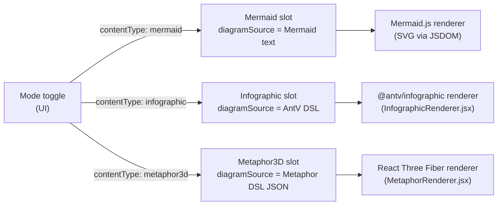

# Content types

Each HTTP request and SSE payload carries `contentType`, which is forwarded from the UI to the `DiagramAgentDispatcher`. The dispatcher selects the Mermaid, Infographic, or Metaphor3D service transparently; routes and stream events are otherwise identical from the client's perspective.

The active content type defaults to `mermaid` and is persisted in `localStorage` under `archislop:content-mode`.

## metaphor3d kinds

The `metaphor3d` slot stores a JSON DSL with a `metaphor` discriminator picking one spatial story:

| metaphor    | item caps | spatial idea                                                                  |
| ----------- | --------- | ----------------------------------------------------------------------------- |
| `city`      | ≤ 50      | Buildings on the XZ plane; `height` + `footprint` + `district`. Optional per-item `lighting` (lit/dim/dark) and `condition` (new/aging/crumbling). |
| `layercake` | ≤ 20      | Vertical stack of cylindrical slabs; `thickness` + `components`. Optional `cracks` (0–1 brittleness) + `tilt` (0–15° instability). |
| `galaxy`    | ≤ 150     | Scattered stars with `magnitude` + `cluster`. Optional per-item `binary` (paired star id) + scene-level `nebula` clouds. |
| `tree`      | ≤ 60      | Radial branching from one or more roots; items reference a `parent` id. `weight` controls branch thickness. |
| `terrain`   | ≤ 40      | Procedural heightmap surface from Gaussian peaks; `elevation` + `intensity` per item. Optional scene-level `surface: { metric, baseline }`. |

Scene-level options (apply to every kind):

- `scene.theme`: `whiteboard` (default) · `noir` · `arcade` · `blueprint`. Each theme also tunes the post-processing (bloom, vignette) and contact-shadow mood — see `metaphorThemePresets.js` `postfx`.
- `scene.camera`: `orbit` (default, user controls) · `isometric` (fixed) · `cinematic` (auto-rotate, controls off). Honored by the renderer and switchable in-canvas via the camera toggle.
- `scene.title` / `scene.subtitle`: rendered as a title card overlaid on the canvas.
- `scene.legend.<axis>`: short phrases naming each encoding axis (`height` = "team size", `elevation` = "risk score"); drawn as an always-on legend panel and reused as the hover-tooltip metric labels.

Per-item and per-link extras:

- Item `glyph`: one of ~30 procedural icons. Item `note`: a ≤140-char phrase shown when the viewer hovers the item.
- Link `kind`: `flow` (a glowing pulse animates along the edge) · `dependency` · `ownership` — sets the edge colour and whether it animates.

Validation lives in `packages/shared/src/metaphorSchema.ts` and `metaphorSanitizer.ts`. Rendering lives in `apps/web/src/components/MetaphorRenderer.jsx`, with per-metaphor layout helpers under `apps/web/src/utils/metaphorLayouts/`. See also [Agents](agents.md) and [Validation & repair](validation.md) for how each slot is validated.
