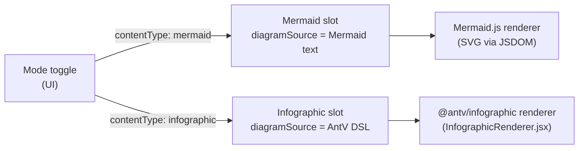

# Content types

Each HTTP request and SSE payload carries `contentType`, which is forwarded from the UI to the `DiagramAgentDispatcher`. The dispatcher selects the Mermaid or Infographic service transparently; routes and stream events are otherwise identical from the client's perspective.

The active content type defaults to `mermaid` and is persisted in `localStorage` under `archislop:content-mode`.

See also [Agents](agents.md) and [Validation & repair](validation.md) for how each slot is validated.
