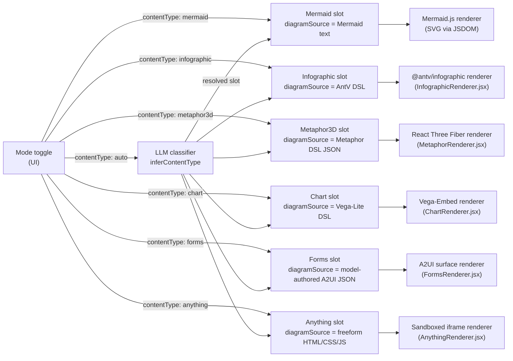

# Content types

The active content type defaults to `mermaid`. The mode picker — **Auto** plus all six concrete slots — is persisted in `localStorage` under `archislop:content-mode` and restored on reload via `readStoredContentMode()` in `apps/web/src/utils/appSessionLocation.js`.

**Persistence model (three layers):**

| Layer                | What survives a reload                                             | Notes                                                                                                                                            |
| -------------------- | ------------------------------------------------------------------ | ------------------------------------------------------------------------------------------------------------------------------------------------ |
| Mode picker          | All seven options                                                  | `archislop:content-mode`                                                                                                                         |
| Client diagram cache | Insights, editor chrome, and the **active** slot's `diagramSource` | Key `archislop:diagram-cache-v2:{sessionId}`; Anything writes `diagramSource: ''` (large/untrusted HTML)                                         |
| Server slot state    | All six slots while the process and `x-session-id` stay alive      | In-memory per server process; not Redis-backed — a cold server restart clears slots unless the client cache can restore the active mode's source |

## Auto mode

**Auto** is a seventh picker option (not a seventh slot). On **Go** / intent only, the client sends `contentType: "auto"`. The server runs a fast LLM classifier (`apps/server/src/agents/inferContentType.ts`), emits an AG-UI `CUSTOM` event `content_type` with the chosen slot, then dispatches the usual per-slot agent against that slot's current revision. The web client switches the mode picker to the resolved slot and keeps it there for transform / Critique / follow-ups. Transform and analyze reject `auto` on the wire — they need a concrete canvas.

Chart vs infographic guidance in the classifier matches the product boundary: **chart** for data-driven marks/encodings; **infographic** for narrative KPI / story layouts.

Each HTTP request and SSE payload carries `contentType`, which is forwarded from the UI to the `DiagramAgentDispatcher` (after Auto resolution when applicable). The dispatcher selects the Mermaid, Infographic, Metaphor3D, Chart, Anything, or Forms service transparently; routes and stream events are otherwise identical from the client's perspective.

## metaphor3d kinds

The `metaphor3d` slot stores a JSON DSL with a `metaphor` discriminator picking one spatial story:

| metaphor      | item caps  | spatial idea                                                                                                                                                                                                                                                                                                                                                                                                                                               |
| ------------- | ---------- | ---------------------------------------------------------------------------------------------------------------------------------------------------------------------------------------------------------------------------------------------------------------------------------------------------------------------------------------------------------------------------------------------------------------------------------------------------------- |
| `city`        | ≤ 50       | Buildings on the XZ plane; `height` + `footprint` + `district`. Optional per-item `lighting` (lit/dim/dark) and `condition` (new/aging/crumbling).                                                                                                                                                                                                                                                                                                         |
| `layercake`   | ≤ 20       | Vertical stack of cylindrical slabs; `thickness` + `components`. Optional `cracks` (0–1 brittleness) + `tilt` (0–15° instability).                                                                                                                                                                                                                                                                                                                         |
| `galaxy`      | ≤ 150      | Scattered stars with `magnitude` + `cluster`. Optional per-item `binary` (paired star id) + scene-level `nebula` clouds.                                                                                                                                                                                                                                                                                                                                   |
| `tree`        | ≤ 60       | Radial branching from one or more roots; items reference a `parent` id. `weight` controls branch thickness.                                                                                                                                                                                                                                                                                                                                                |
| `terrain`     | ≤ 40       | Procedural heightmap surface from Gaussian peaks; `elevation` + `intensity` per item. Optional scene-level `surface: { metric, baseline }`.                                                                                                                                                                                                                                                                                                                |
| `orrery`      | ≤ 40       | Solar system: items with `orbit: 0` are the central sun; `orbit` (1–12) = ring distance from the core, `size` = body scale. Optional `moon` (id of a non-moon item) parks a satellite beside its parent planet.                                                                                                                                                                                                                                            |
| `river`       | ≤ 30       | Winding waterway, source → mouth: `stage` orders stations along the channel, `flow` sets the channel width at each station, optional `hazard` (0–1) renders whitewater rapids.                                                                                                                                                                                                                                                                             |
| `garden`      | ≤ 40       | Living portfolio: `maturity` grows each plant, `impact` sizes its bloom, `bed` groups strategic themes, and `health` (`thriving` / `steady` / `at-risk`) changes colour and posture.                                                                                                                                                                                                                                                                       |
| `archipelago` | ≤ 40       | Peer domains as islands: `mass` sizes each island, `relief` (0–1) raises its peak, `chain` clusters related islands; `links` span as bridges across the ocean.                                                                                                                                                                                                                                                                                             |
| `machine`     | ≤ 40       | Interlocking gears on a shared plate: `size` is gear radius / importance, `speed` is spin rate / activity, `axle` groups subsystems, optional `torque` (0–1) heats strained gears, optional `mesh` (partner id) pulls coupled gears into contact.                                                                                                                                                                                                          |
| `composite`   | ≤ 4 layers | Fuses 1–4 semantic layers (`as` + per-layer `items`) into one deterministic kinetic world. The generic planner maps layer kinds to substrate, landmark, container, path, connector, field, or accent capabilities; it does not mount full scenes or use a fixed pair matrix. New documents use `layout: "fused"` plus optional `seed`, `novelty`, and `motionIntensity`. Explicit `"adjacent"` / `"overlay"` remain as Composite v1 compatibility layouts. |

Scene-level options (apply to every kind):

- `scene.theme`: `whiteboard` (default) · `noir` · `arcade` · `blueprint`. Each theme also tunes the post-processing (bloom, vignette) and contact-shadow mood — see `metaphorThemePresets.js` `postfx`.
- `scene.camera`: still accepted by the schema, but the renderer now always uses user-controlled **orbit** navigation (drag to rotate, scroll to zoom). The fixed/auto-rotate modes and the in-canvas camera toggle were removed — the viewer always drives the camera.
- `scene.title` / `scene.subtitle`: rendered in a compact topic strip in the inline canvas and as a larger title card in fullscreen.
- `scene.legend.<axis>`: short phrases naming each encoding axis (`height` = "team size", `elevation` = "risk score"); shown as compact semantic chips inline, expanded into a fullscreen legend panel, and reused as hover-tooltip metric labels.
- Outdoor `river`, `garden`, and `archipelago` scenes resolve to a bright daylight palette (sunny sky, green landscape / tropical ocean, clear water) even when a dark theme was authored; other metaphor kinds still honor the selected theme directly.

Per-item and per-link extras:

- Item `glyph`: one of ~30 procedural icons. Item `note`: a ≤140-char phrase shown when the viewer hovers the item.
- Link `kind`: `flow` (a glowing pulse animates along the edge) · `dependency` · `ownership` — sets the edge colour and whether it animates.

Validation lives in `packages/shared/src/metaphorSchema.ts` and `metaphorSanitizer.ts`. Rendering lives in `apps/web/src/components/MetaphorRenderer.jsx` (city/layercake scenes plus the canvas shell) and `apps/web/src/components/metaphorScenes/` (extracted tree, galaxy, terrain, orrery, river, garden, archipelago, and machine scenes and the shared label/link/sky building blocks), with per-metaphor layout helpers under `apps/web/src/utils/metaphorLayouts/`. See also [Agents](agents.md) and [Validation & repair](validation.md) for how each slot is validated.

**In-fullscreen kind switching** — while the canvas is in native fullscreen, a kind-switcher pill in the overlay lets the viewer change the spatial metaphor (e.g. city → terrain) without leaving fullscreen. The transition re-maps item magnitudes and groupings to the new encoding axes via `switchMetaphorKind.js`. Picking **Composite** wraps the current actors as one semantic layer in a fused world without inventing duplicate companion actors; the planner supplies the shared substrate and deterministic motion. The metaphor agent may emit richer multi-layer composites when the prompt contains several noun, relationship, metric, or mood grammars. The exit button (×) is also available in-fullscreen because the native browser fullscreen toggle disappears once the overlay surface takes over (`DiagramFullscreenOverlay.jsx`).

Composite v2 planner controls:

- `seed`: stable string or non-negative integer. The same source and seed produce the same topology, placements, anchors, and motion phases across revisions.
- `novelty` (0–1, default `0.55`): bounded topology and placement variation. It never permits unbounded transforms or arbitrary code.
- `motionIntensity` (0–1, default `0.65`): scales semantic pulse, sway, orbit, and flow. `prefers-reduced-motion: reduce` freezes the deterministic pose instead of removing the scene's meaning.

The Composite JSON remains the canonical semantic document. `fusedCompositePlanner.js` produces an internal R3F render plan with stable bounds, anchors, transforms, motion styles, estimated cost, affinity groups, connectors, LOD, and atmosphere; that plan is not a public interchange format. Landmarks and river stations bind to substrate sites by shared `district` / `chain` / `bed` / label affinity. Storytelling fields (`hazard`, `health`, `lighting`, `condition`, `maturity`, `cracks`, `tilt`) affect fused materials and motion. Standards and migration rationale are recorded in [ADR-0009](../decisions/0009-dynamic-composite-standards.md). Export offers **Scene JSON** (authoring round-trip), a **PNG** screenshot, and a **USDA semantic stub** (`.usda`) authored per the [Metaphor USDA mapping](metaphor-usda-mapping.md) — ADR-0009 migration steps 1–2; an earlier baked glTF `.glb` export was removed and may return under step 5.

## chart

The `chart` slot stores a Vega-Lite-compatible DSL. The agent writes valid Vega-Lite JSON with a `chart <type>` header processed by `parseChartDsl` in `packages/shared`. The renderer (`apps/web/src/components/ChartRenderer.jsx`) lazy-loads `vega-embed` and uses `vega-interpreter` to satisfy the CSP `unsafe-eval` restriction.

- Validation: `validateAndPrepareChartPatch` in `apps/server/src/tools/chartDslTool.js`.
- Agent service: `ChartAgentService` (`apps/server/src/agents/chartLangChainAgent.js`).
- **Style** edits are also supported for the chart slot (same `/api/copilotkit/style` route as Mermaid).
- Chart mode follows the persistence model above — the picker and active-slot source are cached client-side; server slot data survives reload while the session is still on the same server process.

## anything

The `anything` slot stores a **freeform, self-contained HTML document** (inline CSS + JS) emitted by the agent — the escape hatch for interactive widgets, mini-games, simulations, and bespoke visuals that don't fit the structured modes.

**The iframe sandbox + CSP are the render-time security boundary.** The document is untrusted LLM output, so the renderer (`apps/web/src/components/AnythingRenderer.jsx`) never mounts it into the host DOM. It renders via `<iframe srcDoc … sandbox={ANYTHING_IFRAME_SANDBOX} csp={ANYTHING_IFRAME_CSP}>` (constants in `packages/shared/src/anythingSchema.ts`):

- **No `allow-same-origin`** — scripts run in an opaque origin with zero access to the app's DOM, cookies, or storage. Never add this token; combined with `allow-scripts` it would let injected HTML take over the app origin.
- **CSP enforced** — `ANYTHING_IFRAME_CSP` blocks outbound network (`connect-src 'none'`), external subresources, nested frames, and form submission. A matching `<meta http-equiv="Content-Security-Policy">` is injected into `srcDoc` as defense-in-depth.
- No top navigation, popups, forms, downloads, or permission grants (`allow` attribute is absent); `referrerPolicy="no-referrer"`.
- The agent prompt (`apps/server/src/prompts/anythingSystemPrompt.js`) teaches the same contract: everything inline, no network, no storage. `ANYTHING_CORE_RULES` (sandbox + document validity) is exported separately for repair prompts; craft guidance (typography, spacing, color/contrast, motion, empty/loading states) lives in `anythingDesignGuide.js`.

Server-side validation is deterministic (`parseAnythingHtml` shape check, `lintAnythingPolicy` security rules, `lintAnythingQuality` structure/JS/CSS syntax, `lintAnythingLibMarkers` allowlist) plus a **runtime check** that executes the page in an isolated jsdom child process emulating the sandbox (see [Validation & repair](validation.md#anything-validation-pipeline)) — there is **no HTML sanitizer** that strips scripts; safety at render time comes from sandbox + CSP, not from rewriting the document.

**Inline libraries (`@lib:` markers):** a document can opt into allowlisted, pinned, vendored libraries — currently **d3** (v7, data viz) and **matter** (Matter.js v0.20, 2D physics) — with an HTML comment marker (`<!-- @lib:d3 -->`, `<!-- @lib:matter -->`) in `<head>`. The slot stores the marker form; the vendored source is spliced in as an inline `<script data-archislop-lib>` only where the document executes: `AnythingRenderer` (lazy `@archislop/shared/anythingLibVendor.js` chunk) and the server's jsdom runtime check. Nothing is fetched over the network, the sandbox/CSP are unchanged, and injected bytes don't count against the size budget. When a rendered document injects libraries, the canvas shows a small corner badge naming each lib and version (derived client-side from the markers + registry metadata — `metadata.libs` on the patch reports the same list to programmatic consumers). The design guide (`anythingDesignGuide.js`) carries when-to-use rules so agents don't import a library for work vanilla JS does better. Registry: `packages/shared/src/anythingLibs.ts`; rationale and the process for adding a lib: [ADR-0008](../decisions/0008-anything-inline-libraries.md).

**Runtime-error bridge:** `wrapAnythingSrcDoc` injects a small error-capture script into the srcDoc (post-validation, so the policy lint's `window.parent` ban never applies to it). Uncaught errors and unhandled rejections inside the iframe are relayed via `postMessage` (`ANYTHING_RUNTIME_ERROR_MESSAGE_TYPE`); `AnythingRenderer` accepts only messages whose `event.source` is its own iframe, renders them as inert text in a dismissible banner, and forwards them via `onRuntimeError`. Load-phase errors feed the auto-fix flow; interaction-time errors stay banner-only.

- Validation: `validateAndPrepareAnythingPatch` in `apps/server/src/tools/anythingHtmlTool.js`.
- Runtime check: `apps/server/src/tools/anythingRuntimeCheck.js` (+ `anythingRuntimeSandbox.js` child; agent patches only, `ANYTHING_RUNTIME_CHECK=0` to disable).
- Single-shot fixer: `apps/server/src/agents/anythingSyntaxFixer.js` (before full agent repair turns).
- Agent service: `apps/server/src/agents/anythingLangChainAgent.js` (intent/transform/analyze; no Style support). Mutations use `apply_anything_patch` (full rewrite) or `apply_anything_edit` (atomic search/replace blocks, preferred for Gilfoyle/Dinesh/Barker/Fix; same validation ladder either way).
- Offline bench: `node apps/server/scripts/benchAnything.js --tag <label>` (see [Validation & repair](validation.md#offline-bench)).
- The canvas disables pan/zoom in this mode — the iframe owns scrolling and interaction (same treatment as `metaphor3d`).
- Anything mode persists in the mode picker, but `App.jsx` writes `diagramSource: ''` into the client diagram cache while Anything is active (large/untrusted HTML). After a server restart the slot is empty unless the user regenerates or restores from an insights entry.

**MCP / external agents:** session state and MCP resources expose raw Anything HTML in JSON — in marker form (`@lib:` markers are NOT expanded; call `expandAnythingLibs` from `@archislop/shared/anythingLibVendor.js` if you must execute the page). Treat it as untrusted — never execute outside the same sandbox + CSP wrapper.

## forms

The `forms` slot is the one mode where an ArchiSlop agent **authors A2UI directly** — the slot's `diagramSource` is a model-written A2UI v0.9 document rendered as a live, interactive form. It is the app's corporate-IT-bureaucracy parody: endless, tedious intake forms. The user fills the controls; on submit, the agent issues the next (worse) form.

This is deliberately the opposite of the **critique** A2UI checklist, where the model writes Markdown and the _server_ builds the A2UI deterministically. Here the model writes the UI JSON, so safety comes from a validation gate, not a builder. The full two-strategy comparison — including the trust table — is in [`architecture-a2ui.md`](../architecture-a2ui.md).

The document is a JSON wrapper `{ archislopFormsVersion, formTitle, formCode?, messages: [...] }`. `parseFormsA2ui` (`packages/shared/src/formsA2ui.ts`) is the whole trust boundary: it enforces the `basicCatalog` component allowlist, requires every Button action to be an `event` (never a client `functionCall`), normalizes `surfaceId`/`catalogId` to fixed values, caps size/component/message counts, and requires at least one input and one Button. Every button, whatever its event name, collapses on the client to a single capability — capture the answers and ask for the next form — so a form can never route to a diagram edit or navigation.

- Validation: `validateAndPrepareFormsPatch` in `apps/server/src/tools/formsA2uiTool.js` (wraps the shared parser; no A2UI runtime on the server).
- Agent service: `apps/server/src/agents/formsLangChainAgent.js` (intent/transform/analyze; no Style support). Mutations use `apply_forms_patch`. Validation: `parseFormsA2ui` allowlist → syntax fixer ladder (`formsSyntaxFixer.js`) → agent repair (`FORMS_REPAIR_MAX_ATTEMPTS`). No sanitizer pack (allowlist errors are precise enough).
- System prompt: `apps/server/src/prompts/formsSystemPrompt.js` (the bureaucratic-parody voice + the A2UI authoring contract). Repair/analyze prompts: `formsSyntaxGuard.js`.
- Renderer + submit loop: `apps/web/src/components/FormsRenderer.jsx` (`@a2ui/react` + `basicCatalog`; `onFormSubmit` → the next-form intent). The empty canvas shows a client-side seed form (`buildFormsSeedDoc`) so the gauntlet is interactive immediately; submitting the seed persists it into the slot before asking for the next form.
- The canvas disables pan/zoom in this mode and opts back into normal `touch-action` / text selection — the A2UI surface owns scrolling and native form interaction (same treatment as `anything`).
- Forms sits after Chart and before Anything in the mode picker.
- Forms mode persists in the mode picker and client cache like Chart; it is **web-only** — MCP hosts do not render the Forms slot (session state may still carry the A2UI JSON for programmatic consumers).

See also [Agents](agents.md) and [Validation & repair](validation.md).
