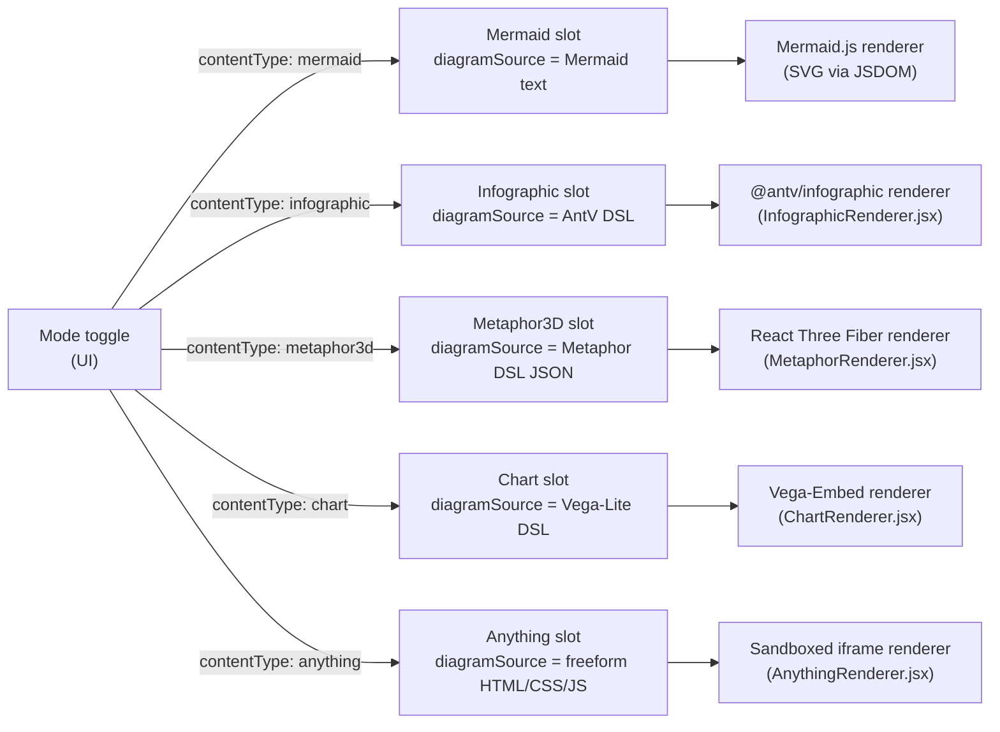

# Content types

Each HTTP request and SSE payload carries `contentType`, which is forwarded from the UI to the `DiagramAgentDispatcher`. The dispatcher selects the Mermaid, Infographic, Metaphor3D, Chart, or Anything service transparently; routes and stream events are otherwise identical from the client's perspective.

The active content type defaults to `mermaid` and is persisted in `localStorage` under `archislop:content-mode`. **Mermaid, Infographic, and Metaphor3D** are persisted across page reloads; **Chart** and **Anything** modes are session-only (revert to Mermaid on reload).

## metaphor3d kinds

The `metaphor3d` slot stores a JSON DSL with a `metaphor` discriminator picking one spatial story:

| metaphor    | item caps | spatial idea                                                                                                                                                                                                    |
| ----------- | --------- | --------------------------------------------------------------------------------------------------------------------------------------------------------------------------------------------------------------- |
| `city`      | ≤ 50      | Buildings on the XZ plane; `height` + `footprint` + `district`. Optional per-item `lighting` (lit/dim/dark) and `condition` (new/aging/crumbling).                                                              |
| `layercake` | ≤ 20      | Vertical stack of cylindrical slabs; `thickness` + `components`. Optional `cracks` (0–1 brittleness) + `tilt` (0–15° instability).                                                                              |
| `galaxy`    | ≤ 150     | Scattered stars with `magnitude` + `cluster`. Optional per-item `binary` (paired star id) + scene-level `nebula` clouds.                                                                                        |
| `tree`      | ≤ 60      | Radial branching from one or more roots; items reference a `parent` id. `weight` controls branch thickness.                                                                                                     |
| `terrain`   | ≤ 40      | Procedural heightmap surface from Gaussian peaks; `elevation` + `intensity` per item. Optional scene-level `surface: { metric, baseline }`.                                                                     |
| `orrery`    | ≤ 40      | Solar system: items with `orbit: 0` are the central sun; `orbit` (1–12) = ring distance from the core, `size` = body scale. Optional `moon` (id of a non-moon item) parks a satellite beside its parent planet. |
| `river`     | ≤ 30      | Winding waterway, source → mouth: `stage` orders stations along the channel, `flow` sets the channel width at each station, optional `hazard` (0–1) renders whitewater rapids.                                  |

Scene-level options (apply to every kind):

- `scene.theme`: `whiteboard` (default) · `noir` · `arcade` · `blueprint`. Each theme also tunes the post-processing (bloom, vignette) and contact-shadow mood — see `metaphorThemePresets.js` `postfx`.
- `scene.camera`: still accepted by the schema, but the renderer now always uses user-controlled **orbit** navigation (drag to rotate, scroll to zoom). The fixed/auto-rotate modes and the in-canvas camera toggle were removed — the viewer always drives the camera.
- `scene.title` / `scene.subtitle`: rendered as a title card overlaid on the canvas, **shown only in fullscreen** (in the inline view it would collide with the app's logo).
- `scene.legend.<axis>`: short phrases naming each encoding axis (`height` = "team size", `elevation` = "risk score"); drawn as a legend panel **in fullscreen** (the inline view would collide with the corner controls) and reused as the hover-tooltip metric labels.

Per-item and per-link extras:

- Item `glyph`: one of ~30 procedural icons. Item `note`: a ≤140-char phrase shown when the viewer hovers the item.
- Link `kind`: `flow` (a glowing pulse animates along the edge) · `dependency` · `ownership` — sets the edge colour and whether it animates.

Validation lives in `packages/shared/src/metaphorSchema.ts` and `metaphorSanitizer.ts`. Rendering lives in `apps/web/src/components/MetaphorRenderer.jsx` (city/layercake scenes plus the canvas shell) and `apps/web/src/components/metaphorScenes/` (extracted tree, galaxy, terrain, orrery, and river scenes and the shared label/link/sky building blocks), with per-metaphor layout helpers under `apps/web/src/utils/metaphorLayouts/`. See also [Agents](agents.md) and [Validation & repair](validation.md) for how each slot is validated.

**In-fullscreen kind switching** — while the canvas is in native fullscreen, a kind-switcher pill in the overlay lets the viewer change the spatial metaphor (e.g. city → terrain) without leaving fullscreen. The transition re-maps item magnitudes and groupings to the new encoding axes via `switchMetaphorKind.js`. The exit button (×) is also available in-fullscreen because the native browser fullscreen toggle disappears once the overlay surface takes over (`DiagramFullscreenOverlay.jsx`).

## chart

The `chart` slot stores a Vega-Lite-compatible DSL. The agent writes valid Vega-Lite JSON with a `chart <type>` header processed by `parseChartDsl` in `packages/shared`. The renderer (`apps/web/src/components/ChartRenderer.jsx`) lazy-loads `vega-embed` and uses `vega-interpreter` to satisfy the CSP `unsafe-eval` restriction.

- Validation: `validateAndPrepareChartPatch` in `apps/server/src/tools/chartDslTool.js`.
- Agent service: `ChartAgentService` (`apps/server/src/agents/chartLangChainAgent.js`).
- **Style** edits are also supported for the chart slot (same `/api/copilotkit/style` route as Mermaid).
- Chart mode is **not persisted** in `localStorage`; a page reload returns to Mermaid.

## anything

The `anything` slot stores a **freeform, self-contained HTML document** (inline CSS + JS) emitted by the agent — the escape hatch for interactive widgets, mini-games, simulations, and bespoke visuals that don't fit the structured modes.

**The iframe sandbox + CSP are the render-time security boundary.** The document is untrusted LLM output, so the renderer (`apps/web/src/components/AnythingRenderer.jsx`) never mounts it into the host DOM. It renders via `<iframe srcDoc … sandbox={ANYTHING_IFRAME_SANDBOX} csp={ANYTHING_IFRAME_CSP}>` (constants in `packages/shared/src/anythingSchema.ts`):

- **No `allow-same-origin`** — scripts run in an opaque origin with zero access to the app's DOM, cookies, or storage. Never add this token; combined with `allow-scripts` it would let injected HTML take over the app origin.
- **CSP enforced** — `ANYTHING_IFRAME_CSP` blocks outbound network (`connect-src 'none'`), external subresources, nested frames, and form submission. A matching `<meta http-equiv="Content-Security-Policy">` is injected into `srcDoc` as defense-in-depth.
- No top navigation, popups, forms, downloads, or permission grants (`allow` attribute is absent); `referrerPolicy="no-referrer"`.
- The agent prompt (`apps/server/src/prompts/anythingSystemPrompt.js`) teaches the same contract: everything inline, no network, no storage. `ANYTHING_CORE_RULES` (sandbox + document validity) is exported separately for repair prompts; craft guidance (typography, spacing, color/contrast, motion, empty/loading states) lives in `anythingDesignGuide.js`.

Server-side validation is deterministic (`parseAnythingHtml` shape check, `lintAnythingPolicy` security rules, `lintAnythingQuality` structure/JS/CSS syntax, `lintAnythingLibMarkers` allowlist) plus a **runtime check** that executes the page in an isolated jsdom child process emulating the sandbox (see [Validation & repair](validation.md#anything-validation-pipeline)) — there is **no HTML sanitizer** that strips scripts; safety at render time comes from sandbox + CSP, not from rewriting the document.

**Inline libraries (`@lib:` markers):** a document can opt into allowlisted, pinned, vendored libraries — currently d3 — with an HTML comment marker (`<!-- @lib:d3 -->`) in `<head>`. The slot stores the marker form; the vendored source is spliced in as an inline `<script data-archislop-lib>` only where the document executes: `AnythingRenderer` (lazy `@archislop/shared/anythingLibVendor.js` chunk) and the server's jsdom runtime check. Nothing is fetched over the network, the sandbox/CSP are unchanged, and injected bytes don't count against the size budget. Registry: `packages/shared/src/anythingLibs.ts`; rationale: [ADR-0008](../decisions/0008-anything-inline-libraries.md).

**Runtime-error bridge:** `wrapAnythingSrcDoc` injects a small error-capture script into the srcDoc (post-validation, so the policy lint's `window.parent` ban never applies to it). Uncaught errors and unhandled rejections inside the iframe are relayed via `postMessage` (`ANYTHING_RUNTIME_ERROR_MESSAGE_TYPE`); `AnythingRenderer` accepts only messages whose `event.source` is its own iframe, renders them as inert text in a dismissible banner, and forwards them via `onRuntimeError`. Load-phase errors feed the auto-fix flow; interaction-time errors stay banner-only.

- Validation: `validateAndPrepareAnythingPatch` in `apps/server/src/tools/anythingHtmlTool.js`.
- Runtime check: `apps/server/src/tools/anythingRuntimeCheck.js` (+ `anythingRuntimeSandbox.js` child; agent patches only, `ANYTHING_RUNTIME_CHECK=0` to disable).
- Single-shot fixer: `apps/server/src/agents/anythingSyntaxFixer.js` (before full agent repair turns).
- Agent service: `apps/server/src/agents/anythingLangChainAgent.js` (intent/transform/analyze; no Style support). Mutations use `apply_anything_patch` (full rewrite) or `apply_anything_edit` (atomic search/replace blocks, preferred for Refine/Exec/Fix; same validation ladder either way).
- Offline bench: `node apps/server/scripts/benchAnything.js --tag <label>` (see [Validation & repair](validation.md#offline-bench)).
- The canvas disables pan/zoom in this mode — the iframe owns scrolling and interaction (same treatment as `metaphor3d`).
- Anything mode is **not persisted** in `localStorage` (diagram source is omitted from the client cache when active); a page reload returns to Mermaid.

**MCP / external agents:** session state and MCP resources expose raw Anything HTML in JSON — in marker form (`@lib:` markers are NOT expanded; call `expandAnythingLibs` from `@archislop/shared/anythingLibVendor.js` if you must execute the page). Treat it as untrusted — never execute outside the same sandbox + CSP wrapper.

See also [Agents](agents.md) and [Validation & repair](validation.md).
