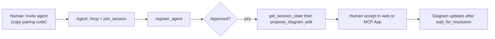

# External agents (MCP)

**Goal:** let Cursor, Claude Desktop, VS Code Copilot, or any MCP client join the **same diagram room** as the human, propose edits, and comment — with explicit human approval for every change.

1. Open **Invite agent** in the web UI (pairing code + QR + **Add to Cursor** / **Install in VS Code**).
2. Configure MCP once: stable URL `https://<host>/mcp` (local: `http://localhost:4000/mcp`).
3. Agent calls `join_session({ pairingCode })` (or connect via `?pairing=` deeplink).
4. Agent calls `register_agent({ name, emoji?, color? })` → human approves in web or handshake MCP App.
5. Agent calls `open_diagram_canvas` (optional visual check), reads `get_session_state` (includes `webCanvasUrl`), then `propose_diagram_edit` with current `baseRevisionId` — **never** auto-applied.
6. Human accepts in Insights pane, **proposal-review** MCP App, or REST; agent polls `wait_for_resolution`.

**Using Cursor (or similar) while ArchiSlop is open in the browser?** Approve handshakes and accept proposals in the **web UI** (handshake dialog + Insights proposal cards). MCP Apps that Cursor opens when the agent calls `register_agent` or `propose_diagram_edit` are optional duplicates for MCP-only hosts; their buttons are often read-only in Cursor, and diagram previews may fall back to the diff tabs.

**Full guide** (tools, session-events, etiquette, REST parity): [`docs/architecture-external-agents.md`](../architecture-external-agents.md).

**Cloud Run:** set `PUBLIC_BASE_URL` (no trailing slash), e.g. `https://mermaid-gen-main-464241135431.us-central1.run.app`, so invites and deeplinks use production, not `localhost`.

## MCP Apps (SEP-1865)

Interactive HTML in MCP hosts that support Apps; bundles in [`apps/server/src/mcp/apps/`](../../apps/server/src/mcp/apps/).

| Tool | MCP App (`ui://…`) | Purpose |
| --- | --- | --- |
| `open_web_companion` | `archislop/web-companion.html` | **Hybrid default:** read-only queue + activity feed while you control approvals in the web UI |
| `join_session` / `open_session_pairing` | `archislop/session-pairing.html` | Paste pairing code from Invite agent |
| `register_agent` | `archislop/web-companion.html` | Opens web companion (handshake focus); approve in web or `open_handshake_review` for MCP-only |
| `open_handshake_review` | `archislop/handshake.html` | Legacy Approve/Deny for MCP-only hosts |
| `open_diagram_canvas` | `archislop/canvas-preview.html` | Live canvas preview + link to web editor |
| `propose_diagram_edit` | `archislop/web-companion.html` | Opens web companion (proposal focus); accept in web Insights |
| `open_proposal_review` | `archislop/proposal-review.html` | Full diff review for MCP-only hosts (optional in hybrid) |
| `open_my_proposals` | `archislop/proposal-inbox.html` | Your proposal status inbox |
| `open_session_dashboard` | `archislop/session-dashboard.html` | Presence + pending proposals; **Review** opens proposal App |
| `open_insights_feed` | `archislop/insights-feed.html` | Attributed insights (Thinking pane parity) |
| `open_critique_review` | `archislop/critique-map.html` | Actionable critique; `request_critique_fix` |
| `open_welcome` / `get_session_bootstrap` | `archislop/welcome.html` | Onboarding checklist + revision ids |
| `open_session_events` | `archislop/session-events.html` | Live collaboration feed (SSE + long-poll fallback) |
| `open_compose_insight` | `archislop/compose-insight.html` | Post note / suggestion / critique |
| `open_focus_picker` | `archislop/focus-picker.html` | Pick a node to highlight via `set_focus` |

Proposal review includes Mermaid preview (with CDN timeouts and fallback copy), unified diff, graph-level chips, and **Request changes** (proposal stays pending; agent gets session event + attributed insight). Apps share nav chrome and auto-refresh via the session event bridge where noted in [`docs/architecture-external-agents.md`](../architecture-external-agents.md).

## Other MCP tools (after handshake)

`open_web_companion` (hybrid read-only queue — prefer when ArchiSlop is open in the browser), `get_insights`, `open_insights_feed`, `get_my_proposals`, `drop_insight`, `set_focus`, `react`, `get_session_snapshot`, plus human-only `resolve_*` / `request_*` from Apps. Prompt `archislop_collaboration_guide` on the server summarizes guest etiquette.

See also [System overview](system-overview.md) and [`docs/architecture-generative-ui.md`](../architecture-generative-ui.md).
