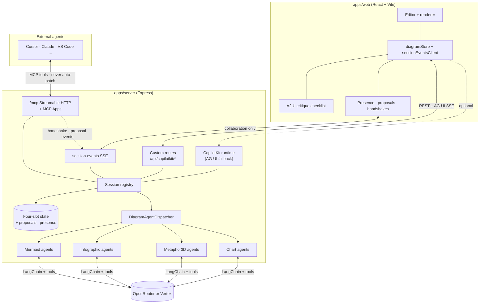

# System overview

The browser owns the editor and renderer; the server owns authoritative diagram state, validation, and LLM calls. Each browser tab gets a stable `x-session-id` header so concurrent users do not share state. The server session carries **four independent slots** — Mermaid source, AntV Infographic DSL, Metaphor3D DSL JSON, and Vega-Lite Chart DSL — plus an `activeContentType` pointer.

Three **parallel channels** serve different participants (guest-agent detail: [`docs/architecture-external-agents.md`](../architecture-external-agents.md)):

| Channel | Path | Used for |
| --- | --- | --- |
| **Built-in agents** | `/api/copilotkit/*` (REST + `agent-stream` AG-UI SSE) | Go, Refine, Critique, Fix, style, CopilotKit clients |
| **Collaboration** | `GET /api/copilotkit/session-events` | Handshakes, proposals, presence, focus, reactions, attributed insights |
| **External agents** | `GET/POST /mcp` | Join room, register, propose edits, insights; MCP Apps for human approval UI |

**Custom routes** (`apps/server/src/routes/copilot.js`) power the main UI.

**Critique checklist (A2UI)** — When **Critique** includes `## Actionable …`, the Thinking pane renders checkboxes via **A2UI v0.9** inside AG-UI `CUSTOM` events (`name: "a2ui"`). The model does not emit raw A2UI; the server builds messages from markdown. See [`docs/architecture-a2ui.md`](../architecture-a2ui.md).

**CopilotKit runtime** (`CopilotRuntime` + `createCopilotExpressHandler`) exposes the same backend through standard AG-UI for third-party CopilotKit clients; `threadId` maps to diagram session when provided.

## Generative UI and MCP surfaces

ArchiSlop uses **three UI strategies** on purpose — full map: [`docs/architecture-generative-ui.md`](../architecture-generative-ui.md).

| Layer | What it is | Where it runs |
| --- | --- | --- |
| **AG-UI** | SSE: phases, tokens, tool calls, draft previews, final state | Web toolbar (`agent-stream`) |
| **A2UI** | Server-built checklist in AG-UI `CUSTOM` events | Web **Critique → Fix selected** |
| **MCP Apps** | `ui://archislop/*.html` opened by MCP tools | Cursor, VS Code, Claude Desktop, … |
| **session-events** | Collaboration SSE (not Gen UI) | Web + MCP Apps |

**MCP:** Streamable HTTP at `/mcp`; bind with pairing code; use **`open_web_companion`** when the browser is open; approve/accept in the **web UI** if host App buttons are read-only.

## Protocol notes

| Layer | Protocol | Doc |
| --- | --- | --- |
| **Overview (all Gen UI + MCP UI)** | AG-UI + A2UI + MCP Apps matrix | [`docs/architecture-generative-ui.md`](../architecture-generative-ui.md) |
| Built-in agent runs | REST + **AG-UI** SSE on `agent-stream` | [`docs/architecture-ag-ui.md`](../architecture-ag-ui.md) |
| Critique checklists (web) | **A2UI** inside AG-UI `CUSTOM` | [`docs/architecture-a2ui.md`](../architecture-a2ui.md) |
| Multi-agent room sync | **session-events** SSE (not AG-UI) | [`docs/architecture-external-agents.md`](../architecture-external-agents.md) |
| External agents | **MCP** Streamable HTTP + MCP Apps | same |

- **CopilotKit v2 runtime** is mounted on `/api/copilotkit` **after** the custom router so AG-UI clients can fall through to `CopilotRuntime`.
- **`contentType`** is forwarded on every mutation — dispatcher, slot selection, and `applyPatch` enforce slot boundaries.
- **Validation (Mermaid)**: in-process `mermaid.parse` (JSDOM) + sanitizer rescue in `validateAndPreparePatch`.
- **Validation (Infographic)**: local `parseSyntax` only.
- **Validation (Metaphor3D)**: JSON schema + sanitizer + syntax fixer; same repair ladder shape as Mermaid.
- **Validation (Chart)**: `parseChartDsl` (shared package) + Vega schema check.
- **External edits**: validated at proposal time; applied only after human accept (same validators as built-in tools).
