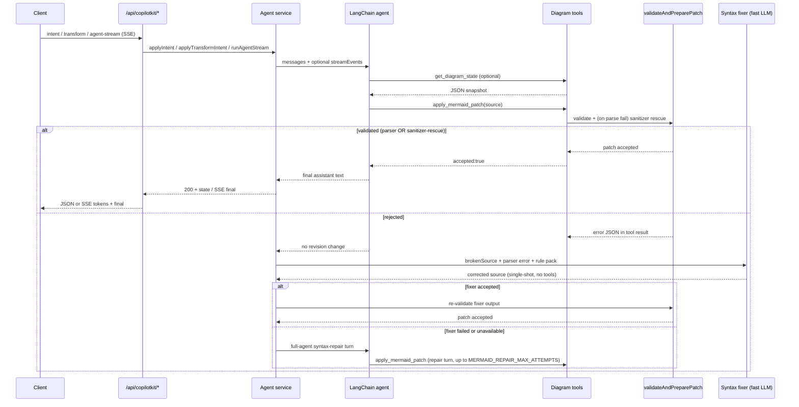
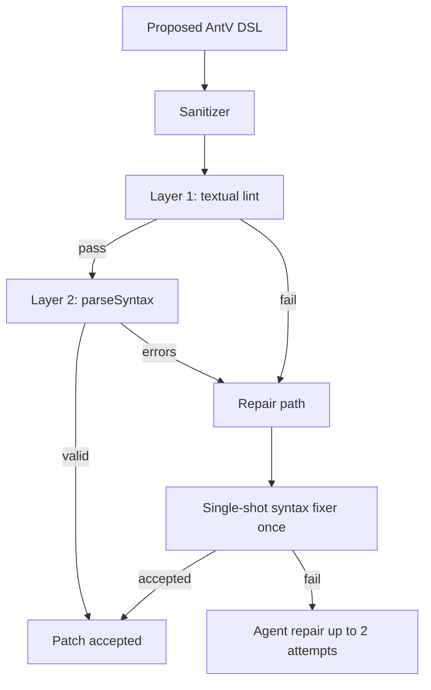
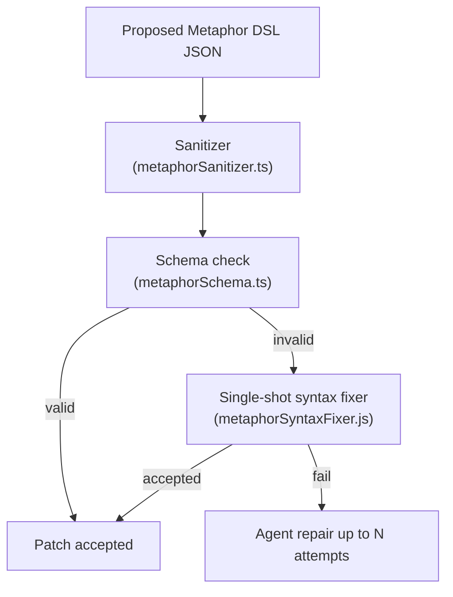
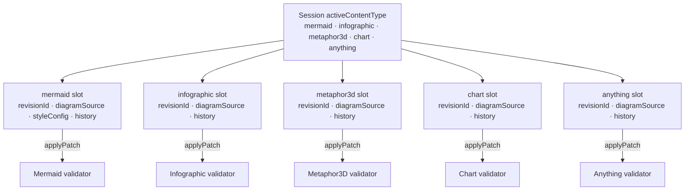
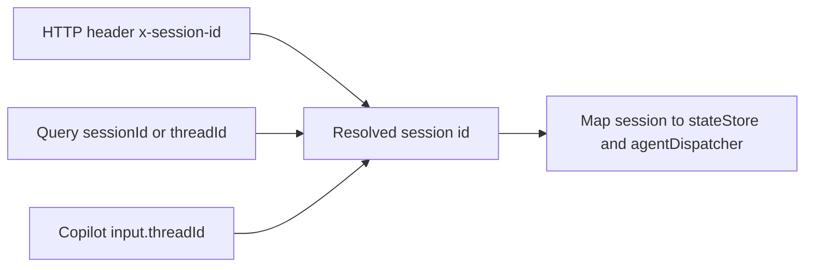

# Validation & repair

## Mermaid validation and repair ladder

Every Mermaid mutation runs through `invokeWithRepair`: inject the current diagram as a system context message, run the agent (stream events when streaming), then walk a **four-layer repair ladder** if the patch did not land or validation failed.



**The four-layer ladder, in order of cost:**

1. **Heuristic prefix check** — instant. Rejects source that doesn't start with a known diagram type.
2. **Deterministic sanitizer rescue** (`packages/shared/src/mermaidSanitizer.js`, also used for thinking-pane Mermaid previews) — ~1–10 ms. Composable fixers (smart quotes, header typos, malformed init JSON, reserved-word node IDs, parens/colons/slashes in labels, **quoted labels with embedded `"` / newlines**, unbalanced subgraphs, stray semicolons).
3. **Single-shot syntax fixer** (`apps/server/src/agents/mermaidSyntaxFixer.js`) — one LLM call, no tools, low temperature, fast model. Includes the parser error, broken source, and a diagram-type-specific rule pack (`apps/server/src/prompts/mermaidSyntaxGuard.js`, 15+ packs).
4. **Full-agent syntax-repair turns** — the original loop, kept as a fallback. Enriched with the same rule pack and broken-source block. Bounded by `MERMAID_REPAIR_MAX_ATTEMPTS` (default **2**).

Tune via [Configuration](configuration.md) (`MERMAID_REPAIR_*`, `MERMAID_METRICS`, run budgets).

## Run budgets, deadlines, and root-cause errors

All five mode agents share the same budget discipline (`packages/shared/src/agentRunBudget.ts`):

- **Absolute deadline.** Each mutation run builds a deadline-capped `AbortSignal` (`apps/server/src/agents/_lib/agentRunDeadline.js`) that combines the caller's stop signal with `AbortSignal.timeout(budget)`. In-flight model turns abort _at_ the budget instead of overrunning it and getting killed later by the client's stream watchdog.
- **Don't start what can't finish.** Before another full-agent repair turn the loop requires `MIN_AGENT_REPAIR_TURN_BUDGET_MS` (12 s) of remaining budget, and before a single-shot fixer call `MIN_SYNTAX_FIXER_BUDGET_MS` (4 s). When the remainder is too small the run fails fast instead of burning a model call that will be cut off anyway.
- **Root cause survives the timeout.** When a run stops on budget, `appendLastValidationError` attaches the most recent validator diagnostic to the `run_budget_exceeded` error (`Last validation error: …`). Exhausted repair loops likewise return `<Mode> update failed: <validator error>` rather than model prose. The web client (`apps/web/src/utils/agentStreamFailureStatus.ts`) extracts that marker and renders it as the failure detail, so the UI shows _what was invalid in the DSL_ (e.g. `Parse error on line 3: … Expecting 'SQE', got 'PS'`) even for timeouts.
- **Parser errors are verbatim.** The server-side Mermaid validator parses without `suppressErrors`, so failures carry Mermaid's real diagnostic (line number, caret, expected tokens) instead of a generic "parser rejected source". Those diagnostics also feed the syntax fixer and repair prompts, which measurably improves first-repair success.
- **Client/server budget alignment.** The web client mirrors `resolveAgentRunBudgetMs(profile, {}, mode)` (including Go Mad headroom) plus a 15 s grace before force-aborting a stream, and REST intent/transform requests use the same budget-derived timeout.

## Infographic validation pipeline

Infographic uses the same **validate → single-shot fixer → agent repair** shape as Mermaid, with a smaller deterministic front end:



- **Sanitizer** runs first (`strip-code-fence`, `tabs-to-spaces`, `smart-quotes-to-ascii`, `strip-leading-prose`).
- **Layer 1** checks the `infographic <template>` header, template whitelist (`@antv/infographic`), and indentation.
- **Layer 2** uses AntV `parseSyntax` for per-template structure.
- On failure, a **single-shot syntax fixer** (fast model, no tools) may apply corrected DSL once, then up to **two** full-agent repair turns with family-specific rule packs (list/sequence, chart, hierarchy, compare, relation).

## Metaphor3D validation pipeline

Metaphor3D uses the same **validate → single-shot fixer → agent repair** shape:



- **Sanitizer** (`packages/shared/src/metaphorSanitizer.ts`) strips code fences, normalises JSON, and coerces obvious type mismatches.
- **Schema check** (`packages/shared/src/metaphorSchema.ts`) validates the discriminated `metaphor` union (city / layercake / galaxy / tree / terrain / orrery / river) and all item/link/scene fields.
- **Single-shot syntax fixer** (`apps/server/src/agents/metaphorSyntaxFixer.js`) — one LLM call with the schema error and broken DSL; references `metaphorSyntaxGuard.js`.
- **Agent repair turns** — bounded by `METAPHOR_REPAIR_MAX_ATTEMPTS` env var.

## Chart validation pipeline

Chart validation runs through `validateAndPrepareChartPatch` (`apps/server/src/tools/chartDslTool.js`):

1. **DSL parse** — `parseChartDsl` (shared package) strips the `chart <type>` header and parses JSON.
2. **Vega-Lite schema check** — validates the extracted spec.
3. **Repair** — same single-shot fixer + agent repair pattern as the other slots.

## Anything validation pipeline

Anything validation runs through `validateAndPrepareAnythingPatch` (`apps/server/src/tools/anythingHtmlTool.js`). Both mutation tools funnel into it: `apply_anything_patch` (full-document rewrite) and `apply_anything_edit` (server-applied aider-style search/replace blocks, `apps/server/src/agents/_lib/searchReplaceEdits.js` — atomic, exact-match-or-fail, preferred for Refine/Exec/Fix). The edited result is validated exactly like a full rewrite; incremental edits never bypass a gate.

1. **Shape check** — `parseAnythingHtml` (shared): string, code-fence strip, size cap, contains at least one HTML tag. The `ANYTHING_HTML_MAX_LENGTH` budget applies to the agent-authored (marker-form) document — bytes injected for `@lib:` markers are exempt.
2. **Policy lint** — `lintAnythingPolicy` (shared): reject external URLs, parent escape, nested frames, `javascript:` URLs, and other sandbox-contract violations.
3. **Quality lint** — `lintAnythingQuality` (shared): require `<html>/<head>/<body>`, balanced tags/CSS, valid inline JS (`acorn`; `type="module"` scripts parse as modules, non-JS data blocks are skipped). Spec-valid optional end tags (`<p>`, `<li>`, `<td>`, …) are tolerated — only genuinely unclosed or mis-nested elements are rejected.
4. **Lib-marker lint** — `lintAnythingLibMarkers` (shared): documents may opt into allowlisted vendored libraries (`<!-- @lib:d3 -->`, `<!-- @lib:matter -->`) with HTML comment markers; unknown ids are rejected (`unknown_lib`) with the allowlist in the error. The vendored source itself is deliberately never linted — library comments contain URLs that would false-positive the policy lint. Accepted patches report the injected lib ids as `metadata.libs`. See [ADR-0008](../decisions/0008-anything-inline-libraries.md).
5. **Runtime check** — `runAnythingRuntimeCheck` (`apps/server/src/tools/anythingRuntimeCheck.js`): executes the page's scripts — with `@lib:` markers expanded to the vendored source via `expandAnythingLibs`, the same bytes the client will inject — in an isolated jsdom child process (clean env, capped heap, hard kill timeout) that emulates the client sandbox — opaque-origin storage and `document.cookie` throw, `fetch` rejects, and browser APIs jsdom lacks (canvas contexts, `matchMedia`, observers, audio) get inert stubs so good pages aren't falsely rejected — the stubs answer property-descriptor introspection consistently, since libraries that monkey-patch host objects walk `hasOwnProperty`/`getOwnPropertyDescriptor` chains at load. Rejects uncaught errors and unhandled rejections (`runtime_error`), infinite loops (`runtime_timeout`), and empty-`<body>` renders (`blank_render`); `console.error` output surfaces as warnings. Runs on agent patches only — client sync skips it so in-progress user edits (and broken source synced for an auto-fix) are never blocked. Infra failures (spawn/crash) fail open. Kill switch: `ANYTHING_RUNTIME_CHECK=0`; budget: `ANYTHING_RUNTIME_CHECK_TIMEOUT_MS` (default 4000 ms).
6. **Single-shot fixer** — `repairAnythingWithFixer` (`anythingSyntaxFixer.js`), one fast-model call before full agent repair. The fixer vets its candidate with static checks only; the store apply that follows re-runs the full ladder including the runtime check.
7. **Agent repair** — bounded by `ANYTHING_REPAIR_MAX_ATTEMPTS`. Deliberately **no HTML sanitizer** — safety at render time is the sandboxed iframe + CSP in `AnythingRenderer.jsx` — see [Content types](content-types.md#anything).

After acceptance the client closes the loop: `AnythingRenderer` expands `@lib:` markers into inline vendored `<script>` tags (lazy-loading the `@archislop/shared/anythingLibVendor.js` chunk only when a document has markers — the slot keeps the compact marker form) and shows a corner badge naming the injected libs and versions, then `wrapAnythingSrcDoc` (shared) injects a runtime-error bridge into the srcDoc — after validation, so the policy lint's `window.parent` ban never applies to it. Uncaught errors and unhandled rejections inside the sandboxed iframe are relayed via `postMessage` (`ANYTHING_RUNTIME_ERROR_MESSAGE_TYPE`); `AnythingRenderer` accepts messages only from its own iframe, shows a dismissible error banner, and forwards them through `onRuntimeError`. `DiagramCanvas` feeds load-phase errors (< 5 s after load) into the same validation/auto-fix plumbing Mermaid render errors use — the per-content-type auto-fix prompt lives in `apps/web/src/utils/autoFixPrompt.js`. Interaction-time errors stay banner-only.

## Session state: five-slot model



All five slots are fully independent — switching modes does not touch the other slots' revision histories. `applyPatch` in `packages/shared` enforces that a patch's `contentType` matches the slot it targets.

## Session alignment (REST vs CopilotKit)



Default session id is `default` when nothing is sent; the web client generates and persists a UUID in `localStorage` (`diagramStore.js`).

## Offline bench

Replay a fixed corpus through the validators (no LLM):

```bash
node apps/server/scripts/benchMermaid.js --tag <label>    # Mermaid: validateAndPreparePatch
node apps/server/scripts/benchAnything.js --tag <label>   # Anything: validateAndPrepareAnythingPatch (full ladder incl. runtime check)
```

`benchAnything.js` replays valid, policy-violating, statically broken, and runtime-failing HTML documents (corpus in `benchAnythingCorpus.js`) and reports accept rate, per-code rejection breakdown, runtime-catch rate, doc sizes, and latency percentiles. A "must stay rejected" case being accepted is treated as a safety regression (non-zero exit).

Snapshots land in `apps/server/bench-results/` (committed baselines for regression comparison; regenerate with the script — do not hand-edit). See [Development](development.md).

## Future work (optional)

Phases 0–4 of the Mermaid reliability ladder are shipped (sanitizer in [`packages/shared/src/mermaidSanitizer.ts`](../../packages/shared/src/mermaidSanitizer.ts), validator reorder, syntax fixer, repair defaults — see [ADR-0002](../decisions/0002-shared-mermaid-sanitizer.md)). Remaining ideas, gated on measurement:

### bench-with-llm

Extend the bench (or add a sibling script) to drive `applyIntent` / `applyTransformIntent` across modes and model profiles on a fixed prompt corpus with real API keys. Use results to decide whether to trim `GO_MAD_TEMP_MAX` and whether the JSON intermediate below is worth building.

### JSON-graph intermediate (Go Mad only)

If Go Mad accept rate stays below target after the shipped ladder, introduce a structured intermediate for high-temperature modes only:

- Extend [`packages/shared/src/diagramSchema.ts`](../../packages/shared/src/diagramSchema.ts) with a discriminated union for diagram types Go Mad uses (mindmap, timeline, gitGraph, quadrantChart, pie, sankey-beta, block-beta, C4\*, flowchart, sequenceDiagram, stateDiagram-v2).
- Add `compileDiagramJsonToMermaid` in `packages/shared` — deterministic JSON → Mermaid (quoting, IDs, labels in code).
- Add `apply_diagram_json` tool parallel to `apply_mermaid_patch`; Go Mad uses it; other modes keep direct Mermaid patches.

Skip this if real-LLM bench shows Go Mad ≥ ~90% accept rate after Phases 0–4.
