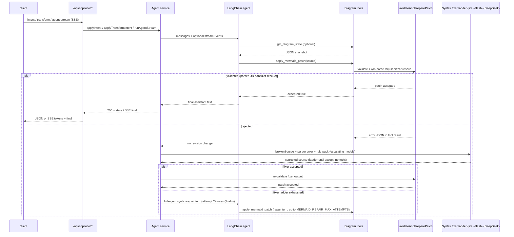
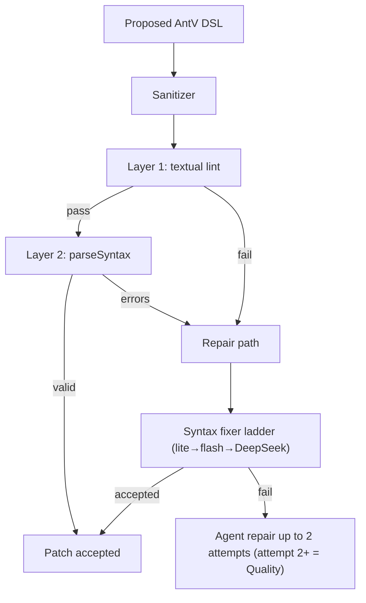
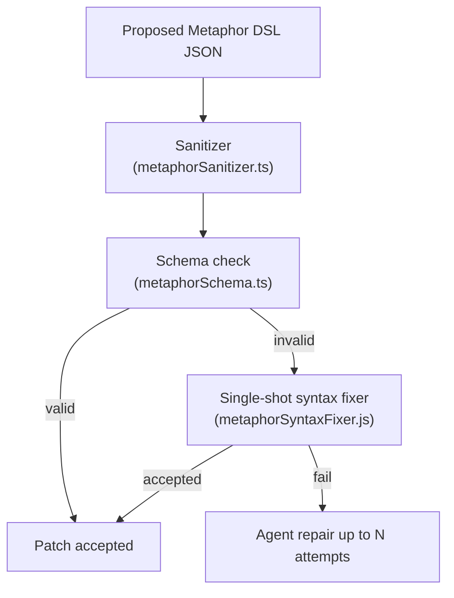
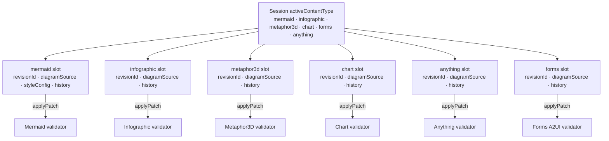
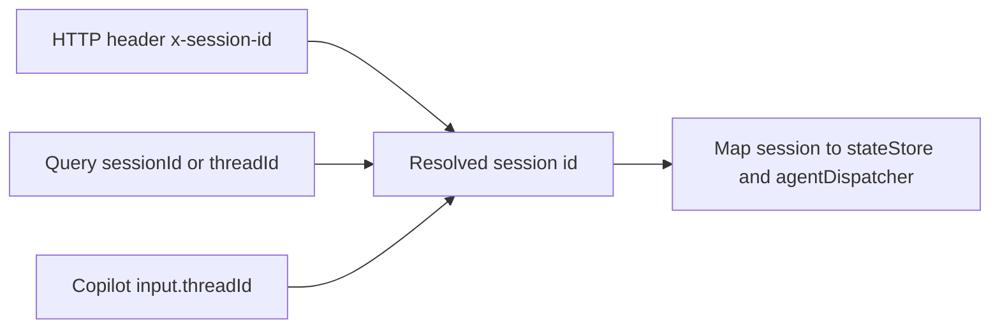

# Validation & repair

## Mermaid validation and repair ladder

Every Mermaid mutation runs through `invokeWithRepair`: inject the current diagram as a system context message, run the agent (stream events when streaming), then walk a **four-layer repair ladder** if the patch did not land or validation failed.



**The four-layer ladder, in order of cost:**

1. **Heuristic prefix check** — instant. Rejects source that doesn't start with a known diagram type.
2. **Deterministic sanitizer rescue** (`packages/shared/src/mermaidSanitizer.ts`, also used for thinking-pane Mermaid previews) — ~1–10 ms. Composable fixers (smart quotes, header typos, malformed init JSON, reserved-word node IDs, parens/colons/slashes in labels, **quoted labels with embedded `"` / newlines**, unbalanced subgraphs, stray semicolons).
3. **Syntax fixer ladder** (`apps/server/src/agents/mermaidSyntaxFixer.js` + `syntaxFixerEscalation.js`) — tool-less, low temperature. Tries **lite → flash → DeepSeek Pro** (independent of Brain) until a rung validates. Includes the parser error, broken source, and a diagram-type-specific rule pack (`apps/server/src/prompts/mermaidSyntaxGuard.js`, 15+ packs). Disable with `SYNTAX_FIXER_ESCALATION=0`.
4. **Full-agent syntax-repair turns** — the original loop, kept as a fallback. Enriched with the same rule pack and broken-source block. Bounded by `MERMAID_REPAIR_MAX_ATTEMPTS` (default **2** per profile when unset; see `resolveAgentRepairMaxAttempts` in `packages/shared/src/agentRunBudget.ts`). Every repair attempt (attempt ≥ 1) climbs to the Quality model via `resolveAgentRepairAttemptProfile`, regardless of Brain.

Tune via [Configuration](configuration.md) (`MERMAID_REPAIR_*`, `MERMAID_METRICS`, run budgets).

## Run budgets, deadlines, and root-cause errors

All six mode agents share the same budget discipline (`packages/shared/src/agentRunBudget.ts`):

- **Absolute deadline.** Each mutation run builds a deadline-capped `AbortSignal` (`apps/server/src/agents/_lib/agentRunDeadline.js`) that combines the caller's stop signal with `AbortSignal.timeout(budget)`. In-flight model turns abort _at_ the budget instead of overrunning it and getting killed later by the client's stream watchdog.
- **Don't start what can't finish.** Before another full-agent repair turn the loop requires `MIN_AGENT_REPAIR_TURN_BUDGET_MS` (12 s) of remaining budget, and before the syntax-fixer ladder `MIN_SYNTAX_FIXER_BUDGET_MS` (18 s). When the remainder is too small the run fails fast instead of burning a model call that will be cut off anyway.
- **Root cause survives the timeout.** When a run stops on budget, `appendLastValidationError` attaches the most recent validator diagnostic to the `run_budget_exceeded` error (`Last validation error: …`). Exhausted repair loops likewise return `<Mode> update failed: <validator error>` rather than model prose. The web client (`apps/web/src/utils/agentStreamFailureStatus.ts`) extracts that marker and renders it as the failure detail, so the UI shows _what was invalid in the DSL_ (e.g. `Parse error on line 3: … Expecting 'SQE', got 'PS'`) even for timeouts.
- **Parser errors are verbatim.** The server-side Mermaid validator parses without `suppressErrors`, so failures carry Mermaid's real diagnostic (line number, caret, expected tokens) instead of a generic "parser rejected source". Those diagnostics also feed the syntax fixer and repair prompts, which measurably improves first-repair success.
- **Client/server budget alignment.** The web client mirrors `resolveAgentRunBudgetMs(profile, {}, mode)` (including Russ headroom) plus a 15 s grace before force-aborting a stream, and REST intent/transform requests use the same budget-derived timeout.

## Infographic validation pipeline

Infographic uses the same **validate → single-shot fixer → agent repair** shape as Mermaid, with a smaller deterministic front end:



- **Sanitizer** runs first (`strip-code-fence`, `tabs-to-spaces`, `smart-quotes-to-ascii`, `strip-leading-prose`).
- **Layer 1** checks the `infographic <template>` header, template whitelist (`@antv/infographic`), and indentation.
- **Layer 2** uses AntV `parseSyntax` for per-template structure.
- On failure, a **single-shot syntax fixer** (fast model, no tools) may apply corrected DSL once, then up to **two** full-agent repair turns with family-specific rule packs (list/sequence, chart, hierarchy, compare, relation).

## Metaphor3D validation pipeline

Metaphor3D uses the same **validate → single-shot fixer → agent repair** shape:



- **Sanitizer** (`packages/shared/src/metaphorSanitizer.ts`) strips code fences, normalises JSON, and coerces obvious type mismatches. On an unrecoverable input it returns a **root-cause `error`** — the verbatim `JSON.parse` message, or the failing Zod issues formatted path-by-path (`items.0.height: …`), mirroring `parseChartDsl` — instead of a generic notice. `validateAndPrepareMetaphorPatch` / `validateMetaphorStrict` relay it verbatim, so the fixer and repair prompts see exactly which field failed (upholds the "parser errors are verbatim" principle above).
- **Schema check** (`packages/shared/src/metaphorSchema.ts`) validates the discriminated `metaphor` union (city / layercake / galaxy / tree / terrain / orrery / river / garden / archipelago / machine) and all item/link/scene fields; failures surface as the formatted Zod issues described above.
- **Single-shot syntax fixer** (`apps/server/src/agents/metaphorSyntaxFixer.js`) — one LLM call with the schema error and broken DSL; references `metaphorSyntaxGuard.js`.
- **Agent repair turns** — bounded by `METAPHOR_REPAIR_MAX_ATTEMPTS` env var.

## Chart validation pipeline

Chart validation runs through `validateAndPrepareChartPatch` (`apps/server/src/tools/chartDslTool.js`):

1. **DSL parse** — `parseChartDsl` (shared package) strips the `chart <type>` header and parses JSON.
2. **Vega-Lite schema check** — validates the extracted spec.
3. **Repair** — syntax fixer ladder (`chartSyntaxFixer.js`, lite → flash → DeepSeek) then agent repair.

## Forms validation pipeline

Forms validation runs through `validateAndPrepareFormsPatch` (`apps/server/src/tools/formsA2uiTool.js`):

1. **Allowlist gate** — `parseFormsA2ui` (shared): JSON wrapper shape, `basicCatalog` components, Button event-only actions, size/count caps, ≥1 input + ≥1 Button.
2. **Syntax fixer ladder** — `formsSyntaxFixer.js` (same lite → flash → DeepSeek climb as chart; higher `maxOutputTokens` for large A2UI docs).
3. **Agent repair** — bounded by `FORMS_REPAIR_MAX_ATTEMPTS` (attempt 2+ uses Quality). Deliberately **no sanitizer pack** — allowlist diagnostics are precise enough without mechanical rewrite rules.

## Anything validation pipeline

Anything validation runs through `validateAndPrepareAnythingPatch` (`apps/server/src/tools/anythingHtmlTool.js`). Both mutation tools funnel into it: `apply_anything_patch` (full-document rewrite) and `apply_anything_edit` (server-applied aider-style search/replace blocks, `apps/server/src/agents/_lib/searchReplaceEdits.js` — atomic, exact-match-or-fail, preferred for Gilfoyle/Dinesh/Barker/Fix). The edited result is validated exactly like a full rewrite; incremental edits never bypass a gate.

1. **Shape check** — `parseAnythingHtml` (shared): string, code-fence strip, size cap, contains at least one HTML tag. The `ANYTHING_HTML_MAX_LENGTH` budget applies to the agent-authored (marker-form) document — bytes injected for `@lib:` markers are exempt.
2. **Policy lint** — `lintAnythingPolicy` (shared): reject external URLs, parent escape, nested browsing contexts, `javascript:` URLs, and other sandbox-contract violations. **Nested browsing** is caught in markup (`<iframe>`, `<object>`, `<embed>`) **and** in script (`document.createElement('iframe'|'object'|'embed')`, plus any `.contentWindow` access) — code `embedded_browsing`. The agent prompt and syntax guard teach the same rule: build every widget in the page itself, never nest a frame. Comments (HTML, JS, CSS) and **XML namespace URIs** are stripped before the URL test: a namespace is an identifier, not an address — `createElementNS` / `setAttributeNS` require it verbatim and no browser fetches it. The exemption is five exact URIs with a trailing boundary, never a `w3.org` prefix, so a lookalike host or a traversal is still rejected.
3. **Quality lint** — `lintAnythingQuality` (shared): require `<html>/<head>/<body>`, balanced tags/CSS, valid inline JS (`acorn`; `type="module"` scripts parse as modules, non-JS data blocks are skipped). Spec-valid optional end tags (`<p>`, `<li>`, `<td>`, …) are tolerated — only genuinely unclosed or mis-nested elements are rejected.
4. **Lib-marker lint** — `lintAnythingLibMarkers` (shared): documents may opt into allowlisted vendored libraries (`<!-- @lib:d3 -->`, `<!-- @lib:matter -->`) with HTML comment markers; unknown ids are rejected (`unknown_lib`) with the allowlist in the error. The vendored source itself is deliberately never linted — library comments contain URLs that would false-positive the policy lint. Accepted patches report the injected lib ids as `metadata.libs`. See [ADR-0008](../decisions/0008-anything-inline-libraries.md).
5. **Runtime check** — `runAnythingRuntimeCheck` (`apps/server/src/tools/anythingRuntimeCheck.js`): executes the page's scripts — with `@lib:` markers expanded to the vendored source via `expandAnythingLibs`, the same bytes the client will inject — in an isolated child process (clean env, hard kill timeout) and rejects uncaught errors and unhandled rejections (`runtime_error`), infinite loops (`runtime_timeout`), and empty-`<body>` renders (`blank_render`); `console.error` output surfaces as warnings. Runs on agent patches only — client sync skips it so in-progress user edits (and broken source synced for an auto-fix) are never blocked. Infra failures (spawn/crash) fail open. Kill switch: `ANYTHING_RUNTIME_CHECK=0`; budget: `ANYTHING_RUNTIME_CHECK_TIMEOUT_MS` (default 6000 ms).

   **Two engines, one contract.** `ANYTHING_RUNTIME_ENGINE` selects `browser` (default when a Chromium binary resolves), `jsdom`, or `auto`. Both satisfy the same suite — `apps/server/test/anythingRuntimeCheck.test.js` runs unchanged against either, which is what keeps them from drifting — and `jsdom` is a one-variable rollback.

   The **browser** engine (`anythingRuntimeBrowser.js`) does not emulate the client sandbox, it _reproduces_ it: a host page builds the real `<iframe sandbox="allow-scripts" srcdoc={wrapAnythingSrcDoc(html)}>` using the same shared constants `AnythingRenderer.jsx` uses. So `localStorage` and `document.cookie` throw `SecurityError` on the opaque origin for real, `fetch` is refused by the injected CSP's `connect-src 'none'`, and errors arrive over the runtime-error bridge the wrapper already injects — none of it patched by hand. The page also gets a real canvas and a real layout engine. Measured through the full ladder on the 26-fixture corpus (`benchAnythingCorpus.js`): **p50 139 ms against jsdom's 1,009 ms**, identical verdicts on every fixture. The parent cannot read into the frame (no `allow-same-origin`), so the visual probe (`anythingRuntimeProbe.js`, shared with the bench observer) runs inside and reports over postMessage.

   The **jsdom** engine is the original: no layout engine (`getBoundingClientRect()` returns zeros for everything), canvas stubbed with an inert Proxy so a chart that draws nothing passes, and the sandbox contract emulated by hand. Still correct on everything except layout and paint, which is why it remains the fallback.

   **Each engine gets its own clock.** When the browser rung fails open (a cold Chromium launch that produced no page verdict), the jsdom fallback runs on `ANYTHING_RUNTIME_FALLBACK_TIMEOUT_MS` — default `max(browser budget, 6000 ms)` — never on the browser's remaining budget. The two engines exist as a pair _because_ their startup costs differ, so resharing one clock made a budget tightened for the browser starve the fallback, which then reported `runtime_timeout` — a page rejection — for what was only the second rung running out of time ([#347](https://github.com/acuhlmann/mermaid-gen/issues/347)). A budget _raised_ for the browser still lifts the fallback; only tightening was ever browser-specific. Worst case the two budgets run back to back, which is what a fail-open fallback costs.

   **Visual findings warn; they do not reject** unless `ANYTHING_RUNTIME_VISUAL_REJECT=1`, and then only on _hard_ findings (`blank_canvas`, `canvas_zero_size`, `collapsed_element`, `body_no_height` → `visual_broken`). `low_contrast` is always a warning: the generation bench measured 32 of 35 accepted pages carrying one between ~3:1 and 4.4:1, and rejecting on legible-but-imperfect contrast would thrash the repair loop for craft rather than correctness. The hard-finding rate on accepted pages measured **8.57%** — that is the extra rejection this switch buys, against a 12–60 s repair turn each.

6. **Single-shot fixer** — `repairAnythingWithFixer` (`anythingSyntaxFixer.js`), one fast-model call before full agent repair. The fixer vets its candidate with static checks only; the store apply that follows re-runs the full ladder including the runtime check.
7. **Agent repair** — bounded by `ANYTHING_REPAIR_MAX_ATTEMPTS`. Deliberately **no HTML sanitizer** — safety at render time is the sandboxed iframe + CSP in `AnythingRenderer.jsx` — see [Content types](content-types.md#anything).

**Runtime-safe JS craft** — the runtime check executes the page's scripts, so patterns that throw at load time burn a repair turn even when static lints pass. `anythingDesignGuide.js` teaches the recurring classes: guard `querySelector` / `getElementById` before property access (or run init after the queried nodes exist); call `getTotalLength()` only on **geometry elements** (`<path>`, `<rect>`, `<circle>`, `<ellipse>`, `<line>`, `<polygon>`, `<polyline>`) — what throws is calling it on a **non-geometry** node such as a `<g>` wrapper, the `<svg>` root, `<text>`, or a plain `<div>` (stroke-draw animations must target the shape being stroked, not its container); with `@lib:d3`, chain `.append` / `.attr` on selections — never reassign a selection to a DOM node and call `.append` on it; with `@lib:d3` force layouts, give every node a string `id` and use those same ids in link `source`/`target`, with `.force('link', d3.forceLink(links).id(d => d.id))` — mismatched names or numeric indices throw `"node not found"` at runtime. Corpus fixtures `runtime-svg-gettotallength` and `runtime-d3-force-link-mismatch` pin the last two rules. Both engines must agree on corpus expectations — a fixture that only rejects under jsdom (e.g. asserting `<rect>` lacks `getTotalLength` when real Chromium implements `SVGGeometryElement`) is a drift trap ([#393](https://github.com/acuhlmann/mermaid-gen/issues/393)).

After acceptance the client closes the loop: `AnythingRenderer` expands `@lib:` markers into inline vendored `<script>` tags (lazy-loading the `@archislop/shared/anythingLibVendor.js` chunk only when a document has markers — the slot keeps the compact marker form) and shows a corner badge naming the injected libs and versions, then `wrapAnythingSrcDoc` (shared) injects a runtime-error bridge into the srcDoc — after validation, so the policy lint's `window.parent` ban never applies to it. Uncaught errors and unhandled rejections inside the sandboxed iframe are relayed via `postMessage` (`ANYTHING_RUNTIME_ERROR_MESSAGE_TYPE`); `AnythingRenderer` accepts messages only from its own iframe, shows a dismissible error banner, and forwards them through `onRuntimeError`. `DiagramCanvas` feeds load-phase errors (< 5 s after load) into the same validation/auto-fix plumbing Mermaid render errors use — the per-content-type auto-fix prompt lives in `apps/web/src/utils/autoFixPrompt.js`. Interaction-time errors stay banner-only.

Both Mermaid render errors and Anything load-phase errors take a **fast-path repair endpoint** first: `POST /api/diagram/render-error` (`apps/server/src/routes/diagramRepair.js`) runs only the single-shot syntax fixer (one LLM call, no agent loop) against the still-current slot, applies the result through the normal state-store pipeline (so the Anything runtime check still runs), and returns `{repaired}`. It accepts a `contentType` of `mermaid` (default) or `anything`; `runAutoFix` (`App.jsx`) only falls back to the full intent ladder when the fast path rejects.

## Session state: six-slot model



All six slots are fully independent — switching modes does not touch the other slots' revision histories. `applyPatch` in `packages/shared` enforces that a patch's `contentType` matches the slot it targets.

## Session alignment (REST vs CopilotKit)



Default session id is `default` when nothing is sent; the web client generates and persists a UUID in `localStorage` (`diagramStore.js`).

## Offline bench

Two different things, easy to confuse. **Corpus benches** replay fixed documents through the validators and ask whether the gate still classifies them as declared — a regression suite for the ladder, no LLM involved. The **generation bench** sends real prompts through the real agent and measures the model — a quality measurement, not a contract.

### Corpus benches (no LLM)

```bash
node --import ./scripts/register-antv-layout-esm.mjs --import tsx \
  apps/server/scripts/benchMermaid.js --tag <label>    # Mermaid: validateAndPreparePatch
node apps/server/scripts/benchAnything.js --tag <label>   # Anything: validateAndPrepareAnythingPatch (full ladder incl. runtime check)
```

`benchMermaid.js` needs both `--import` flags because its subject (`mermaidDiffTool.js`) reaches TypeScript-only modules and `@antv/infographic`; bare `node` dies with `ERR_MODULE_NOT_FOUND` before a case runs (issue #349). The other corpus benches run under plain `node`.

`benchAnything.js` replays valid, policy-violating, statically broken, and runtime-failing HTML documents (corpus in `benchAnythingCorpus.js`) and reports accept rate, per-code rejection breakdown, runtime-catch rate, doc sizes, and latency percentiles. A "must stay rejected" case being accepted is treated as a safety regression (non-zero exit). Note the `acceptRate` it reports is a property of the corpus (how many fixtures are _supposed_ to pass), **not** a quality signal — the number to read is `expectationMatch`.

### Generation bench (real LLM — spends tokens)

```bash
node --import ./scripts/register-antv-layout-esm.mjs --import tsx \
  apps/server/scripts/benchAnythingGeneration.js --tag <label> [--browser]
```

Sends the prompt corpus in `benchAnythingGenerationCorpus.js` through the real agent and reports **first-pass accept rate** (how often the model gets it right with no repair), the rejection-code histogram (which rung actually bites), repair convergence (`converged` / `stuck-same-code` / `reshuffled`), which mechanism won (first try / syntax fixer / repair turn N), tokens, and latency. Most cases use `applyIntent` (mode `go`); the **refine** family seeds a document with one prompt, then runs a follow-up through `applyTransformIntent` (`transformMode: 'barker'` on `refine-add-control`) so scoped edits exercise `apply_anything_edit`. The summary includes an `editTool` block (`transformRuns`, `editToolUsed`, `editToolRate`) for that arm. Not part of `npm test`; it needs a configured backend ([LLM config](../llm-config.md)).

**Always pass `--samples 3` or more for a baseline you intend to compare against.** Two consecutive single-sample runs of the same 12 cases measured first-pass accept rates of 66.7% and 91.7% — a 25-point swing from nondeterminism alone. A one-sample run is a smoke test, not a measurement.

Read `firstPassAcceptRate` next to `failureKinds`. A `transport` failure is a model call cut off mid-stream — infrastructure, not generation quality — and it depresses the accept rate exactly like a page the model could not fix. One appeared in the very first baseline run.

Both `--import` flags are required: the agent's import graph reaches TypeScript leaves behind `.js` specifiers, and transitively reaches `@antv/infographic`, whose `{ DagreLayout }` import only resolves through the repo's ESM layout hook — the same pair `scripts/run-server-tests.mjs` uses.

`--browser` additionally renders every **accepted** page in a real headless Chromium (`anythingBrowserProbe.js`) and records what the jsdom rung structurally cannot see: blank canvases (jsdom's `getContext` is an inert Proxy, so nothing is ever drawn), collapsed layout (no layout engine — every `getBoundingClientRect()` is zeros), and text below the 4.5:1 contrast floor the [design guide](../../apps/server/src/prompts/anythingDesignGuide.js) asks for. It is an **observer, not a rung** — it changes no verdict; it exists to measure how much more a browser would reject, which is the number that decides whether a browser is worth promoting into the request path. It needs no new dependency (`spawn` + `--dump-dom` + an in-page probe) and fails open when no Chromium is present.

Snapshots land in `apps/server/bench-results/` (committed baselines for regression comparison; regenerate with the script — do not hand-edit). See [Development](development.md).

## Future work (optional)

Phases 0–4 of the Mermaid reliability ladder are shipped (sanitizer in [`packages/shared/src/mermaidSanitizer.ts`](../../packages/shared/src/mermaidSanitizer.ts), validator reorder, syntax fixer, repair defaults — see [ADR-0002](../decisions/0002-shared-mermaid-sanitizer.md)). Remaining ideas, gated on measurement:

### Anything runtime rung: gated on measurement

The browser rung is live and at parity — visual findings warn, nothing rejects on them yet. What is left is deliberately gated: each item below is a decision that wants a number, not a patch. Reference baselines are committed under `apps/server/bench-results/`:

| tag                                         | first-pass | eventual | hard-flagged |
| ------------------------------------------- | ---------- | -------- | ------------ |
| `baseline-2026-08-20T06-45-15-328Z` (jsdom) | 83.33%     | 97.22%   | 8.57%        |
| `browser-engine-2026-08-20T09-34-06-801Z`   | 72.22%     | 100%     | 11.11%       |

The first-pass gap between them is **not** the engine: it is the static rungs 1–4 (`external_url` 5→7, `script_syntax` 0→3). Rung 5 rejected _fewer_ on the browser (5→3). Do not re-derive that — it is in the `browser-engine` commit message.

**1. Verify the Dockerfile Chromium layer.** The one thing from the browser-engine work never exercised: no Docker daemon in the sessions it was written in, and CI's build job is `npm run build`, not a container build — so the layer first runs at deploy.

```bash
docker build --build-arg UI_VARIANT=main-only -t archislop-verify .
docker run --rm archislop-verify /usr/bin/chromium --version
docker images archislop-verify --format '{{.Size}}'   # expect ~+400MB vs main
```

Confirm the size delta **before** trusting the `--memory=1Gi` sizing in `scripts/deploy-cloud-run.sh`. Do this before the next deploy, not after.

**2. Turn on visual rejection.** The measured decision the whole bench exists for. Set `ANYTHING_RUNTIME_VISUAL_REJECT=1`, then:

```bash
node --import ./scripts/register-antv-layout-esm.mjs --import tsx \
  apps/server/scripts/benchAnythingGeneration.js --tag visual-reject --browser --samples 3
```

Expect ~8–11% more rejections — but re-measure first: the run that fixed the namespace lint saw hard findings drop to 0 (see item 3), so that ceiling may no longer hold. Ship **only if repair converges on them** — read `convergenceHistogram` for `stuck-same-code` / `reshuffled`, not just the accept rate. A page that gets rejected and cannot be fixed is worse than one that ships imperfect. `low_contrast` stays a warning permanently; that is settled, not pending.

**3. ~~Tighten `external_url` in the prompt.~~ Done differently — it was not a prompt problem.** `external_url` was the largest rejection code in the browser baseline (7, against `runtime_error`'s 3), and the standing theory was that the model reaches for a font or CDN URL. A probe that replayed corpus prompts and printed the offending line found something else:

```js
var ns = 'http://www.w3.org/2000/svg';
```

That is `createElementNS` — correct, entirely offline code, and the only way to build SVG from script. The lint stripped the namespace in its `xmlns=` **attribute** form and not in a **string literal**, so the identical URI passed in markup and was rejected in JS, and the repair error then told a page that had drawn its own SVG to go and inline its assets. Fixed in `lintAnythingPolicy` rather than in the prompt; tightening the prompt would have pushed the model _away_ from the right API.

Measured through the full generation bench, same flags and sample count as the `browser-engine` baseline (`ns-lint-fix-2026-08-21T08-00-57-108Z`):

| metric            | `browser-engine` | `ns-lint-fix` |
| ----------------- | ---------------- | ------------- |
| first-pass accept | 72.22%           | **88.89%**    |
| eventual accept   | 100%             | 100%          |
| mean attempts     | 1.42             | **1.25**      |
| `external_url`    | 7                | **0**         |
| `script_syntax`   | 3                | 1             |
| `runtime_error`   | 3                | 3             |

`external_url` going to zero is causal and certain — the rung mechanically no longer fires on a namespace — and the first-pass gain follows from it. `runtime_error` is unchanged, which is the control you want: the fix touched one rung and left the others alone.

Two things in that run are **not** established and should not be acted on from one sample set. `script_syntax` 3→1 is within the nondeterminism this bench is known for. More interesting, the browser observer's hard findings went 4→0 (`collapsed_element` 19→0): plausibly causal, since a page repaired out of its rejected `createElementNS` code can leave the container it was going to fill empty — but that is exactly the number gating the visual-rejection rollout above, so re-measure it before reading anything into it.

Worth keeping as method: the handoff asserted a cause, and one probe that printed the actual offending line refuted it in a few model calls. Do that before rewriting a prompt — there is still no evidence in this corpus of a genuine font or CDN reach, so no prompt change was made.

**4. Remove the cold-start cost.** Today the first check after idle pays the browser budget _and then_ a jsdom run before returning — correct, but wasteful, and Cloud Run scales to zero so it is a real user-facing path. A one-off warm render (`about:blank`) per process would remove it. Correctness is already handled by the fail-open in `anythingRuntimeBrowser.js` and, since [#347](https://github.com/acuhlmann/mermaid-gen/issues/347), by the fallback's own budget — so this is an optimization, not a fix.

Traps, all of which have been paid for once already:

- **Both `--import` flags or neither.** The generation bench needs `--import ./scripts/register-antv-layout-esm.mjs --import tsx`; each missing one fails with a different unhelpful module error.
- **`--samples 3` minimum.** Two single-sample runs of the same corpus measured 66.7% and 91.7%.
- **Read `failureKinds` beside the accept rate.** A `transport` entry is a model call cut off mid-stream — infrastructure, not quality.

### bench-with-llm

**Shipped for `anything`** as `benchAnythingGeneration.js` (see [Generation bench](#generation-bench-real-llm--spends-tokens) above) — it drives `applyIntent` on most cases and `applyTransformIntent` on the refine family, reports first-pass accept rate, the rung histogram, repair convergence, and (for transform runs) whether the model reached for `apply_anything_edit`. Still open for the **other slots**: extend the same harness to mermaid / infographic / chart / metaphor3d / forms (each needs a corpus and a store adapter). Still open for **anything transform breadth**: only Barker is wired today; add Gilfoyle / Fix refine cases when bench evidence shows scoped-edit failures Barker does not cover. The per-slot work is a corpus and a store adapter; the harness (event capture, attempt trail, reporting) is slot-agnostic apart from the validator it calls.

(`RUSS_TEMP_MAX` has since been trimmed to ~1.15 — Russ chaos is now prompt-driven; a mermaid arm of this bench would confirm the accept-rate gain and whether the JSON intermediate below is still worth building.)

### JSON-graph intermediate (Russ only)

If Russ accept rate stays below target after the shipped ladder, introduce a structured intermediate for high-temperature modes only:

- Extend [`packages/shared/src/diagramSchema.ts`](../../packages/shared/src/diagramSchema.ts) with a discriminated union for diagram types Russ uses (mindmap, timeline, gitGraph, quadrantChart, pie, sankey-beta, block-beta, C4\*, flowchart, sequenceDiagram, stateDiagram-v2).
- Add `compileDiagramJsonToMermaid` in `packages/shared` — deterministic JSON → Mermaid (quoting, IDs, labels in code).
- Add `apply_diagram_json` tool parallel to `apply_mermaid_patch`; Russ uses it; other modes keep direct Mermaid patches.

Skip this if real-LLM bench shows Russ ≥ ~90% accept rate after Phases 0–4.
