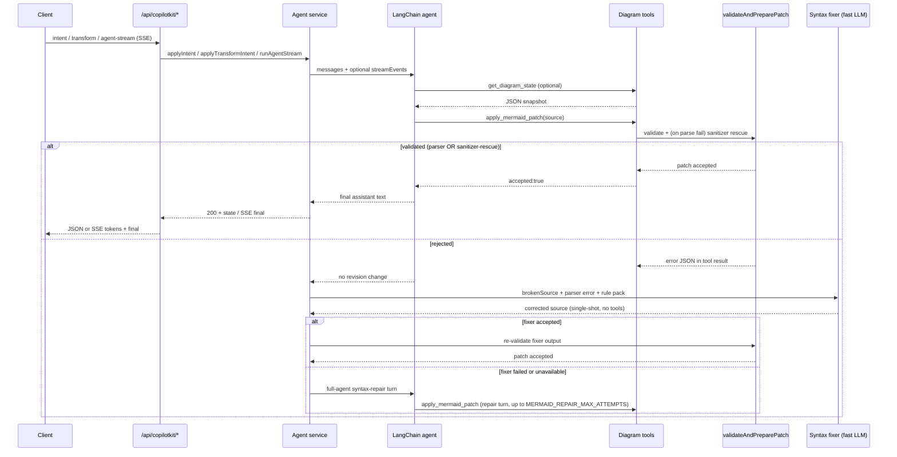
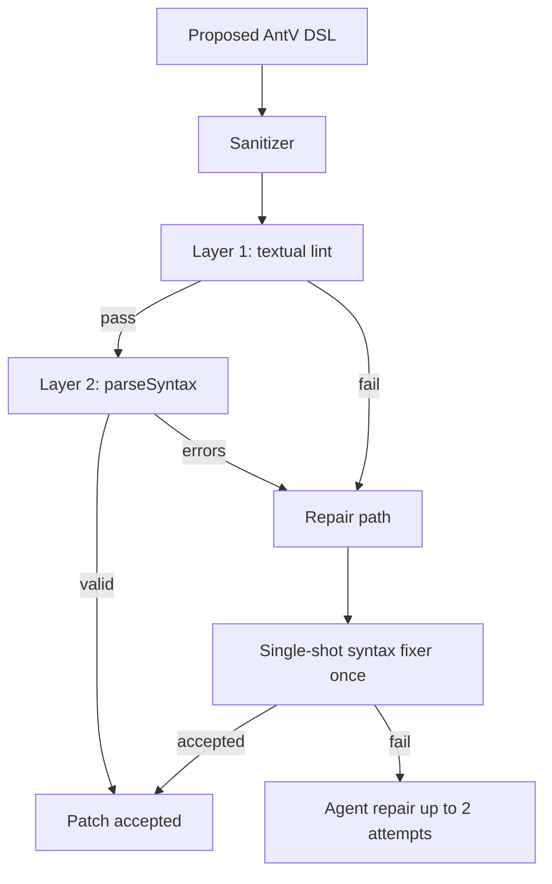
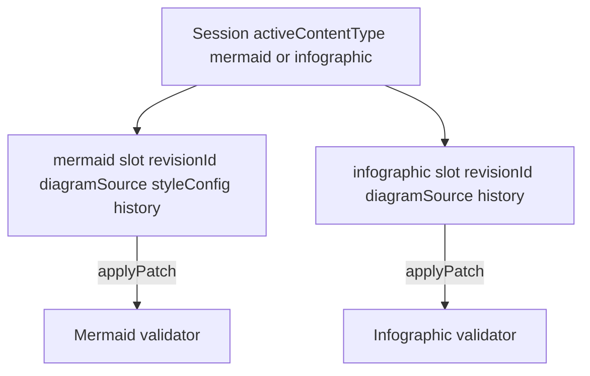
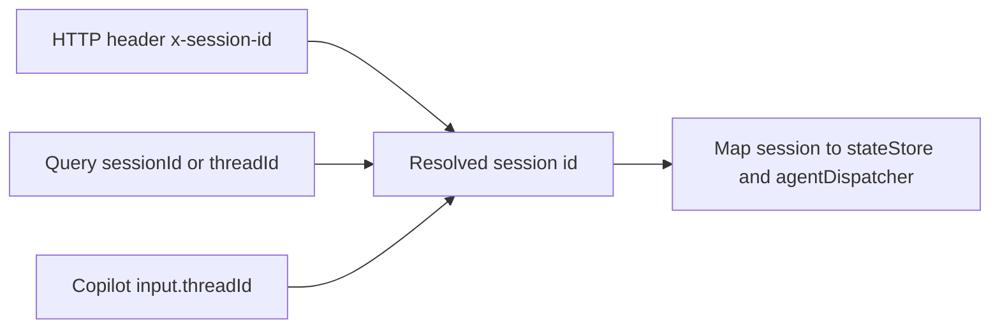

# Validation & repair

## Mermaid validation and repair ladder

Every Mermaid mutation runs through `invokeWithRepair`: inject the current diagram as a system context message, run the agent (stream events when streaming), then walk a **four-layer repair ladder** if the patch did not land or validation failed.

**The four-layer ladder, in order of cost:**

1. **Heuristic prefix check** — instant. Rejects source that doesn't start with a known diagram type.
2. **Deterministic sanitizer rescue** (`packages/shared/src/mermaidSanitizer.js`, also used for thinking-pane Mermaid previews) — ~1–10 ms. Composable fixers (smart quotes, header typos, malformed init JSON, reserved-word node IDs, parens/colons/slashes in labels, **quoted labels with embedded `"` / newlines**, unbalanced subgraphs, stray semicolons).
3. **Single-shot syntax fixer** (`apps/server/src/agents/mermaidSyntaxFixer.js`) — one LLM call, no tools, low temperature, fast model. Includes the parser error, broken source, and a diagram-type-specific rule pack (`apps/server/src/prompts/mermaidSyntaxGuard.js`, 15+ packs).
4. **Full-agent syntax-repair turns** — the original loop, kept as a fallback. Enriched with the same rule pack and broken-source block. Bounded by `MERMAID_REPAIR_MAX_ATTEMPTS` (default **2**).

Tune via [Configuration](configuration.md) (`MERMAID_REPAIR_*`, `MERMAID_METRICS`, run budgets).

## Infographic validation pipeline

Infographic uses the same **validate → single-shot fixer → agent repair** shape as Mermaid, with a smaller deterministic front end:

- **Sanitizer** runs first (`strip-code-fence`, `tabs-to-spaces`, `smart-quotes-to-ascii`, `strip-leading-prose`).
- **Layer 1** checks the `infographic <template>` header, template whitelist (`@antv/infographic`), and indentation.
- **Layer 2** uses AntV `parseSyntax` for per-template structure.
- On failure, a **single-shot syntax fixer** (fast model, no tools) may apply corrected DSL once, then up to **two** full-agent repair turns with family-specific rule packs (list/sequence, chart, hierarchy, compare, relation).

## Session state: dual-slot model

The two slots are fully independent — switching modes does not touch the other slot's revision history. `applyPatch` in `packages/shared` enforces that a patch's `contentType` matches the slot it targets.

## Session alignment (REST vs CopilotKit)

Default session id is `default` when nothing is sent; the web client generates and persists a UUID in `localStorage` (`diagramStore.js`).
